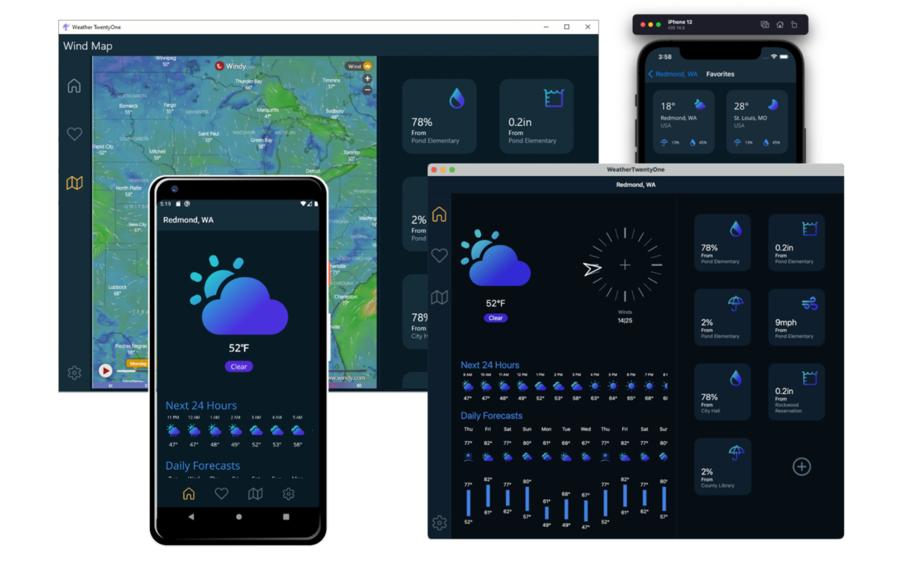

# .NET Multi-platform App UI (.NET MAUI)

 

[.NET Multi-platform App UI (.NET MAUI)](https://dotnet.microsoft.com/en-us/apps/maui) is a cross-platform framework for creating mobile and desktop apps with C# and XAML. Using .NET MAUI, you can develop apps that can run on Android, iOS, iPadOS, macOS, and Windows from a single shared codebase.

## Getting Started ##

* [Install .NET MAUI](https://dot.net/maui)
* [.NET MAUI Documentation](https://docs.microsoft.com/dotnet/maui)
* [.NET MAUI Samples](https://github.com/dotnet/maui-samples)
* [Development Guide](./.github/DEVELOPMENT.md)

## Overview

.NET Multi-platform App UI (.NET MAUI) is the evolution of Xamarin.Forms that expands capabilities beyond mobile Android and iOS into desktop apps for Windows and macOS. With .NET MAUI, you can build apps that perform great for any device that runs Windows, macOS, Android, & iOS from a single codebase. Coupled with Visual Studio productivity tools and emulators, .NET and Visual Studio significantly speed up the development process for building apps that target the widest possible set of devices. Use a single development stack that supports the best of breed solutions for all modern workloads with a unified SDK, base class libraries, and toolchain. [Read More](https://docs.microsoft.com/dotnet/maui/what-is-maui)

## Current News
* November 13, 2024 - [What's new in .NET MAUI for .NET 9](https://learn.microsoft.com/dotnet/maui/whats-new/dotnet-9)
* November 12, 2024 - [Announcing .NET 9](https://devblogs.microsoft.com/dotnet/announcing-dotnet-9/#.net-maui-–-enhancing-multi-platform-app-development)
* October 22, 2024 - [.NET MAUI Welcomes Syncfusion Open-source Contributions](https://devblogs.microsoft.com/dotnet/dotnet-maui-welcomes-syncfusion-open-source-contributions/)

Follow the [.NET MAUI Blog](https://devblogs.microsoft.com/dotnet/category/net-maui/) and visit the [News](https://github.com/dotnet/maui/wiki/News) wiki page for more news and updates.

## FAQs

Do you have questions? Do not worry, we have prepared a complete [FAQ](https://github.com/dotnet/maui/wiki/FAQs) answering the most common questions.

## How to Engage, Contribute, and Give Feedback

Some of the best ways to [contribute](./.github/CONTRIBUTING.md) are to try things out, file issues, join in design conversations,
and make pull-requests. Proposals for changes specific to MAUI can be found [here for discussion](https://github.com/dotnet/maui/issues).

See [CONTRIBUTING](./.github/CONTRIBUTING.md), [CODE-OF-CONDUCT](./.github/CODE_OF_CONDUCT.md) and the [Development Guide](./.github/DEVELOPMENT.md).
