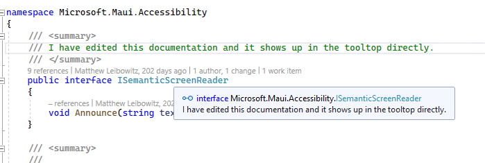

# Code Documentation Guidelines

In this document you will find the guidelines for adding XML comments to our codebase. By adding consistent and well-formatted comments to our code we benefit on all fronts: the online API docs are a useful reference for people looking up our APIs, the IntelliSense inside of Visual Studio will help developers understand our product better, and contributors and maintainers of this repository will have all the documentation at hand.

## Guidelines

For what kind of comments to our code we mainly follow the [recommended XML tags documentation](https://learn.microsoft.com/dotnet/csharp/language-reference/xmldoc/recommended-tags) by Microsoft. This is also what is best supported by Visual Studio. As a rule of thumb: complete your code first and just start typing a triple slash (`///`) above your code. That will suggest all the attributes that we want to see. Which attributes will show up is inferred from your code.

If you're unsure about how to document a certain element, have a look the [.NET API docs wiki](https://github.com/dotnet/dotnet-api-docs/wiki) which has a very extensive description on what kind of comment to add on which element in the code. We would highly recommend going through that and applying the same style of comments everywhere.

These are the tags that we would like to see when applicable: `
`, `<remarks>`, `<returns>`, `<param>`, `<exception>`, `<inheritdoc>`, `<see>`, `<c>`.

* All public members should have at the very least a `
`
* Add "This is a bindable property." to the end of the summary of the regular C# properties that are bindable properties.
* Keep the descriptions short and concise
  * 1-2 lines typically, no screenshots or long code-blocks (those belong in the conceptual docs)
* Make sure the spelling is correct
* Add the descriptions at the highest base class/interface level. On an implementing type add `<inheritdoc/>` on each member
  * If the implemented member differs too much you can choose to override the comments;  typically this shouldn't be necessary
  * When adding `<inheritdoc/>` on a class where you want to inherit the comments from an interface, you will have to be explicit about which interface to inherit from. Even if the class only implements one interface. For example: `<inheritdoc cref="IEntry"/>` will inherit the comments from the `IEntry` interface.
  * Do **not** add `<inheritdoc/>` to overridden members, this will potentially cause issues in the online API docs system and doesn't add any value. The documentation is inherited implicitly.
* Where applicable make references to other types and parameters with the appropriate tags (`<see cref="YourType"/>` and `<paramref name="parameterName"/>` respectively). This will create links in IntelliSense and online API docs
* Reference all C# keywords with a `<see langword="keyword"/>` tag. For example for `true`: `<see langword="true"/>`
* If you do want to add a minimal amount of code in your comment, use the `<c></c>` tags which formats it as code
* Think of things you'd like to know as a developer/future-you maintainer:
  * default values that are not obvious
  * in which scale a value should be (seconds or milliseconds, 0.0 is nothing 1.0 is everything)
  * what exceptions can you expect and what triggers them

If you are looking for examples, browse through the codebase, searching for the `
` tag or `///` should give you all kinds of examples.

## "Testing" the documentation

You can "test" the docs by simply hovering over the type in Visual Studio. The IntelliSense updates should be instantaneous when you have edited something. See image below for an example.

