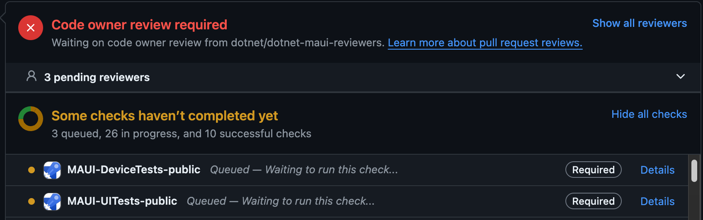
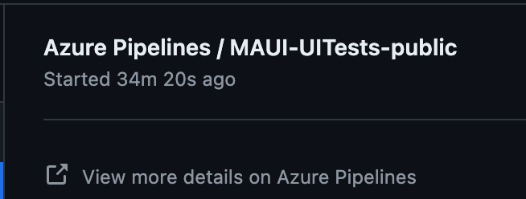
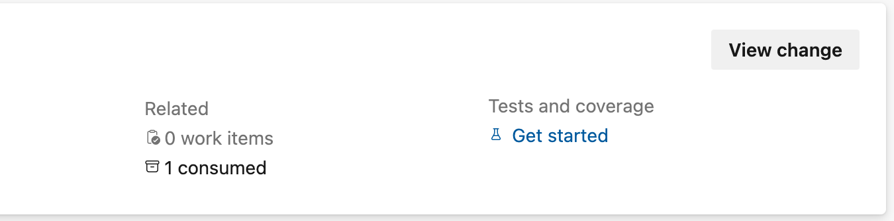
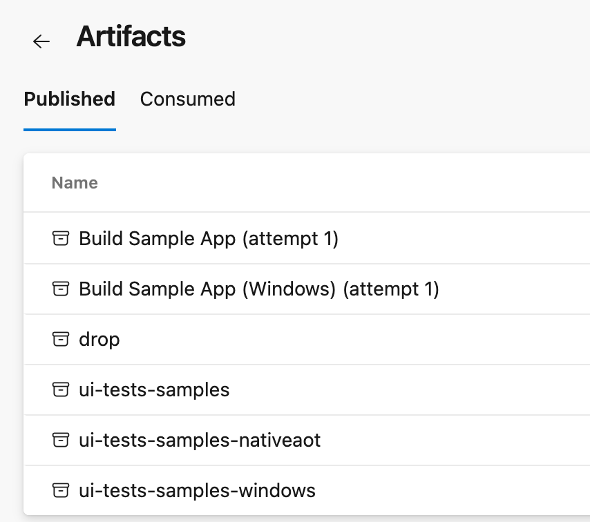
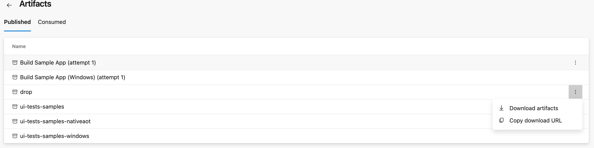
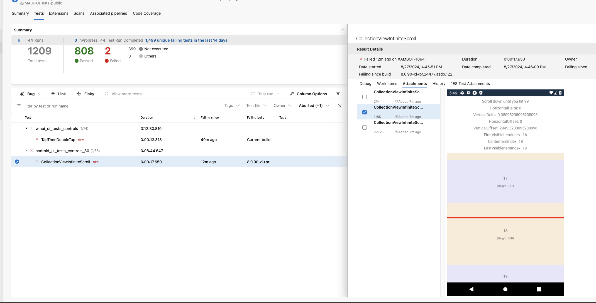

# UI Testing Architecture and CI Integration

This document covers the architecture decisions, CI/CD integration, and advanced topics for .NET MAUI UI testing.

**For day-to-day test writing**, see [UITesting-Guide.md](../UITesting-Guide.md).

## Overview

This document focuses on architecture, CI/CD integration, and advanced topics for .NET MAUI UI testing. For basic concepts and API reference, see the [UITesting-Guide.md](../UITesting-Guide.md).

## Local Development Tips

### Using MauiProgram.user.cs for Rapid Testing

When working on a single test case, you can bypass the test selection UI and launch directly to your issue page:

1. Create `src/Controls/tests/TestCases.HostApp/MauiProgram.user.cs` (not tracked by git):

```csharp
using Controls.TestCases.HostApp.Issues;

namespace Maui.Controls.Sample;

public partial class MauiProgram
{
    static partial void OverrideMainPage(ref Page mainPage)
    {
        mainPage = new Issue99999(); // Your issue number here
    }
}
```

2. Run the HostApp normally - it will load your issue page directly
3. This file is gitignored, so it won't be committed by mistake

**Benefits:**
- Faster iteration when developing/debugging a single test
- No need to navigate through test selection UI
- See visual changes immediately

## CI/CD Integration

### Screenshot Verification Workflow

Testing against saved screenshots from CI is important for visual regression testing. Here's how to set up screenshot verification:

#### 1. Add Screenshot Verification to Test

```csharp
[Test]
public void MyVisualTest()
{
    App.WaitForElement("MyElement");
    // ... test interactions ...

    VerifyScreenshot(); // Call at end of test
}
```

#### 2. Run on CI to Generate Baseline

1. Create a PR with your test
2. Wait for CI to run
3. At the bottom of your PR, find the checks section
4. Locate `Maui-UITestpublic` (marked as required) and click **Details**

   

5. Click "View More Details on Azure Pipelines"

   

6. On the summary page, find the box with "Related" and click **Consumed**

   
   

7. Click the three dots next to "Drop" and download

   

#### 3. Add Baseline Screenshots to Repository

1. Unzip the downloaded artifact
2. Navigate to `Controls.TestCases.Shared/` folder to find your snapshot
3. Add the `.png` file to the appropriate platform-specific snapshots folder:
   - **Android**: `src/Controls/tests/TestCases.Android.Tests/snapshots/`
   - **iOS**: `src/Controls/tests/TestCases.iOS.Tests/snapshots/ios/`
   - **Windows**: `src/Controls/tests/TestCases.Windows.Tests/snapshots/`
   - **MacCatalyst**: `src/Controls/tests/TestCases.Mac.Tests/snapshots/`

4. **Important**: File name must match your test method name exactly
5. **Note**: iOS has `ios/` and `ios-iphonex/` subfolders - only submit to `ios/`
6. Commit and push to your PR

#### 4. Failed Test Screenshots

When tests fail, CI produces comparison screenshots showing differences:
- Failed screenshots have `-diff` suffix
- Red highlighting indicates problem areas
- View these in the test results on Azure Pipelines



## Advanced Test Patterns

### Gallery Page Architecture

Gallery tests run the same set of tests across multiple controls. When creating a new control, add a gallery page.

**Base Classes:**
- [CoreGalleryPage](https://github.com/dotnet/maui/blob/main/src/Controls/tests/TestCases.HostApp/CoreViews/CoreGalleryPage.cs)
- [ContentViewGalleryPage](https://github.com/dotnet/maui/blob/main/src/Controls/tests/TestCases.HostApp/Elements/ContentViewGalleryPage.cs)

Derive from these to automatically get standard test interactions for your control.

### Restarting the App Between Tests

By default, all test methods in a class run in the same app instance. The app restarts when moving to the next test class.

To restart the app after **each test method**:

```csharp
public class MyIssueTests : _IssuesUITest
{
    protected override bool ResetAfterEachTest => true;

    // Each test method below will get a fresh app instance
}
```

**Use this when:**
- Tests modify global state
- Tests have side effects that affect other tests
- You need guaranteed isolation between test methods

### Platform-Specific Tests

Use preprocessor directives when tests can't run on all platforms:

```csharp
#if !MACCATALYST
[Test]
public void ScreenshotTest()
{
    // This test won't appear on MacCatalyst
    VerifyScreenshot();
}
#endif
```

**Common scenarios:**
- `VerifyScreenshot()` doesn't work on MacCatalyst (yet)
- Platform-specific APIs being tested
- Known platform limitations

When compiling for that platform, the test won't appear in the test list.

## Logging and Diagnostics

Access logs from CI builds using the same "Drop" artifact download process as screenshots.

### Platform-Specific Logs

**All Platforms:**
- `appium_<platform_name>.log` - Appium driver output

**iOS:**
- `logarchive` files - Console output from simulator
- Note: May include logs from other simulators, verify timestamps

**Android:**
- `logcat` file - Only present if test failed or device crashed
- Contains full device logs for troubleshooting

**Windows & Mac:**
- Log output currently only available in [Device Tests](https://github.com/dotnet/maui/wiki/DeviceTests)
- Use Device Tests for detailed Windows/Mac diagnostics

### Debugging Tips

1. **Check Appium logs first** - Often shows element location failures
2. **Look for timing issues** - Missing `WaitForElement` calls
3. **Verify AutomationIds** - Must match exactly between XAML and test
4. **Platform differences** - Some elements behave differently per platform

## Known Issues and Limitations

### iOS Nested Accessibility Elements
- iOS doesn't support nested accessibility elements
- Some elements may be unreachable through the accessibility tree
- **Workaround**: Flatten your UI hierarchy or use direct coordinate tapping

### Windows Layout AutomationId
- AutomationId doesn't work on layouts on Windows
- Appium uses the accessibility tree, and layouts aren't visible there
- **Workaround**: Focus on individual elements (Label, Entry, Button, etc.)

### MacCatalyst Screenshot Verification
- `VerifyScreenshot()` not currently supported on MacCatalyst
- **Workaround**: Use `#if !MACCATALYST` to skip screenshot tests on Catalyst

## Additional Resources

- [UITesting-Guide.md](../UITesting-Guide.md) - Complete practical guide for writing tests
- [Testing Wiki](https://github.com/dotnet/maui/wiki/UITests) - Setup and running tests
- [Device Tests Wiki](https://github.com/dotnet/maui/wiki/DeviceTests) - Alternative testing approach
- [Types of Tests](https://github.com/mattleibow/DeviceRunners/wiki/Types-of-Tests) - Understanding test types in MAUI
