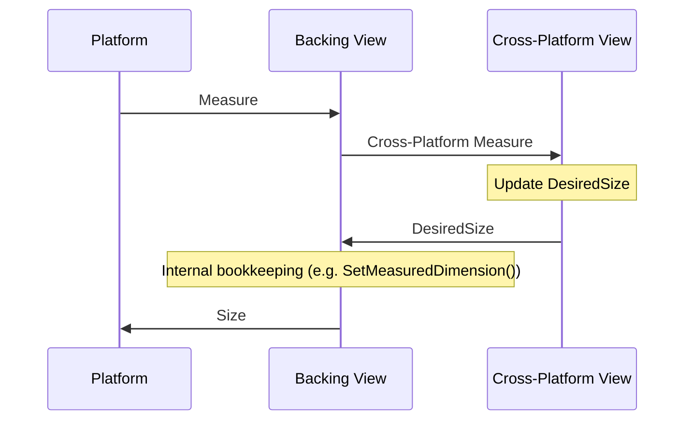
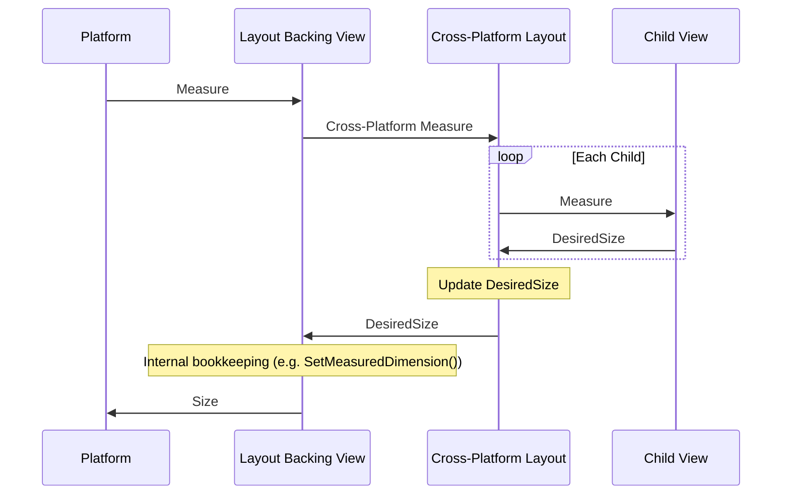
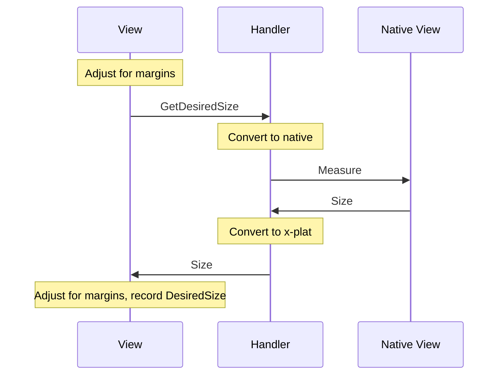

# Cross-Platform Layout

This document explains the workings of .NET MAUI's cross-platform layout system. It primarily includes details of the MAUI.Core layer (where most of the layout is implemented), plus some exceptions/customizations in MAUI.Controls which are included for backward compatibility with Xamarin.Forms. 

This document is a work in progress.

# The Basics 

## LayoutAlignment

Layout alignment controls how a View positions itself in a container. The possible options are `Fill`, `Start`, `Center`, and `End`. `Fill` is the default for all of the Views in the Controls SDK. 

`LayoutAlignment` in Core is mostly handled by the `ComputeFrame()` extension method. When a View is being arranged in a Rect, it calls `ComputeFrame()` to determine what its Frame should be. Frames are always in relation to the container. 

For ease of migration, Controls still uses the `LayoutOptions` structure, which also includes the (deprecated) "AndExpand" flags. The Core layout system ignores the "AndExpand" flags and  translates the Fill/Start/Center/End values from `LayoutOptions` to the `LayoutAlignment` enumeration. 

- Note: Controls still supports "AndExpand" on StackLayout (but _not_ VerticalStackLayout or HorizontalStackLayout). It does this by converting the StackLayout at runtime to a single column or single row Grid. Because that's all "AndExpand" was ever really doing in Forms.
	
### Center

The View is centered within the container along the axis. 

### Start/End

The View is aligned with the starting or ending edge of the container along the axis. Vertically, `Start` is the top edge, `End` is the bottom edge. Horizontally, when the `FlowDirection` of the container is LTR, `Start` is the left edge and `End` is the right edge. When the container's `FlowDirection` is RTL, these are reversed. 

However, the Core layout code doesn't actually worry about this - it always computes the frames as if the layout were LTR. The underlying platforms do all the work to flip the layouts in the LayoutHandlers and the platform layout views (e.g., LayoutViewGroup and LayoutPanel). So the Core layout engine doesn't have to worry about effective flow direction. 

### Fill

If the View does not have an explicit size along the axis, then `Fill` will make the `Frame` be the size of the container in that direction (minus any margins). The `DesiredSize` of the View doesn't matter - `Fill` will stretch/shrink the View to the container size. 

If the View _does_ have an explicit size along the axis (i.e, if the `Width` or `Height` is set to something other than `Dimension.Unset`), then `ComputeFrame()` now has a conflict - the user has requested that the View fill a space, but they've also requested an explicit size. In this case, the explicit size wins. The `Frame` will have the explicit size, and if that size is less than the available space the `Frame` will be aligned to the center of the space. 

For example, given this layout...

```
<VerticalStackLayout WidthRequest="400">
    <Label Text="Hello" WidthTRequest="100" HorizontalOptions="Fill"/>
</VerticalStackLayout>
```

...the label will be 100 units wide and centered horizontally. This also applies to Maximum/Minimum sizes along the axis; e.g., 

```
<VerticalStackLayout WidthRequest="400">
    <Label Text="Hello" MaximumWidthRequest="50" HorizontalOptions="Fill"/>
</VerticalStackLayout>
```

...will also center the Label horizontally, and will limit it to 50 units wide.


## Dimension 

The layout code in Core relies on several constants set in `Microsoft.Maui.Primitives.Dimension` to avoid any confusion from magic numbers when dealing with the height/width of views. 

By default, the height/width of a view in Core's layout is `Dimension.Unset`; this indicates that the view should be whatever size the underlying platform wants given other constraints (container size, etc.). To indicate an explicit, user-set height/width for an `IView`, the `IView.Width` or `IView.Height` need to return an actual number (between `Dimension.Minimum` and `Dimension.Maximum`). The `Dimension.IsExplicitSet()` helper can be used to check for that. 

By definition, any IView in the Core layout system has a minimum width/height set (if not otherwise specified, it's zero). Whether a maximum width/height has been set can be checked with `Dimension.IsMaximumSet()`.

In the Controls layer there are some disconnects between these values in order to provide backward compatibility with magic numbers from Forms. So a View can set a `WidthRequest` of -1, and this will ultimately map to `Dimension.Unset`.

## Z-Index

Z-Index as a Core layout concept does not explicitly map to any platform z-index properties. Instead, it relies on the ordering of the platform controls within the layout backing controls on each platform. 

For example, in an Android ViewGroup, absent any other Elevation settings, the children of the ViewGroup will be drawn in order; the first child will be the "lowest", with subsequent overlapping children being drawn atop one another. Windows and iOS work similarly. 

So in the Core LayoutHandler implementations, the views in the `ILayout` are sorted by their `ZIndex` (preserving their collection order) when they are added to the platform layout control. This ordering is preserved as children are added, removed, or have their `ZIndex` modified. Because controls later in the collection are drawn over controls earlier in the collection, this effectively gives us a z-index without explicitly mapping any properties. 

The underlying platforms _do_ have concepts akin to z-index, but they behave differently enough that simple mapping causes side effects that are undesirable for our cross-platform layouts. (Specifically, Android's closest property, `Elevation`, also affects the shadows of elevated views, and causes problems when elevating controls like Button, which utilizes `Elevation` for state effects like "pressed".)

### Example 1

A Grid has 3 children:

	Label1 { ZIndex = 0 }
	Label2 { ZIndex = 0 }
	Label3 { ZIndex = 0 }

The LayoutHandler will create a LayoutViewGroup with the children in the order {Label1, Label2, Label3}.

### Example 2

A Grid has 3 children:

	Label1 { ZIndex = 0 }
	Label2 { ZIndex = 10 }
	Label3 { ZIndex = 0 }

The LayoutHandler will create a LayoutViewGroup with the children in the order {Label1, Label3, Label2}. Label2 is pushed to the top because it has the highest z-index. The order of Label1 and Label3 with respect to one another is preserved.

## Padding

Padding is space _inside_ of a view around the _content_ of that view. Anything that implements IPadding can have padding. In some cases, the padding is provided by the platform (by mapping the IPadding thickness values to platform padding properties). For cross-platform layouts, the padding is provided by the layout system.

If padding is requested in the layout system it will be provided to the best of the system's ability. This means that the content of a control _will_ be shrunk enough to provide the padding even if that means shrinking the control to its minimum size (possibly zero). 

## Margin

Margin is space _outside_ of a view. Margins are handled entirely by the layout system. Like padding, if a margin is requested it will be granted, even if that shrinks the platform view itself to nothing. 

Margins are included in the `DesiredSize` that a view reports after measurement.

## Visibility

In MAUI.Core, Visibility has 3 possible values:

- Visible: the item is visible
- Hidden: the item occupies space, but cannot be seen
- Collapsed: the item does not occupy space, and cannot be seen

The MAUI.Core built-in layouts understand and honor all three values. 

In MAUI.Controls, for backward-compatibility, visibility is limited to two values via the `IsVisible` property. `IsVisble == true` maps to `Visibility.Visible`; `IsVisible == false` maps to `Visibility.Collapsed`. 

The mapped implementations of visibility for individual controls in MAUI.Core _should_ all handle `Visibility.Hidden` properly. So while MAUI.Controls does not have the concept of `Visibility.Hidden`, other SDKs can use it if they like. And custom handlers/controls in MAUI.Controls can also make use of it if they need to. 

## Layout vs ContentView

A Layout is a list of views with rules and properties defining how to arrange those views within a frame. Examples of Layouts include Grid, AbsoluteLayout, StackLayout, VerticalStackLayout, and HorizontalStackLayout. 

A ContentView is responsible for displaying a single view. It takes an input view (the `Content` property) and displays an output view (the `PresentedContent` property). The input view and output view may be the same, or there may be some transformation applied (e.g., using a template). Examples of ContentViews include Page and ScrollView. 

Note: Because of some backward-compatibility constraints, in some cases the base classes for the implementations in MAUI.Controls are confusing. So while ScrollView is not a Layout, it does inherit from the Layout class. 

## Measure/Arrange

The cross-platform measure/arrange process in MAUI.Core piggybacks on each platform's layout process. Whenever the platform requests the measure or arrangement of a backing control (e.g., a ContentViewGroup, LayoutViewGroup, LayoutPanel, etc.), the backing control calls its `CrossPlatformMeasure()` or `CrossPlatformArrange()` method. 

### CrossPlatformMeasure

In a Layout, `CrossPlatformMeasure()` is responsible for calling `IView.Measure()` on each of the Layout's children. In a ContentView, `CrossPlatformMeasure()` is responsible for calling `IView.Measure()` on the ContentView's `PresentedContent` view.

### CrossPlatformArrange

In a Layout, `CrossPlatformArrange()` is responsible for calling `IView.Arrange()` on each of the Layout's children. In a ContentView, `CrossPlatformArrange()` is responsible for calling `IView.Arrange()` on the ContentView's `PresentedContent` view.

## Platform Backing Layouts

All layouts are backed by a single control per platform:

<table>
<thead><tr><th>Platform</th><th>Control</th></tr></thead>
<tbody>
<tr><td>iOS</td><td>LayoutView</td></tr>
<tr><td>Android</td><td>LayoutViewGroup</td></tr>
<tr><td>WinUI</td><td>LayoutPanel</td></tr>
</tbody>
</table>

(If you're familiar with how layout worked in Xamarin.Forms, these backing controls are similar to the `DefaultRenderer` implementations on each platform.)

Layouts are mapped to these controls via a LayoutHandler. The LayoutHandler is responsible for adding the platform controls for each child of the layout to the backing control, keeping them in an appropriate Z-Index order, and mapping the `CrossPlatformMeasure()` and `CrossPlatformArrange()` methods.

When a backing control (e.g., LayoutViewGroup) is being measured (in response to the platform's measure/layout pass), it calls `CrossPlatformMeasure()` on its cross-platform IView. When the backing control is being arranged, it calls `CrossPlatformArrange()`. This is one of the points where control is passed between the platform's layout system and MAUI.Core's layout system. 

The backing controls also handle bounds clipping for their layouts, and are capable of handling safe area on platforms which support it. 

- Note: at the moment, we only support Safe Area on iOS. We _should_ support it on Android, but we haven't done that yet.

## Platform Backing ContentViews

All content views are backed by a single control per platform:

<table>
<thead><tr><th>Platform</th><th>Control</th></tr></thead>
<tbody>
<tr><td>iOS</td><td>ContentView</td></tr>
<tr><td>Android</td><td>ContentViewGroup</td></tr>
<tr><td>WinUI</td><td>ContentPanel</td></tr>
</tbody>
</table>

ContentViews are mapped to these controls via a ContentViewHandler. The ContentViewHandler is responsible for setting up the backing control, updating the platform content, and mapping the `CrossPlatformArrange()` and `CrossPlatformMeasure()` methods. 

As with layouts, the ContentView backing controls handle bounds clipping and safe area.

# Layout Implementation

## ILayout/ILayoutManager

The ILayout interface is composed of a few other interfaces - it's an IView, an IContainer (that is, it's a list of other IViews), an IPadding (it provides padding around its content), and an ISafeAreaView (it's aware of the safe area of the host platform, and is able to either confine itself to the safe area, or ignore the boundaries).

It also provides the `ClipsToBounds` property, which determines whether its child views can be displayed outside of its boundaries, or are clipped at the edges. 

> 📝 In MAUI.Controls, the value of `ClipsToBounds` is provided by the `IsClippedToBounds` property of Layout. For migration convenience from Xamarin.Forms, the `IsClippedToBounds` property defaults to `false`, so layouts in MAUI.Controls _do not clip_ by default. 

The ILayout interface also provides the `CrossPlatformMeasure()` and `CrossPlatfromArrange()` methods; these methods are utilized by the platform backing controls (e.g. LayoutViewGroup) to handle the cross-platform layout work. 

Technically speaking, it's possible to implement all of the cross-platform layout logic directly in an implementation of ILayout, and it's possible that some SDKs may choose to do so. But by convention, that work is instead delegated to an implementation of ILayoutManager. 

ILayoutManager defines two methods - `Measure()` and `ArrangeChildren()`. By convention, the ILayout implementation can call `ILayoutManager.Measure()` to do the work of `CrossPlatformMeasure()` and `ILayoutManager.ArrangeChildren()` to do the work of `CrossPlatformArrange()`. All of the actual logic to handle cross-platform layout is contained in the ILayoutManager implementation; this allows us to mix/match/reuse implementations, and it allows other SDK implementors to reuse that logic in other layout types if they desire. 

In MAUI.Controls, the abstract type `Layout` handles delegating the cross-platform measure and arrange calls to a layout manager. It also contains a predefined overridable method `CreateLayoutManager()` that derived layouts can use to specify the layout manager they want. And it contains logic which can look for an `ILayoutManagerFactory` service implementation. Layout handles most of the work of adding/removing child views, and provides several virtual methods for doing addtional bookkeeping when the collection changes. It also contains logic for notifying the ILayoutHandler implementation of those changes, so the LayoutHandler can do things like adding/removing platform controls and sorting by z-index.

## Customization

The built-in layouts have predefined layout managers to handle their layout. However, it's possible that users may want to define custom layout logic for layouts. There are two ways to do this.

The first is to create a custom layout type (usually a subclass of an existing layout type, or of Layout) and override `CreateLayoutManager()`. 

The alternative is to implement `ILayoutManagerFactory`, register the implementation with the application's service provider, and use that to define which layout manager implementation is to be used for each layout type. In this second scenario, it's possible to define a new layout manager for an existing layout type; e.g., a user can provide a custom layout manager for Grid, with different layout rules or other customizations. This is especially useful for situations where users would like to patch in a previously deprecated behavior for a layout. It's also great when you would like a new behavior but don't want to update the type of an existing widely-used layout. 

Creating custom layouts and layout managers is relatively easy; [we keep a repo of examples](https://github.com/hartez/CustomLayoutExamples) to help folks get started.

# The Layouts

The following descriptions apply to the default layout manager implementations provided in MAUI.Core and MAUI.Controls. 

## VerticalStackLayout/HorizontalStackLayout

VerticalStackLayout and HorizontalStackLayout are very straightforward - they stack their child views next to each other. 

In the unconstrained direction (vertically for VSL, horizontally for HSL), they stack their child views one after the other until all of them have been stacked. They are unconstrained in this direction; they will keep stacking even if it takes them past the width or height constraint parameters given to the Measure and Arrange methods. In other words, the effective height constraint of a VerticalStackLayout is always infinity; the effective width constraint of a HorizontalStackLayout is always infinity.

In the other direction, the layout is constrained. For example, a single VerticalStackLayout on a Page will have its width constrained to the Page's width. 

Putting a VSL or HSL into a ScrollView with the appropriate scrolling direction will allow the user to view content which exceeds the size of the container. 

Both layouts provide a Spacing property; this spacing is applied between all visible items in the layout. Views which have `Visibility.Collapsed` are not displayed and do not count for spacing purposes.

## StackLayout

StackLayout works the same as VerticalStackLayout/HorizontalStackLayout, but it also includes the `Orientation` property. The StackLayout uses this property to determine whether it will render a VerticalStackLayout or a HorizontalStackLayout. Under the hood, the `Orientation` property simply switches the LayoutManager being used. 

StackLayout also checks its child views for the presence of any "AndExpand" layout options; if any exist in the relevant direction (e.g., if there are vertical "AndExpand" options and the `Orientation` is set to `Vertical`), then an AndExpandLayoutManager is swapped in. This LayoutManager converts the StackLayout at runtime to a single row/column Grid, with the appropriate row/column definitions to expand the views which require it. 

## Grid

Grids subdivide a given area into rows and columns for arranging their child views. 

### RowDefinitions and ColumnDefinitions

The set of rows and columns in a Grid is defined by its RowDefinitions and ColumnDefinitions. Rows are defined in order from the top of the Grid downward. A Grid with no explicit RowDefinitions defaults to a single row with height `GridLength.Star`. Columns are defined in order from the left to the right. A Grid with no explicit ColumnDefinitions defaults to a single column with width `GridLength.Star`.

### Spacing

A Grid can specify `ColumnSpacing` and `RowSpacing`. These are `double` values which specify how much empty space the Grid should leave between its rows and columns. Spacing on both axes defaults to zero. Spacing is applied _between_ rows/columns; it is not applied to the outside edges of the Grid. A Grid with a single column or row will not have any spacing applied on that axis.

Empty rows/columns still count for the purposes of spacing - if the row/column does not have any child views in it, the spacing is still applied. For example, the following Grid:

```xaml
<Grid RowSpacing="10" ColumnSpacing="10" RowDefintions="Auto, Auto" ColumnDefinitions="Auto,Auto" />
```

will measure 10x10, even though it's empty. 

### GridLength

Every row and column definition specifies a `GridLength`, which can be of three types:

#### Explicit

A `double` value which specifies the size of the row/column. When specified, the row/column will get this size in the final layout regardless of its content. 

#### Auto

The Grid will measure all of the child Views in the row/column and set the height/width large enough to accommodate the largest View. If the row/column has no child Views, its size will be set to zero. The row/column still counts for the purposes of spacing, however. 

#### Star

"Star" values indicate a weighted portion of the remaining space available. Star values are specified in the format "[weight]*", where [weight] is a `double` and defaults to 1.0 if not specified.

As an example, take a Grid with `HeightRequest="100"` and `RowDefinitions="*,2*,6*,0.5*,0.5*"`. The available space is 100 units. The sum of the weights is 10 (1 + 2 + 6 + 0.5 + 0.5). So the size of each "*" is 100 / 10 = 10. Therefore, the rows would have heights of 10, 20, 60, 5, and 5 units.

`GridLength.Star` only has meaning when its axis is constrained; the concept of "remaining space" stops making sense when the space is infinite. When a row or column with `GridLength.Star` is measured with a constraint of `double.PositiveInfinity`, it is treated as if it were `GridLength.Auto`. 

## AbsoluteLayout

AbsoluteLayout allows child views to be positioned and sized using explicit values and/or proportionally to the size of the layout.

The layout of a child view in AbsoluteLayout can be specified with a combination of two values:

### LayoutBounds

The layout bounds of a child view is a `Rect` which specifies the position and size of the view. If not specified, the default layout bounds for a view are a position of (0, 0) with the `Width` and `Height` properties set to `AbsoluteLayout.AutoSize` (a constant value of -1). 

### LayoutFlags

The layout flags of a child view specify how the values in the layout bounds are used. By default, no flags are specified (`AbsoluteLayoutFlags.None`). The `XProportional` and `YProportional` values can be independently set, or both values can be set at once by setting `PositionProportional`. Likewise, `HeightProportional` and `WidthProportional` can be set independently, or both can be set at once with `SizeProportional`. All flags can be set at once using `AbsoluteLayoutFlags.All`.

### Layout Bounds/Flags Interaction

The layout rules for a child view are determined by a combination of its layout bounds and its layout flags:

#### Position

If the `XProportional`/`YProportional` flags are set, then the X/Y values of the layout bounds are multiplied by the width/height of the AbsoluteLayout to determine the final X/Y coordinate values. For instance, imagine an AbsoluteLayout which is 100 x 100. It has a child with layout bounds of (0.4, 0.6, 20, 20), and the child's `XProportional` and `YProportional` flags are set. The position of that child will be X = (100 * 0.4) = 40 and Y = (100 * 0.6) = 60. 

If `XProportional`/`YProportional` flags are not set, then the X and Y values in the layout bounds are explicit values. For instance, imagine an AbsoluteLayout which is 100 x 100. It has a child with layout bounds of (45, 67, 20, 20), and the child's `XProportional` and `YProportional` flags are  _not_ set. The position of that child will be X = 45 and Y = 67. 

Both explicit and proportional position values _can_ exceed the boundaries of the AbsoluteLayout.

#### Size

If the `WidthProportional`/`HeightProportional` flags are set, then the Width/Height values of the layout bounds are multiplied by the width/height of the AbsoluteLayout to determine the final Width/Height values. For instance, imagine an AbsoluteLayout which is 100 x 100. It has a child with layout bounds of (0, 0, 0.3, 0.47), and the child's `WidthProportional` and `HeightProportional` flags are set. The size of that child will be Width = (100 * 0.3) = 30 and Height = (100 * 0.47) = 47. 

If `WidthProportional`/`HeightProportional` flags are not set, then the Width and Height values in the layout bounds are explicit values. For instance, imagine an AbsoluteLayout which is 100 x 100. It has a child with layout bounds of (0, 0, 45, 20), and the child's `WidthProportional` and `HeightProportional` flags are  _not_ set. The size of that child will be Width = 45 and Height = 20. 

Both explicit and proportional size values _can_ exceed the boundaries of the AbsoluteLayout.

### Unbounded Dimensions

If the AbsoluteLayout is unbounded along a dimension (e.g., if it's a child of a VerticalStackLayout, and is not provided with an explicit height), then the concept of "proportional" along that dimension has no meaning. Proportional flags along those dimensions are ignored; if the layout bounds specifies a non-Auto value along that dimension, it will be used. Otherwise, the automatic size of the view will be used along that dimension.

For example, say an AbsoluteLayout is the child of a VerticalStackLayout with a width of 200. The only child of the AbsoluteLayout has LayoutBounds of (0, 0, 100, 0.5) and has `AbsoluteLayoutFlags.HeightProportional` set. Because the AbsoluteLayout has no vertical constraints, the `AbsoluteLayoutFlags.HeightProportional` flag is ignored, and the child's height is set to the value of 0.5 from its layout bounds. 

# The Layout Process

The cross-platform layout process in Maui.Core piggy-backs off of the native layout process on each platform. Generally speaking, _all_ layout work is initiated by the native layout system; the cross-platform layout process kicks in when a layout or content backing control initiates it as a result of being measured/arranged by the native layout system.

The following diagram shows the process when the native layout system wants to measure a backing view:



For the purposes of walking through this, let's assume that the cross-platform View being measured is a ContentView which contains a Label. The native platform (e.g., Android) needs to know the size of the ContentView, given some constraints. Let's say 100 units for the width, 200 units for the height. 

The platform calls `Measure()` on the ContentView's backing view (e.g., on Android this would be a `ContentViewGroup`) with the constraints. The backing view converts those constraints to cross-platform units (if necessary), and then calls its `CrossPlatformMeasure()` method with those constraints to determine how large the content (the Label in this case) would like to be.

The `CrossPlatformMeasure()` method is responsible for calling the Label's `Measure()` method. The Label measures its native counterpart (more on that later), and updates its `DesiredSize` property based on that measurement. That value is returned to to the backing view as the result of `CrossPlatformMeasure()`. The backing view does whatever internal bookkeeping it needs to, then returns its measured size to the platform.

## Measuring a Layout

The process for Layout measurement is basically the same as described above, except that multiple child views need to be measured:



The process of iterating over the child views and measuring each one is generally handled by the LayoutManager for each type of Layout, inside of the LayoutManager's `Measure()` method.

## Measuring a View

Any time a cross-platform View is measured, it hands off the actual measurement to its native counterpart. 

For instance, in the example above, the Label's `Measure()` method takes the constraints it is given by `CrossPlatformMeasure()` and makes any appropriate adjustments (for example, subtracting its margins). It then hands off the updated constraints to its Handler's `GetDesiredSize()` method. The Handler is aware of the native control (a TextView, on Android); the Handler takes care of converting the constraints to appropriate values for the platform and calling the native control's version of `Measure()`. The Handler takes the return value from the native measurement and converts it back to cross-platform values (if necessary) and returns it to the Label. 

The Label adjusts the result if necessary (for example, by adding back in the size of its margins), and then tracks that result in its `DesiredSize` property. It then returns that value as the result of `Measure()`. 



## Other Notes

Each platform handles layout slightly differently; one of the goals of the cross-platform layout code is to be as platform-agnostic as possible. All special-case scenarios should be dealt with in the handler platform code for each platform. `#if` in cross-platform layout code is a code smell; if it's _ever_ necessary (and it probably shouldn't be), it needs to have a _lot_ of explanation. 

As a general rule, any layout pass should call `Measure()` before calling `Arrange()`. It's perfectly legal to call `Measure()` multiple times before calling `Arrange()`; a platform may need to do some speculative measurements before arranging views. 

It is also legal to call `Arrange()` multiple times at different sizes/locations as long as `Measure()` has been called at least once. For example, a desktop application may determine that a window resizing operation requires arranging a view at a different location, but that the changes to the window size could not have affected the measurements of the view - there's no reason to re-measure the view. 

Each platform generally handles its own optimization of measurement operations; the platform code is much better at making such decisions than the cross-platform layout code ever could be. The goal of the cross-platform code should be to get out of the way and allow the platform to do its own optimization. For example, if the cross-platform code calls `Measure()` on an Android view twice in a row with the same `measureSpec` values, the native Android code will simply return the cached value unless it determines that there's a good underlying reason for the native view to be remeasured. Attempting to make that decision (or cache the measurement value) at the cross-platform level defeats the native decision making (which has far superior local knowledge). 

# Platform Notes

## Measurement on Android

### MeasureSpec

When you see native Android measurement methods, usually they take parameters called `widthMeasureSpec` and `heightMeasureSpec`. You may notice that these tend are integer values. It is very important to note that these are not equivalent to the `double widthConstraint` and `double heightConstraint` values that we use for cross-platform measurement in MAUI. Rather, these are an [Android construct](https://developer.android.com/reference/android/view/View.MeasureSpec) - a packed integer value that includes _both_ the size of the constraint and the type of constraint.

The mode of the measureSpec (that is, the type of constraint), is packed into the upper bits of the integer. The possible options are `UNSPECIFIED`, `EXACTLY`, and `AT_MOST`. See https://developer.android.com/reference/android/view/View.MeasureSpec for more info on what those values mean. 

The size of the measureSpec is in the rest of the bits. We have convenience methods in the `MeasureSpec` class for extracting both the size of the spec and the mode. 

So even though a `measureSpec` is an integer, you cannot simply add or subtract values from it. If you want to increase or decrease the measurement constraints, you need to unpack the size, make your changes, and pack that into a new measureSpec using `MeasureSpec.MakeMeasureSpec()`. If you try to simply add or subtract values from a measureSpec, the nature of integers and integer overflow will result in nonsense values. 

It is also important to remember that measureSpec size values should always be in native pixels. This means that when constructing a measureSpec from cross-platform sizes, you need to convert the sizes using `Context.ToPixels()`. 

# Legacy Notes

## OnSizeAllocated

The `VisualElement.OnSizeAllocated(double width, double height)` method is still available for overriding to support controls being ported from Xamarin.Forms to MAUI.Controls. In Forms, this method was typically used to react to size changes; occasionally it was a way to ensure that a control was part of the control hierarchy and ready to show up on screen. 

This method does not exist at all in MAUI.Core; in MAUI.Controls, it's available for backward compatibility and is called when the `Frame` (also aliased as `Bounds` for backward compatibility) is updated during the `Arrange` portion of the layout process. Specifically, it's called when the `Frame` is set; for a typical VisualElement this is during the `ArrangeOverride()` method, right before the native platform's arrange method is called. 

When creating a custom component for MAUI.Controls, the suggested customization point is an override of the `ArrangeOverride(Rect bounds)` method, rather than `OnSizeAllocated()`. This provides more flexibility. 

## Xamarin.Forms -> MAUI.Controls Layout Differences

### StackLayout
 
There are a few differences between the stack layouts in MAUI (StackLayout, VerticalStackLayout, and HorizontalStackLayout) and the StackLayout in Xamarin.Forms. The first is that the MAUI stack layouts are _very_ simple; they stack their child views in a single direction until all of them have been stacked. They will keep going until the last child has been stacked, even if that takes them beyond the available space in the stacking direction. MAUI stack layouts simply arrange controls in a particular direction; they do not subdivide a space. 

This is in contrast to the Xamarin.Forms StackLayout, which changes its behavior based on circumstances and the presence of any "AndExpand" layout options (e.g., `FillAndExpand` or `CenterAndExpand`). Sometimes the Forms StackLayout subdivides the space, expanding to (or stopping at) the edge of its container; in other cases, it expands beyond its container. All of these special cases impact layout performance and make the behavior of the StackLayout more difficult to reason about. 

This brings us to the second main difference: the MAUI VerticalStackLayout and HorizontalStackLayout do not recognize the "AndExpand" layout options. If they see a child with layout options that include "AndExpand", they simply treat it as if the "AndExpand" weren't there - e.g., `FillAndExpand` becomes `Fill`. 

For simplicity of migration from Forms to MAUI, the MAUI.Controls StackLayout _does_ honor "AndExpand", at least for the time being. All of the "AndExpand" options have been marked `Obsolete`. If you want to avoid the warning about the obsolete properties, you should convert your layouts which use "AndExpand" options to the appropriate layout type. The suggested process is as follows:

1. If your layout is anything other than a StackLayout, remove all uses of "AndExpand". Just as in Xamarin.Forms, the "AndExpand" options have no effect on any layout other than StackLayout. If your layout wasn't a StackLayout, "AndExpand" was never doing anything. 

2. Remove any "AndExpand" properties which are orthogonal to the stacking direction. For example, if you have a StackLayout with an Orientation of `Vertical`, and it has a child with a `HorizontalAligment="CenterAndExpand"` - that "AndExpand" does nothing. You can just remove it. 

3. If you have any remaining "AndExpand" properties on a StackLayout, you should convert that StackLayout to a Grid; the Grid is designed to subdivide a space, and will provide the layout that "AndExpand" provided in Xamarin.Forms. For example,

```
<StackLayout>
	<Label Text="howdy"/>
	<Image VerticalOptions="FillAndExpand" src="dotnetbot.png"/>
</StackLayout>
```

can be converted to 

```
<Grid RowDefinitions="Auto, *">
	<Label Text="howdy"/>
	<Image Grid.Row="1" src="dotnetbot.png"/>
</StackLayout>
```
 
Anything that was marked "AndExpand" should go in its own row or column with a size of "*".

### ScrollView Changes

The other main difference is that the Xamarin.Forms ScrollView does not behave consistently when stacking. It has some arbitrary limits on minimum size which depend partially on its content, and it will compress to allow other items to fit on the screen inside a StackLayout in ways that are inconsistent and sometimes surprising. 

MAUI, on the other hand, simply allows the ScrollView to expand its viewport to the size of its content unless otherwise constrained. This means that inside of a VerticalStackLayout, which can expand infinitely, a ScrollView will simply set the height of its viewport to the height of the contnet; it will not scroll. This can be a little surprising for Forms users. Remember, StackLayouts simply continue in their stacking direction until they run out of content; they do not subdivide their container along that axis. If you want to limit your content to a constrained space in a direction, you should use another control, like a Grid.

So instead of this:

```
<StackLayout> 
	<ScrollView>...</ScrollView>
</StackLayout>
```

you probably want this:

```
<Grid>
	<ScrollView>...</ScrollView>
</Grid>
```

This also applies when putting the ScrollView in a Grid row/column marked as `Auto`. In Forms, this situation would treat the ScrollView's size as `Auto` right up until the Grid would no longer fit on a screen - then it would limit the size of the ScrollView to the available space (effectively changing the `Auto` value to `*`). This special treatment is confusing and more costly to compute, so in MAUI the ScrollView simply follows the same rules as everything else - be as big as you want to be. 

### Grid

The biggest change in Grid behavior between Xamarin.Forms and MAUI.Controls is that Grids don't automagically add missing rows/columns for you anymore. For example, in Forms you could do this:

```
<Grid>
	<Label Text="Hello"/>
	<Label Grid.Row="1" Text="World"/>
</Grid>
```

And even though you didn't declare that there were two rows in the Grid, Forms would guess that's what you wanted and add the second row for you. MAUI.Controls doesn't do that; you have to explicitly say you want `RowDefinitions="Auto,Auto"`. This was changed for performance reasons. 

However, MAUI.Controls _does_ still assume the zeroth row/column for you. That is, if you don't declare any `RowDefinitions` or `ColumnDefinitions`, then the default is `RowDefinitions="*"` and `ColumnDefinitions="*"`

### General Changes

MAUI.Controls generally honors explicit size requests. If you ask for a control to be 200 points wide, then MAUI will oblige you and make that control 200 points wide, even if the container is only 100 points wide. 
