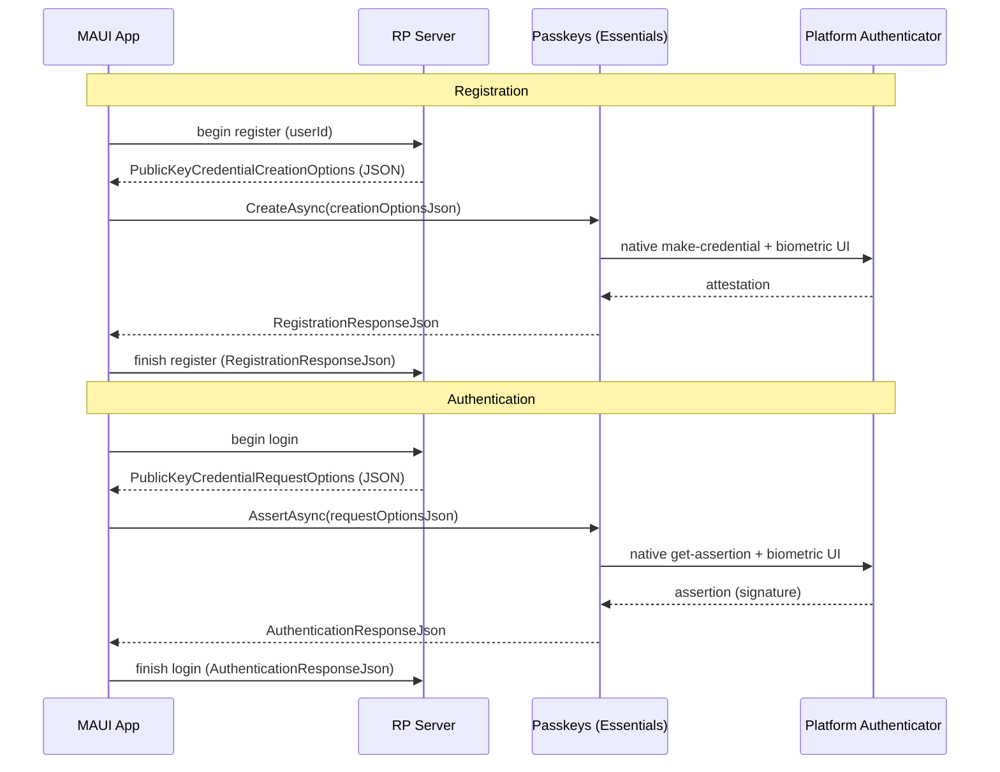

# Passkeys (WebAuthn / FIDO2) — Cross-platform Essentials API

| | |
|---|---|
| **Status** | Draft / Proposal (spec-first, open for discussion) |
| **Area** | `area-essentials` |
| **Namespace** | `Microsoft.Maui.Authentication` |
| **Target** | Next `netN.0` feature branch (adds public API) |
| **Related** | Discussion [#21498](https://github.com/dotnet/maui/discussions/21498) "FIDO2 Passkeys support?", Issue [#32020](https://github.com/dotnet/maui/issues/32020) "Cannot use passkey/fido/webauthn in BlazorWebView" |

> **This is a spec-first proposal.** The intent is to agree on the public API shape and per-platform
> implementation strategy *before* writing the implementation. Please leave feedback on the PR. The API
> surface, type names, and design decisions in this document are all open for refinement.

## 1. Summary

Add a cross-platform Essentials API that lets a .NET MAUI app create and use **passkeys** (WebAuthn /
FIDO2 public-key credentials) using the native platform authenticator UI (Face ID / Touch ID / Windows
Hello / Android biometric + Google Password Manager / iCloud Keychain).

The API is intentionally **thin**: it brokers between the app's relying-party (RP) server and the OS
authenticator. The server produces standard WebAuthn options JSON; the API drives the native UI and
returns the standard WebAuthn response JSON to send back to the server for verification. It does **not**
implement any server-side WebAuthn verification, attestation validation, or challenge generation.

## 2. Motivation

- Passwordless / phishing-resistant sign-in via passkeys is now a first-class capability on **all**
  MAUI target platforms (Android, iOS, iPadOS, macOS/Mac Catalyst, Windows). Today MAUI exposes **none**
  of it natively.
- The existing `WebAuthenticator` Essentials API is **OAuth web-redirect** auth — despite the similar
  name it is unrelated to WebAuthn/passkeys.
- BlazorWebView cannot use the browser WebAuthn JS API ([#32020](https://github.com/dotnet/maui/issues/32020)),
  so even hybrid apps need a native bridge.
- Each platform's native passkey API is non-trivial (delegate/callback bridges on Apple, coroutine
  interop on Android, raw Win32 struct marshaling on Windows). Centralizing this in Essentials removes a
  large amount of per-app boilerplate and platform expertise.

## 3. Goals / Non-goals

### Goals
- One cross-platform API to **create** (register) and **get** (authenticate / assert) a passkey.
- Use the **standard WebAuthn JSON** contract so it interoperates 1:1 with existing server libraries
  (e.g. [Fido2NetLib](https://github.com/passwordless-lib/fido2-net-lib), SimpleWebAuthn, etc.).
- Follow existing Essentials conventions (`interface` + static facade + per-platform partial
  implementation + `Default`/`SetDefault` testability), mirroring `WebAuthenticator`.
- Graceful capability detection (`IsSupported`) and clear exceptions on unsupported OS/versions.

### Non-goals (for v1)
- Server-side WebAuthn (challenge issuance, attestation/assertion verification). That stays on the RP
  server, as the spec intends.
- Acting as a **credential provider** / password manager (Android `CredentialProviderService`, iOS
  AutoFill credential provider extension). This is "use passkeys in my app", not "be a passkey vault".
- Conditional UI / autofill-driven passkey sign-in (may be a follow-up; see Open Questions).
- Cross-device / security-key–only flows as a distinct API. On platforms where the OS offers this
  automatically (Apple, Windows) it is available through the same call; a dedicated security-key API is
  out of scope for v1.
- A strongly-typed C# model of the entire WebAuthn options/response schema (see §6.2 for rationale).

## 4. Background: passkeys & the cross-platform insight

A passkey ceremony has two operations, both defined by the [W3C WebAuthn spec](https://www.w3.org/TR/webauthn-3/):

1. **Registration** (`navigator.credentials.create`): server sends `PublicKeyCredentialCreationOptions`
   → authenticator creates a key pair → returns an attestation response → server stores the public key.
2. **Authentication** (`navigator.credentials.get`): server sends `PublicKeyCredentialRequestOptions`
   → authenticator signs the challenge → returns an assertion → server verifies the signature.



**Key design driver — the interop format:**

| Platform | Native contract |
|---|---|
| **Android** (Credential Manager) | **WebAuthn JSON in / JSON out** — native |
| **Apple** (AuthenticationServices) | Structured `NSData` objects |
| **Windows** (Win32 `webauthn.dll`) | Structured C structs |

Because Android already speaks the exact browser WebAuthn JSON, and because that JSON is what every
server library emits/consumes, the cross-platform contract is **JSON-in / JSON-out**. Android is a
pass-through; Apple and Windows translate JSON ⇄ native structures internally. This keeps the public API
tiny and forward-compatible with new WebAuthn fields.

## 5. Proposed public API

```csharp
namespace Microsoft.Maui.Authentication;

/// <summary>
/// Create and use passkeys (WebAuthn / FIDO2 public-key credentials) with the native
/// platform authenticator. Brokers standard WebAuthn JSON between a relying-party server
/// and the OS; does not perform server-side verification.
/// </summary>
public interface IPasskeys
{
    /// <summary>
    /// Whether this platform (and OS version) can create and use passkeys.
    /// </summary>
    bool IsSupported { get; }

    /// <summary>
    /// Registers a new passkey. Drives the native "create credential" UI.
    /// </summary>
    /// <param name="options">
    /// The relying party's <c>PublicKeyCredentialCreationOptions</c> (server-provided).
    /// </param>
    /// <returns>The WebAuthn registration response to send back to the RP server.</returns>
    Task<PasskeyCreationResponse> CreateAsync(
        PasskeyCreationOptions options,
        CancellationToken cancellationToken = default);

    /// <summary>
    /// Authenticates with an existing passkey. Drives the native "get credential" UI.
    /// </summary>
    /// <param name="options">
    /// The relying party's <c>PublicKeyCredentialRequestOptions</c> (server-provided).
    /// </param>
    /// <returns>The WebAuthn assertion response to send back to the RP server.</returns>
    Task<PasskeyAssertionResponse> AssertAsync(
        PasskeyRequestOptions options,
        CancellationToken cancellationToken = default);
}

/// <summary>
/// Opaque carrier for a WebAuthn JSON payload. The underlying JSON is always available via
/// <see cref="Json"/> (or <see cref="ToString"/>); strongly-typed fields are exposed selectively
/// through extension methods rather than fully decoding the schema. This keeps the type stable as
/// the WebAuthn spec evolves — unknown/new fields simply flow through the JSON untouched.
/// </summary>
public abstract class PasskeyJsonObject
{
    private protected PasskeyJsonObject(string json) =>
        Json = json ?? throw new ArgumentNullException(nameof(json));

    /// <summary>The raw underlying WebAuthn JSON.</summary>
    public string Json { get; }

    /// <summary>Returns the raw underlying WebAuthn JSON (same as <see cref="Json"/>).</summary>
    public override string ToString() => Json;
}

/// <summary>
/// The relying party's <c>PublicKeyCredentialCreationOptions</c>, for <see cref="IPasskeys.CreateAsync"/>.
/// </summary>
public sealed class PasskeyCreationOptions : PasskeyJsonObject
{
    /// <param name="creationOptionsJson">The server's <c>PublicKeyCredentialCreationOptions</c> JSON.</param>
    public PasskeyCreationOptions(string creationOptionsJson) : base(creationOptionsJson) { }

    /// <summary>
    /// When <see langword="true"/>, only offer credentials already available on-device without a
    /// network/hybrid step. Maps to Android <c>preferImmediatelyAvailableCredentials</c>; ignored
    /// where unsupported. (App-side behavior knob — not part of the server JSON.)
    /// </summary>
    public bool PreferImmediatelyAvailable { get; set; }
}

/// <summary>
/// The relying party's <c>PublicKeyCredentialRequestOptions</c>, for <see cref="IPasskeys.AssertAsync"/>.
/// </summary>
public sealed class PasskeyRequestOptions : PasskeyJsonObject
{
    /// <param name="requestOptionsJson">The server's <c>PublicKeyCredentialRequestOptions</c> JSON.</param>
    public PasskeyRequestOptions(string requestOptionsJson) : base(requestOptionsJson) { }

    /// <inheritdoc cref="PasskeyCreationOptions.PreferImmediatelyAvailable"/>
    public bool PreferImmediatelyAvailable { get; set; }
}

/// <summary>
/// Result of a passkey registration. <see cref="PasskeyJsonObject.Json"/> is the full WebAuthn
/// registration response (shape of <c>PublicKeyCredential</c> with an
/// <c>AuthenticatorAttestationResponse</c>) — POST it to the RP server to finish registration.
/// </summary>
public sealed class PasskeyCreationResponse : PasskeyJsonObject
{
    internal PasskeyCreationResponse(string registrationResponseJson) : base(registrationResponseJson) { }
}

/// <summary>
/// Result of a passkey authentication. <see cref="PasskeyJsonObject.Json"/> is the full WebAuthn
/// authentication response (shape of <c>PublicKeyCredential</c> with an
/// <c>AuthenticatorAssertionResponse</c>) — POST it to the RP server to finish sign-in.
/// </summary>
public sealed class PasskeyAssertionResponse : PasskeyJsonObject
{
    internal PasskeyAssertionResponse(string authenticationResponseJson) : base(authenticationResponseJson) { }
}

/// <summary>Static facade, mirroring <see cref="WebAuthenticator"/>.</summary>
public static class Passkeys
{
    public static bool IsSupported => Default.IsSupported;

    public static Task<PasskeyCreationResponse> CreateAsync(PasskeyCreationOptions options, CancellationToken cancellationToken = default)
        => Default.CreateAsync(options, cancellationToken);

    public static Task<PasskeyAssertionResponse> AssertAsync(PasskeyRequestOptions options, CancellationToken cancellationToken = default)
        => Default.AssertAsync(options, cancellationToken);

    static IPasskeys? defaultImplementation;
    public static IPasskeys Default => defaultImplementation ??= new PasskeysImplementation();
    internal static void SetDefault(IPasskeys? implementation) => defaultImplementation = implementation;
}
```

#### Extension methods (selective strongly-typed access)

Rather than decoding the entire WebAuthn schema onto the types, a small set of extension methods pull out
the handful of fields apps commonly need on-device. Everything else stays in `Json` for the server. This
set is deliberately small and can grow based on feedback.

```csharp
public static class PasskeysExtensions
{
    // --- Convenience string overloads (construct the opaque options from raw JSON) ---
    public static Task<PasskeyCreationResponse> CreateAsync(this IPasskeys passkeys, string creationOptionsJson, CancellationToken ct = default)
        => passkeys.CreateAsync(new PasskeyCreationOptions(creationOptionsJson), ct);

    public static Task<PasskeyAssertionResponse> AssertAsync(this IPasskeys passkeys, string requestOptionsJson, CancellationToken ct = default)
        => passkeys.AssertAsync(new PasskeyRequestOptions(requestOptionsJson), ct);

    // --- A couple of decoded fields on the responses (not the whole schema) ---

    /// <summary>The base64url credential id (<c>id</c>) of the created/used passkey.</summary>
    public static string GetId(this PasskeyCreationResponse response);
    public static string GetId(this PasskeyAssertionResponse response);

    /// <summary>The credential id decoded to bytes (<c>rawId</c>).</summary>
    public static byte[] GetRawId(this PasskeyCreationResponse response);
    public static byte[] GetRawId(this PasskeyAssertionResponse response);

    /// <summary>
    /// The user handle returned by the assertion (<c>response.userHandle</c>), i.e. the RP's user id,
    /// or <see langword="null"/> when the authenticator did not return one.
    /// </summary>
    public static byte[]? GetUserHandle(this PasskeyAssertionResponse response);
}
```

> Only three extraction helpers are proposed for v1 (`GetId`, `GetRawId`, `GetUserHandle`) — the fields
> most often needed client-side. Attestation object, authenticator data, signature, and client-data JSON
> remain accessible through `response.Json` (they're what the server verifies anyway). See Open Question
> #4 for which helpers, if any, are worth including.

### 5.1 Usage examples

#### Registration (creating a passkey)

The app asks its server to begin registration, hands the returned `PublicKeyCredentialCreationOptions`
JSON to `CreateAsync`, which drives the native "create credential" UI (Face ID / Windows Hello / Android
biometric). The resulting registration response JSON is posted back to the server, which verifies it and
stores the new public key.

```csharp
using Microsoft.Maui.Authentication;

if (!Passkeys.IsSupported)
    return; // fall back to password UI

// 1. Ask your server to begin registration; it returns PublicKeyCredentialCreationOptions JSON.
string creationOptionsJson = await httpClient.GetStringAsync("/passkey/register/begin");

// 2. Drive the native create-credential UI (Face ID / Windows Hello / Android biometric).
PasskeyCreationResponse created = await Passkeys.CreateAsync(creationOptionsJson);

// 3. Send the raw response JSON back to the server to verify + store the public key.
//    `created.Json` (or created.ToString()) is the full WebAuthn registration response.
await httpClient.PostAsJsonAsync("/passkey/register/finish", created.Json);
```

#### Login (authenticating with a passkey)

The app asks its server to begin sign-in, hands the returned `PublicKeyCredentialRequestOptions` JSON to
`AssertAsync`, which drives the native "get credential" UI so the user picks a passkey and authenticates.
The resulting assertion response JSON is posted back to the server, which verifies the signature to
complete sign-in.

```csharp
using Microsoft.Maui.Authentication;

if (!Passkeys.IsSupported)
    return; // fall back to password UI

// 1. Ask your server to begin sign-in; it returns PublicKeyCredentialRequestOptions JSON.
string requestOptionsJson = await httpClient.GetStringAsync("/passkey/login/begin");

// 2. Drive the native get-credential UI so the user selects a passkey and authenticates.
PasskeyAssertionResponse asserted = await Passkeys.AssertAsync(requestOptionsJson);

// 3. Send the raw response JSON back to the server to verify the signature and finish sign-in.
await httpClient.PostAsJsonAsync("/passkey/login/finish", asserted.Json);

// Optional: a couple of decoded fields are available client-side via extension methods.
string credentialId = asserted.GetId();          // base64url credential id
byte[]? userHandle = asserted.GetUserHandle();   // the RP's user id, if returned
```

## 6. Design decisions

### 6.1 Why JSON in / JSON out (wrapped in opaque objects)
- **Zero translation on Android** — Credential Manager consumes/produces exactly this JSON.
- **1:1 with server libraries** — Fido2NetLib etc. already emit `CreationOptions`/`RequestOptions` JSON
  and consume the response JSON. No impedance mismatch.
- **Smallest public surface** — two options types + two response types, all sharing the
  `PasskeyJsonObject` base.
- **Forward-compatible** — new WebAuthn fields (e.g. `hints`, PRF extension) require no API change; they
  flow through the JSON. On Apple/Windows we map the subset the OS supports and ignore the rest.

### 6.2 Opaque objects + selective extensions (not raw strings, not a full typed model)
The payloads are wrapped in **opaque objects** (`PasskeyJsonObject` with `Json` / `ToString()`) rather
than passed as bare `string`s. This is the deliberate middle ground:

- **vs. raw strings:** stronger typing (can't accidentally pass a request where a response is expected),
  a natural home for app-side behavior knobs (e.g. `PreferImmediatelyAvailable`), and a discoverable
  surface for the extension helpers — while still exposing the underlying JSON verbatim.
- **vs. a fully-typed WebAuthn model:** a complete model (`Rp`, `User`, `PubKeyCredParams`,
  `AllowCredentials`, `AuthenticatorSelection`, extensions…) is a **large** public surface that must
  track ongoing WebAuthn spec churn, still needs JSON serialization for Android, and duplicates types in
  server libraries. Instead we decode **only a couple** of high-value fields via extension methods
  (`GetId`, `GetRawId`, `GetUserHandle`); everything else stays in `Json`.
- Typed builders/decoders for more fields can be added later as extension methods **without breaking**
  the core API — the opaque object is the stable anchor.

### 6.3 Naming / placement
- Lives in Essentials alongside `WebAuthenticator`, namespace `Microsoft.Maui.Authentication`.
- `Passkeys` (not `WebAuthn`/`Fido2`) as the user-facing term the platforms and users actually use.
- `CreateAsync` / `AssertAsync` mirror the WebAuthn verbs (`create` / `get`; "assert" disambiguates from
  the many `GetAsync` methods and matches the "assertion" terminology).

## 7. Platform implementation design

Each platform gets a `PasskeysImplementation` partial (`Passkeys.android.cs`, `Passkeys.ios.macos.cs`,
`Passkeys.windows.cs`, `Passkeys.netstandard.tizen.tvos.watchos.cs`).

### 7.1 Android — Jetpack Credential Manager

- Docs: [Credential Manager](https://developer.android.com/identity/credential-manager) ·
  [Sign in with passkeys](https://developer.android.com/identity/sign-in/credential-manager) ·
  [`androidx.credentials` reference](https://developer.android.com/reference/androidx/credentials/package-summary)
- **New NuGet dependencies**: `Xamarin.AndroidX.Credentials` and
  `Xamarin.AndroidX.Credentials.PlayServicesAuth` (Essentials currently references AndroidX Activity,
  Browser, Security.SecurityCrypto — not Credentials).
- Native model (Kotlin, from the official guide):

  ```kotlin
  // Registration
  val credentialManager = CredentialManager.create(context)
  val request = CreatePublicKeyCredentialRequest(requestJson = creationOptionsJson)
  val result = credentialManager.createCredential(context, request)
        as CreatePublicKeyCredentialResponse
  val registrationResponseJson = result.registrationResponseJson

  // Authentication
  val option = GetPublicKeyCredentialOption(requestJson = requestOptionsJson)
  val getRequest = GetCredentialRequest(listOf(option))
  val getResult = credentialManager.getCredential(context, getRequest)
  val publicKeyCredential = getResult.credential as PublicKeyCredential
  val authenticationResponseJson = publicKeyCredential.authenticationResponseJson
  ```

- Projected .NET usage (`AndroidX.Credentials`, exact async-interop shape to be confirmed during
  implementation — the underlying API is Kotlin-suspend/callback and will be wrapped in a
  `TaskCompletionSource`):

  ```csharp
  var manager = CredentialManager.Create(Platform.CurrentActivity!);
  var request = new CreatePublicKeyCredentialRequest(options.Json);
  var response = (CreatePublicKeyCredentialResponse)await manager.CreateCredentialAsync(
      Platform.CurrentActivity!, request /*, cancellationSignal, executor */);
  var registrationResponseJson = response.RegistrationResponseJson;
  ```

- **Context**: requires the current `Activity` (via `Platform.CurrentActivity`). Passkey UI is a bottom
  sheet on that activity.
- **App setup (documented, not code)**: host a [Digital Asset Links](https://developer.android.com/identity/sign-in/credential-manager#add-support-dal)
  file at `https://<rp-id>/.well-known/assetlinks.json` binding the app's signing certificate.
- **Min API**: Credential Manager is API 23+, but passkeys realistically need **API 28+ (Android 9)**
  with Google Play services. `IsSupported` gates on this.
- Exceptions map from `CreateCredentialException` / `GetCredentialException` subclasses (e.g.
  `*CancellationException` → `TaskCanceledException`, `NoCredentialException` → no-credential result).

### 7.2 Apple — AuthenticationServices (iOS / iPadOS / Mac Catalyst / macOS)

- Docs: [`ASAuthorizationPlatformPublicKeyCredentialProvider`](https://developer.apple.com/documentation/authenticationservices/asauthorizationplatformpublickeycredentialprovider) ·
  [Supporting passkeys](https://developer.apple.com/documentation/authenticationservices/public-private_key_authentication/supporting_passkeys) ·
  [.NET binding](https://learn.microsoft.com/dotnet/api/authenticationservices.asauthorizationplatformpublickeycredentialprovider)
- **No new dependency** — `AuthenticationServices` is already bound in `Microsoft.iOS` /
  `Microsoft.MacCatalyst` / `Microsoft.macOS`.
- **Structured, not JSON.** We parse the incoming options JSON, extract `challenge`, `user.id`,
  `user.name`, `rp.id`, `pubKeyCredParams`, `allowCredentials`, `userVerification`, then build the
  native request; on completion we read the raw `NSData` and **assemble the WebAuthn response JSON**
  ourselves (base64url-encoding the binary fields).
- Native model (Swift):

  ```swift
  let provider = ASAuthorizationPlatformPublicKeyCredentialProvider(relyingPartyIdentifier: rpId)

  // Registration
  let reg = provider.createCredentialRegistrationRequest(
      challenge: challenge, name: userName, userID: userId)
  // Authentication
  let asr = provider.createCredentialAssertionRequest(challenge: challenge)

  let controller = ASAuthorizationController(authorizationRequests: [reg]) // or [asr]
  controller.delegate = self
  controller.presentationContextProvider = self
  controller.performRequests()
  ```

- Verified .NET binding members we build on (`net-ios` `AuthenticationServices`):
  - `ASAuthorizationPlatformPublicKeyCredentialProvider(string relyingPartyIdentifier)`,
    `.CreateCredentialRegistrationRequest(NSData challenge, string name, NSData userId)`,
    `.CreateCredentialAssertionRequest(NSData challenge)`.
  - Request props: `Challenge`, `Name`, `UserId`, `DisplayName`, `UserVerificationPreference`,
    `AttestationPreference`.
  - Registration result `ASAuthorizationPlatformPublicKeyCredentialRegistration`:
    `RawAttestationObject`, `RawClientDataJson`, `CredentialId`.
  - Assertion result `ASAuthorizationPlatformPublicKeyCredentialAssertion`:
    `RawAuthenticatorData`, `Signature`, `UserId`, `RawClientDataJson`, `CredentialId`.
- Async bridge: wrap the `ASAuthorizationControllerDelegate` callbacks
  (`didCompleteWithAuthorization` / `didCompleteWithError`) in a `TaskCompletionSource`. Reuse the
  window/presentation-anchor plumbing already used by other Essentials APIs.
- **App setup (documented)**: [Associated Domains](https://developer.apple.com/documentation/xcode/supporting-associated-domains)
  entitlement with `webcredentials:<rp-id>` and a hosted `apple-app-site-association` file.
- **Min OS**: iOS 16 / iPadOS 16 / Mac Catalyst 16 / macOS 13 (Ventura). Gate `IsSupported` via
  `OperatingSystem.IsIOSVersionAtLeast(16)` etc.

### 7.3 Windows — Win32 WebAuthn API (`webauthn.dll`)

- Docs: [`WebAuthNAuthenticatorMakeCredential`](https://learn.microsoft.com/windows/win32/api/webauthn/nf-webauthn-webauthnauthenticatormakecredential) ·
  [`WebAuthNAuthenticatorGetAssertion`](https://learn.microsoft.com/windows/win32/api/webauthn/nf-webauthn-webauthnauthenticatorgetassertion) ·
  [webauthn.h header](https://learn.microsoft.com/windows/win32/api/webauthn/) ·
  [Microsoft `webauthn` reference implementation](https://github.com/microsoft/webauthn)
- **No NuGet dependency** — direct P/Invoke into the in-box `webauthn.dll`. `AllowUnsafeBlocks` is
  already enabled for the Windows TFM in `Essentials.csproj`.
- **Structured, not JSON.** Same JSON ⇄ struct translation as Apple, plus manual marshaling.
- Native signatures:

  ```cpp
  HRESULT WebAuthNAuthenticatorMakeCredential(
      HWND hWnd,
      PCWEBAUTHN_RP_ENTITY_INFORMATION                 pRpInformation,
      PCWEBAUTHN_USER_ENTITY_INFORMATION               pUserInformation,
      PCWEBAUTHN_COSE_CREDENTIAL_PARAMETERS            pPubKeyCredParams,
      PCWEBAUTHN_CLIENT_DATA                           pWebAuthNClientData,
      PCWEBAUTHN_AUTHENTICATOR_MAKE_CREDENTIAL_OPTIONS pWebAuthNMakeCredentialOptions,
      PWEBAUTHN_CREDENTIAL_ATTESTATION                *ppWebAuthNCredentialAttestation);

  HRESULT WebAuthNAuthenticatorGetAssertion(
      HWND hWnd,
      LPCWSTR                                          pwszRpId,
      PCWEBAUTHN_CLIENT_DATA                           pWebAuthNClientData,
      PCWEBAUTHN_AUTHENTICATOR_GET_ASSERTION_OPTIONS  pWebAuthNGetAssertionOptions,
      PWEBAUTHN_ASSERTION                             *ppWebAuthNAssertion);

  DWORD WebAuthNGetApiVersionNumber();
  HRESULT WebAuthNIsUserVerifyingPlatformAuthenticatorAvailable(BOOL *pbIsUserVerifyingPlatformAuthenticatorAvailable);
  void   WebAuthNFreeCredentialAttestation(PWEBAUTHN_CREDENTIAL_ATTESTATION);
  void   WebAuthNFreeAssertion(PWEBAUTHN_ASSERTION);
  ```

- **HWND**: the API is modal on a top-level window. Acquire the current window handle from the MAUI
  window (`WinRT.Interop.WindowNative.GetWindowHandle(...)`).
- **`ClientDataJson`**: on Windows we must supply the `WEBAUTHN_CLIENT_DATA` (challenge + origin +
  type). We build client data JSON from the options and pass it through; the OS returns
  `pbAttestationObject` / `pbCredentialId` (make) and `pbAuthenticatorData` / `pbSignature` /
  `pbUserId` (get), which we base64url-encode into the response JSON.
- **Version gating**: `WebAuthNGetApiVersionNumber()` for capability, and
  `WebAuthNIsUserVerifyingPlatformAuthenticatorAvailable` for Hello availability. Passkeys need
  **Windows 11**; older `webauthn.dll` (Win10 1903+) supports FIDO2 security keys but not full passkeys.
- **Highest implementation cost** of the three (struct marshaling, memory ownership/free, version
  branching). Recommend implementing this platform **last**.

### 7.4 Unsupported platforms
- `netstandard`, Tizen, tvOS, watchOS: `IsSupported == false`; `CreateAsync`/`AssertAsync` throw
  `FeatureNotSupportedException` (consistent with other Essentials APIs).

## 8. Error handling

| Situation | Behavior |
|---|---|
| OS/version without passkey support | `IsSupported == false`; calls throw `FeatureNotSupportedException` |
| User cancels the native UI | `TaskCanceledException` (matches `WebAuthenticator`) |
| No matching credential (authenticate) | `TaskCanceledException` or a dedicated `PasskeyException` (Open Question) |
| Malformed options JSON | `ArgumentException` |
| Domain association not configured | Platform error surfaced as `PasskeyException` with the native message |
| Any other native failure | `PasskeyException` wrapping the platform exception/HRESULT |

## 9. Dependencies & packaging impact
- **Android**: adds `Xamarin.AndroidX.Credentials` + `Xamarin.AndroidX.Credentials.PlayServicesAuth`
  package references (version pinned via `eng/Versions.props`). This increases the Android dependency
  closure of `Microsoft.Maui.Essentials` — needs sign-off (size/servicing considerations, `NuGets.md`).
- **Apple / Windows**: no new NuGet packages (in-box frameworks / P/Invoke).
- **Public API**: new types in `Microsoft.Maui.Authentication` → `PublicAPI.Unshipped.txt` entries per
  TFM. Because this adds public API, implementation targets the current `netN.0` feature branch.

## 10. Security considerations
- The API never sees or stores private keys — those remain in the platform authenticator / secure
  hardware. It only relays the public attestation/assertion material.
- Challenges must be generated and verified **server-side**; the API does not validate them. Doc must
  make this explicit to avoid misuse.
- RP ID / origin binding is enforced by the OS via domain association (asset links / associated
  domains). Misconfiguration fails closed at the OS layer.
- No secrets are logged; binary fields are surfaced only as part of the response the caller already
  must send to their server.

## 11. Testing strategy
- **Unit tests** (`Essentials.UnitTests`): options/response JSON (de)serialization, base64url handling,
  `IsSupported` gating, `SetDefault` substitution, exception mapping. Platform calls mocked via
  `IPasskeys`.
- **Device tests**: passkey ceremonies require real authenticators/biometrics and hosted domain
  association, so full end-to-end is hard to automate in CI. Propose: verify `IsSupported`, request
  construction, and JSON translation on-device; gate the interactive ceremony behind a manual/sample
  test with a reference RP server.
- **Sample**: add a Passkeys page to `Essentials.Sample` wired to a small reference RP endpoint.

## 12. Open questions
1. **Package size / dependency**: is adding AndroidX Credentials to Essentials acceptable, or should
   passkeys ship as a **separate opt-in NuGet** (e.g. `Microsoft.Maui.Authentication.Passkeys`) to avoid
   growing the Essentials closure for apps that don't use it?
2. **Security keys / cross-device**: expose any explicit control, or rely entirely on the OS-offered
   flows within the single call?
3. **Conditional UI / autofill** passkey sign-in (Android `preferImmediatelyAvailable`, iOS
   `ASAuthorizationController.performAutoFillAssistedRequests`, Windows silent) — v1 or follow-up?
4. **Extraction helpers**: the current proposal wraps payloads in opaque `PasskeyJsonObject`s (raw JSON via
   `Json`/`ToString()`) plus **three** decode helpers (`GetId`, `GetRawId`, `GetUserHandle`). Are those the
   right ones? Should we add/remove any (e.g. `GetClientDataJson`, `GetTransports`), or ship with **none**
   and let callers parse `Json` themselves?
5. **Method naming**: `AssertAsync` vs `GetAsync` vs `AuthenticateAsync` (the last collides
   conceptually with `WebAuthenticator.AuthenticateAsync`).
6. **BlazorWebView bridge** ([#32020](https://github.com/dotnet/maui/issues/32020)): should we also ship
   a JS-interop shim so `navigator.credentials` in BlazorWebView routes to this native API? Likely a
   separate proposal, but worth acknowledging.

## 13. References
- W3C WebAuthn Level 3 — https://www.w3.org/TR/webauthn-3/
- FIDO Alliance passkeys — https://fidoalliance.org/passkeys/
- Android Credential Manager — https://developer.android.com/identity/credential-manager
- Android passkeys guide — https://developer.android.com/identity/sign-in/credential-manager
- `androidx.credentials` API — https://developer.android.com/reference/androidx/credentials/package-summary
- Apple `ASAuthorizationPlatformPublicKeyCredentialProvider` — https://developer.apple.com/documentation/authenticationservices/asauthorizationplatformpublickeycredentialprovider
- Apple "Supporting passkeys" — https://developer.apple.com/documentation/authenticationservices/public-private_key_authentication/supporting_passkeys
- Windows `WebAuthNAuthenticatorMakeCredential` — https://learn.microsoft.com/windows/win32/api/webauthn/nf-webauthn-webauthnauthenticatormakecredential
- Windows `WebAuthNAuthenticatorGetAssertion` — https://learn.microsoft.com/windows/win32/api/webauthn/nf-webauthn-webauthnauthenticatorgetassertion
- Microsoft `webauthn` reference — https://github.com/microsoft/webauthn
- Fido2NetLib (server-side .NET) — https://github.com/passwordless-lib/fido2-net-lib
