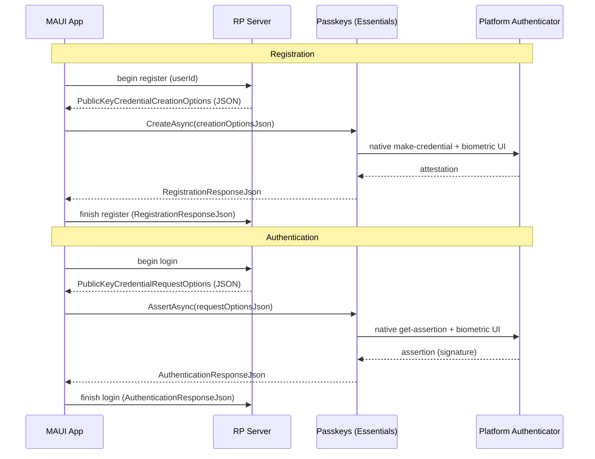

# Passkeys (WebAuthn / FIDO2) — Cross-platform Essentials API

| | |
|---|---|
| **Status** | Proposed — finalized design, pending implementation |
| **Area** | `area-essentials` |
| **Namespace** | `Microsoft.Maui.Authentication` |
| **Target** | `net11.0` feature branch (adds public API) |
| **Related** | Discussion [#21498](https://github.com/dotnet/maui/discussions/21498) "FIDO2 Passkeys support?", Issue [#32020](https://github.com/dotnet/maui/issues/32020) "Cannot use passkey/fido/webauthn in BlazorWebView" |

> This document describes the **finalized design** of the Passkeys Essentials API to be implemented on the
> `net11.0` branch. It is the end-state specification: the public surface, naming, platform strategy, and
> per-platform behavior are all settled. Items intentionally left for later are listed under
> [§13 Planned follow-ups](#13-planned-follow-ups).

## 1. Summary

Add a cross-platform Essentials API that lets a .NET MAUI app create and use **passkeys** (WebAuthn /
FIDO2 public-key credentials) using the native platform authenticator UI (Face ID / Touch ID / Windows
Hello / Android biometric + Google Password Manager / iCloud Keychain).

The API is intentionally **thin**: it brokers between the app's relying-party (RP) server and the OS
authenticator. The server produces standard WebAuthn options JSON; the API drives the native UI and
returns the standard WebAuthn response JSON to send back to the server for verification. It does **not**
implement any server-side WebAuthn verification, attestation validation, or challenge generation.

## 2. Motivation

- Passwordless / phishing-resistant sign-in via passkeys is now a first-class capability on the primary
  MAUI app platforms — Android, iOS/iPadOS, Mac Catalyst, and Windows — yet MAUI exposes **none** of it
  natively. (Support is per-platform; see §7 for exactly which targets are covered and which fall back to
  `IsSupported == false`.)
- The existing `WebAuthenticator` Essentials API is **OAuth web-redirect** auth — despite the similar
  name it is unrelated to WebAuthn/passkeys.
- BlazorWebView cannot use the browser WebAuthn JS API ([#32020](https://github.com/dotnet/maui/issues/32020)),
  so even hybrid apps need a native bridge.
- Each platform's native passkey API is non-trivial (delegate/callback bridges on Apple, coroutine
  interop on Android, raw Win32 struct marshaling on Windows). Centralizing this in Essentials removes a
  large amount of per-app boilerplate and platform expertise.

## 3. Goals / Non-goals

### Goals
- One cross-platform API to **create** (register) and **get** (authenticate / assert) a passkey.
- Use the **standard WebAuthn JSON** contract so it interoperates 1:1 with existing server libraries
  (e.g. [Fido2NetLib](https://github.com/passwordless-lib/fido2-net-lib), SimpleWebAuthn, and
  **ASP.NET Core Identity's built-in passkeys**, .NET 10+).
- Follow existing Essentials conventions (`interface` + static facade + per-platform partial
  implementation + `Default`/`SetDefault` testability), mirroring `WebAuthenticator`.
- **Use only the OS-official credential provider on each platform** — AndroidX Credential Manager, Apple
  AuthenticationServices, Windows WebAuthn — with **no Google Play Services dependency** (see §7.1/§9).
- Graceful capability detection (`IsSupported`) and clear exceptions on unsupported OS/versions.

### Non-goals (for v1)
- Server-side WebAuthn (challenge issuance, attestation/assertion verification). That stays on the RP
  server, as the spec intends.
- Acting as a **credential provider** / password manager (Android `CredentialProviderService`, iOS
  AutoFill credential provider extension). This is "use passkeys in my app", not "be a passkey vault".
- Bundling **Google Play Services** to back-fill passkeys on Android 9–13. We ship the OS-native path
  only (Android 14+); apps that need the older range can add the Play adapter themselves (§7.1).
- Conditional UI / autofill-driven passkey sign-in — a separate view-oriented feature, deferred (§7.5,
  Appendix A).
- A **BlazorWebView passkey bridge** ([#32020](https://github.com/dotnet/maui/issues/32020)), deferred —
  see [§13 Planned follow-ups](#13-planned-follow-ups). A detailed follow-up issue is filed once the native
  API is implemented and working.
- Cross-device / security-key–only flows as a distinct API. On platforms where the OS offers this
  automatically (Apple, Windows) it is available through the same call; a dedicated security-key API is
  out of scope for v1.
- A strongly-typed C# model of the entire WebAuthn options/response schema (see §6.2 for rationale).

## 4. Background: passkeys & the cross-platform insight

A passkey ceremony has two operations, both defined by the [W3C WebAuthn spec](https://www.w3.org/TR/webauthn-3/):

1. **Registration** (`navigator.credentials.create`): server sends `PublicKeyCredentialCreationOptions`
   → authenticator creates a key pair → returns an attestation response → server stores the public key.
2. **Authentication** (`navigator.credentials.get`): server sends `PublicKeyCredentialRequestOptions`
   → authenticator signs the challenge → returns an assertion → server verifies the signature.



**Key design driver — the interop format:**

| Platform | Native contract |
|---|---|
| **Android** (Credential Manager) | **WebAuthn JSON in / JSON out** — native |
| **Apple** (AuthenticationServices) | Structured `NSData` objects |
| **Windows** (Win32 `webauthn.dll`) | Structured C structs |

Because Android already speaks the exact browser WebAuthn JSON, and because that JSON is what every
server library emits/consumes, the cross-platform contract is **JSON-in / JSON-out**. Android is a
pass-through; Apple and Windows translate JSON ⇄ native structures internally. This keeps the public API
tiny and forward-compatible with new WebAuthn fields.

## 5. Public API

> The C# below is **illustrative shape, not compilable code** — get-only properties, elided bodies, and
> `internal` constructors show the intended public surface, not the implementation. Types are sketched to
> convey names, signatures, and relationships for review.

```csharp
namespace Microsoft.Maui.Authentication;

/// <summary>
/// Create and use passkeys (WebAuthn / FIDO2 public-key credentials) with the native
/// platform authenticator. Brokers standard WebAuthn JSON between a relying-party server
/// and the OS; does not perform server-side verification.
/// </summary>
public interface IPasskeys
{
    /// <summary>
    /// Whether this platform (and OS version) can create and use passkeys.
    /// </summary>
    bool IsSupported { get; }

    /// <summary>
    /// Registers a new passkey. Drives the native "create credential" UI.
    /// </summary>
    /// <param name="options">
    /// The relying party's <c>PublicKeyCredentialCreationOptions</c> (server-provided).
    /// </param>
    /// <returns>The WebAuthn registration response to send back to the RP server.</returns>
    Task<PasskeyCreationResponse> CreateAsync(
        PasskeyCreationOptions options,
        CancellationToken cancellationToken = default);

    /// <summary>
    /// Authenticates with an existing passkey. Drives the native "get credential" UI.
    /// </summary>
    /// <param name="options">
    /// The relying party's <c>PublicKeyCredentialRequestOptions</c> (server-provided).
    /// </param>
    /// <returns>The WebAuthn assertion response to send back to the RP server.</returns>
    Task<PasskeyAssertionResponse> AssertAsync(
        PasskeyRequestOptions options,
        CancellationToken cancellationToken = default);
}

/// <summary>
/// The relying party's <c>PublicKeyCredentialCreationOptions</c>, for <see cref="IPasskeys.CreateAsync"/>.
/// </summary>
public sealed class PasskeyCreationOptions
{
    /// <param name="creationOptionsJson">The server's <c>PublicKeyCredentialCreationOptions</c> JSON.</param>
    public PasskeyCreationOptions(string creationOptionsJson) =>
        _json = creationOptionsJson ?? throw new ArgumentNullException(nameof(creationOptionsJson));

    readonly string _json;

    /// <summary>
    /// When <see langword="true"/>, only offer credentials already available on-device without a
    /// network/hybrid step. Maps to Android <c>preferImmediatelyAvailableCredentials</c>; ignored
    /// where unsupported. (App-side behavior knob — not part of the server JSON.)
    /// </summary>
    public bool PreferImmediatelyAvailable { get; set; }

    /// <summary>Returns the underlying <c>PublicKeyCredentialCreationOptions</c> JSON.</summary>
    public override string ToString() => _json;
}

/// <summary>
/// The relying party's <c>PublicKeyCredentialRequestOptions</c>, for <see cref="IPasskeys.AssertAsync"/>.
/// </summary>
public sealed class PasskeyRequestOptions
{
    /// <param name="requestOptionsJson">The server's <c>PublicKeyCredentialRequestOptions</c> JSON.</param>
    public PasskeyRequestOptions(string requestOptionsJson) =>
        _json = requestOptionsJson ?? throw new ArgumentNullException(nameof(requestOptionsJson));

    readonly string _json;

    /// <inheritdoc cref="PasskeyCreationOptions.PreferImmediatelyAvailable"/>
    public bool PreferImmediatelyAvailable { get; set; }

    /// <summary>Returns the underlying <c>PublicKeyCredentialRequestOptions</c> JSON.</summary>
    public override string ToString() => _json;
}

/// <summary>
/// Result of a passkey registration. <see cref="ToString"/> returns the full WebAuthn registration
/// response (shape of <c>PublicKeyCredential</c> with an <c>AuthenticatorAttestationResponse</c>) —
/// POST it to the RP server to finish registration. A couple of commonly-needed fields are decoded
/// and cached as properties; everything else stays in the JSON for the server to verify.
/// </summary>
public sealed class PasskeyCreationResponse
{
    internal PasskeyCreationResponse(string registrationResponseJson) { /* parses lazily; caches */ }

    /// <summary>
    /// The credential id (base64url), i.e. the WebAuthn <c>PublicKeyCredential.id</c>. This is the
    /// single, primary identifier of the created passkey; store it to look the credential up later.
    /// </summary>
    public string Id { get; }

    /// <summary>Returns the full WebAuthn registration response JSON.</summary>
    public override string ToString();
}

/// <summary>
/// Result of a passkey authentication. <see cref="ToString"/> returns the full WebAuthn authentication
/// response (shape of <c>PublicKeyCredential</c> with an <c>AuthenticatorAssertionResponse</c>) —
/// POST it to the RP server to finish sign-in. A couple of commonly-needed fields are decoded and
/// cached as properties; everything else stays in the JSON for the server to verify.
/// </summary>
public sealed class PasskeyAssertionResponse
{
    internal PasskeyAssertionResponse(string authenticationResponseJson) { /* parses lazily; caches */ }

    /// <summary>
    /// The credential id (base64url), i.e. the WebAuthn <c>PublicKeyCredential.id</c> — identifies which
    /// passkey was used.
    /// </summary>
    public string Id { get; }

    /// <summary>
    /// The user handle (base64url) the RP set as <c>user.id</c> at registration, i.e. the WebAuthn
    /// <c>response.userHandle</c>. Present for discoverable-credential ("username-less") sign-in; may be
    /// <see langword="null"/> when the authenticator does not return one.
    /// </summary>
    public string? UserHandle { get; }

    /// <summary>Returns the full WebAuthn authentication response JSON.</summary>
    public override string ToString();
}

/// <summary>Static facade, mirroring <see cref="WebAuthenticator"/>.</summary>
public static class Passkeys
{
    public static bool IsSupported => Default.IsSupported;

    public static Task<PasskeyCreationResponse> CreateAsync(PasskeyCreationOptions options, CancellationToken cancellationToken = default)
        => Default.CreateAsync(options, cancellationToken);

    public static Task<PasskeyAssertionResponse> AssertAsync(PasskeyRequestOptions options, CancellationToken cancellationToken = default)
        => Default.AssertAsync(options, cancellationToken);

    // Convenience string overloads on the facade (construct the options object from raw server JSON).
    public static Task<PasskeyCreationResponse> CreateAsync(string creationOptionsJson, CancellationToken cancellationToken = default)
        => Default.CreateAsync(new PasskeyCreationOptions(creationOptionsJson), cancellationToken);

    public static Task<PasskeyAssertionResponse> AssertAsync(string requestOptionsJson, CancellationToken cancellationToken = default)
        => Default.AssertAsync(new PasskeyRequestOptions(requestOptionsJson), cancellationToken);

    static IPasskeys? defaultImplementation;
    public static IPasskeys Default => defaultImplementation ??= new PasskeysImplementation();
    internal static void SetDefault(IPasskeys? implementation) => defaultImplementation = implementation;
}
```

**On the response properties (the 80/20).** Rather than extension methods, the two or three fields most
apps actually read on-device are exposed as **real, cached properties** directly on the response types.
Everything else (attestation object, authenticator data, signature, client-data JSON) stays inside the
JSON returned by `ToString()` — those are consumed by the RP server, not the client. The responses parse
their JSON lazily on first property access and cache the results.

- **`Id` (both responses)** — the credential id, base64url. See §6.3 for why it's `Id` (matches the W3C
  JSON member `id`) and not `CredentialId`, and why raw bytes are deferred.
- **`UserHandle` (assertion only)** — base64url, nullable; the RP's `user.id`, useful for username-less
  sign-in.

### 5.1 Usage examples

#### Registration (creating a passkey)

The app asks its server to begin registration, hands the returned `PublicKeyCredentialCreationOptions`
JSON to `CreateAsync`, which drives the native "create credential" UI (Face ID / Windows Hello / Android
biometric). The resulting registration response JSON is posted back to the server, which verifies it and
stores the new public key.

```csharp
using System.Text; // for StringContent / Encoding
using Microsoft.Maui.Authentication;

if (!Passkeys.IsSupported)
    return; // fall back to password UI

// 1. Ask your server to begin registration; it returns PublicKeyCredentialCreationOptions JSON.
string creationOptionsJson = await httpClient.GetStringAsync("/passkey/register/begin");

// 2. Drive the native create-credential UI (Face ID / Windows Hello / Android biometric).
PasskeyCreationResponse created = await Passkeys.CreateAsync(creationOptionsJson);

// 3. Send the raw response JSON back to the server to verify + store the public key.
//    `created.ToString()` is *already* WebAuthn JSON, so post it as a raw application/json
//    body — do NOT use PostAsJsonAsync, which would re-encode the string as a quoted JSON literal.
using var body = new StringContent(created.ToString(), Encoding.UTF8, "application/json");
await httpClient.PostAsync("/passkey/register/finish", body);

// Optional: store the credential id so you can reference this passkey later.
string credentialId = created.Id;   // base64url
```

#### Login (authenticating with a passkey)

The app asks its server to begin sign-in, hands the returned `PublicKeyCredentialRequestOptions` JSON to
`AssertAsync`, which drives the native "get credential" UI so the user picks a passkey and authenticates.
The resulting assertion response JSON is posted back to the server, which verifies the signature to
complete sign-in.

```csharp
using System.Text; // for StringContent / Encoding
using Microsoft.Maui.Authentication;

if (!Passkeys.IsSupported)
    return; // fall back to password UI

// 1. Ask your server to begin sign-in; it returns PublicKeyCredentialRequestOptions JSON.
string requestOptionsJson = await httpClient.GetStringAsync("/passkey/login/begin");

// 2. Drive the native get-credential UI so the user selects a passkey and authenticates.
PasskeyAssertionResponse asserted = await Passkeys.AssertAsync(requestOptionsJson);

// 3. Send the raw response JSON back to the server to verify the signature and finish sign-in.
//    Post the already-serialized WebAuthn JSON as a raw application/json body (not PostAsJsonAsync).
using var body = new StringContent(asserted.ToString(), Encoding.UTF8, "application/json");
await httpClient.PostAsync("/passkey/login/finish", body);

// Optional: a couple of commonly-needed fields are available directly as (cached) properties.
string credentialId = asserted.Id;          // base64url — which passkey was used
string? userHandle = asserted.UserHandle;   // base64url RP user id, if returned
```

## 6. Design

### 6.1 JSON-in / JSON-out contract
The API passes the server's WebAuthn options JSON through to the OS and returns the OS's WebAuthn response
JSON back. This contract:
- **Requires zero translation on Android** — Credential Manager consumes/produces exactly this JSON.
- **Interoperates 1:1 with server libraries** — Fido2NetLib, SimpleWebAuthn, and ASP.NET Core Identity
  already emit `CreationOptions`/`RequestOptions` JSON and consume the response JSON.
- **Keeps the public surface small** — two options types + two response types.
- **Is forward-compatible** — new WebAuthn fields (e.g. `hints`, the PRF extension) flow through the JSON
  with no API change. On Apple/Windows the implementation maps the subset the OS supports and passes the
  rest through.

### 6.2 Thin wrapper types
Each payload is a small dedicated type whose **`ToString()` returns the underlying WebAuthn JSON**. There is
no shared base class and no `Json` property — the JSON is simply what the object stringifies to. The options
types add the one app-side behavior knob (`PreferImmediatelyAvailable`); the response types add the couple
of decoded properties apps read on-device (`Id`, and `UserHandle` on the assertion).

- Wrapper types (rather than bare `string`s) give **compile-time safety** — an options object can't be
  passed where a response is expected — and a natural home for the behavior knob and decoded properties,
  while still surfacing the raw JSON verbatim via `ToString()`.
- The API deliberately does **not** model the full WebAuthn schema (`Rp`, `User`, `PubKeyCredParams`,
  `AllowCredentials`, `AuthenticatorSelection`, extensions…). That would be a large public surface tracking
  ongoing WebAuthn spec churn, still require JSON serialization for Android, and duplicate types already in
  server libraries. All of it stays in the JSON.
- Decoded fields are **real, cached properties** on the response types. Responses parse their JSON lazily on
  first access and cache the result. Additional properties/methods can be added later without breaking the
  API.

### 6.3 Naming decisions

Naming is anchored to the terms the W3C WebAuthn spec and the platform SDKs already use, so the API is
familiar to anyone who has touched passkeys and searchable against existing docs.

**Industry background.** The [W3C WebAuthn Level 3](https://www.w3.org/TR/webauthn-3/) spec defines
dedicated *JSON serialization* types whose names all carry a **`JSON` suffix**:
[`PublicKeyCredentialCreationOptionsJSON`](https://w3c.github.io/webauthn/#dictdef-publickeycredentialcreationoptionsjson),
[`PublicKeyCredentialRequestOptionsJSON`](https://w3c.github.io/webauthn/#dictdef-publickeycredentialrequestoptionsjson),
[`RegistrationResponseJSON`](https://w3c.github.io/webauthn/#dictdef-registrationresponsejson), and
[`AuthenticationResponseJSON`](https://w3c.github.io/webauthn/#dictdef-authenticationresponsejson),
produced/consumed via [`PublicKeyCredential.toJSON()`](https://w3c.github.io/webauthn/#dom-publickeycredential-tojson)
and `parseCreationOptionsFromJSON()` / `parseRequestOptionsFromJSON()`. Android's Credential Manager
mirrors this with string members named
[`requestJson`](https://developer.android.com/reference/androidx/credentials/CreatePublicKeyCredentialRequest),
[`registrationResponseJson`](https://developer.android.com/reference/androidx/credentials/CreatePublicKeyCredentialResponse),
and [`authenticationResponseJson`](https://developer.android.com/reference/androidx/credentials/PublicKeyCredential).

So the industry vocabulary is: **inputs are "options", outputs are "responses", and the serialized form
is called "JSON"** — not "payload", not "request"/"response body". That directly informs the names below.

| MAUI type / member | Wraps (industry type) | Reasoning & source |
|---|---|---|
| `PasskeyCreationOptions` | [`PublicKeyCredentialCreationOptionsJSON`](https://w3c.github.io/webauthn/#dictdef-publickeycredentialcreationoptionsjson) | Registration **input** → "creation options". Matches W3C "creation options" and Android's `CreatePublicKeyCredentialRequest(requestJson)`. |
| `PasskeyRequestOptions` | [`PublicKeyCredentialRequestOptionsJSON`](https://w3c.github.io/webauthn/#dictdef-publickeycredentialrequestoptionsjson) | Authentication **input** → "request options". Matches W3C "request options" and Android's `GetPublicKeyCredentialOption(requestJson)`. (WebAuthn overloads "request" to mean the *get* options — hence `RequestOptions`, not `AssertionOptions`.) |
| `PasskeyCreationResponse` | [`RegistrationResponseJSON`](https://w3c.github.io/webauthn/#dictdef-registrationresponsejson) | Registration **output**. W3C/Android both call this the "registration response". |
| `PasskeyAssertionResponse` | [`AuthenticationResponseJSON`](https://w3c.github.io/webauthn/#dictdef-authenticationresponsejson) | Authentication **output**. The W3C JSON type is "authentication response"; the underlying object is `AuthenticatorAssertionResponse` and Apple calls it an *assertion* — `Assertion` names the response after that ceremony output. |
| `ToString()` (each type) | `...JSON` suffix / Android `...Json` members | Returns the raw serialized value. There is no separate `Json` property or shared base — the object simply stringifies to its WebAuthn JSON. |
| `Id` (both responses) | [`PublicKeyCredential.id`](https://www.w3.org/TR/webauthn-3/#dom-publickeycredential-id) | The credential id, base64url. See "Id" below. |
| `UserHandle` (assertion) | [`AuthenticatorAssertionResponse.userHandle`](https://www.w3.org/TR/webauthn-3/#dom-authenticatorassertionresponse-userhandle) → JSON [`userHandle`](https://w3c.github.io/webauthn/#dom-authenticationresponsejson) | "User handle" is the W3C term of art (the RP's `user.id`). `string?` base64url, nullable. Apple exposes it as `UserId`; the API uses the W3C name. |
| `Passkeys` / `IPasskeys` | — | User-facing term everyone uses ([FIDO Alliance "passkeys"](https://fidoalliance.org/passkeys/)), rather than the spec-internal `WebAuthn`/`PublicKeyCredential` or the older `FIDO2`. |
| `CreateAsync` | `navigator.credentials.create()` | W3C registration verb is *create*; Android is `createCredential`. |
| `AssertAsync` | `navigator.credentials.get()` | The W3C authentication verb is *get*, but a bare `GetAsync` is meaningless here and collides with the many `Get*` APIs; the ceremony's output is an [*assertion*](https://www.w3.org/TR/webauthn-3/#authentication-assertion), so `Assert` is precise. |

**No shared base type.** The four wrapper types have no public base class. Holding and stringifying JSON is
fully served by a `ToString()` override on each concrete type, and an options type and a response type share
nothing else. ("Payload" is not used as a name — WebAuthn/Android never use it, and it would blur the
options-vs-response distinction.)

**`Id`.** In WebAuthn the value is the [**Credential ID**](https://www.w3.org/TR/webauthn-3/#credential-id):
a probabilistically-unique byte sequence identifying the public key credential. It surfaces on
`PublicKeyCredential` in two forms of the *same* value —
[`id`](https://www.w3.org/TR/webauthn-3/#dom-publickeycredential-id) (base64url string) and
[`rawId`](https://www.w3.org/TR/webauthn-3/#dom-publickeycredential-rawid) (the bytes). Within a single
passkey response there is exactly one identifier and it is the primary one, so it is exposed as **`Id`**
(`string`, base64url):

- Matches the W3C/Android JSON member name `id` verbatim — the exact token stored in the RP's database, so
  comparisons are direct.
- Unambiguous in context (a `PasskeyAssertionResponse.Id` can only be the credential id).
- Shortest correct name.

**Raw id bytes are not surfaced.** `rawId` is the same Credential ID as bytes. Credential IDs are
[spec-capped at 1023 bytes](https://www.w3.org/TR/webauthn-3/#credential-id) but for passkeys are typically
small (~16–64 bytes). The base64url `Id` is what apps forward and compare, and the full `rawId` remains in
the `ToString()` JSON. If bytes are ever needed, the .NET guideline against array-typed properties means
they would be added as a **method** (`byte[] GetRawId()`) — additive and non-breaking.

### 6.4 Placement
- Lives in Essentials alongside `WebAuthenticator`, namespace `Microsoft.Maui.Authentication`.

### 6.5 Decoded properties (surfaced vs. left in JSON)

Everything in the response is reachable via `ToString()` (the raw WebAuthn JSON). The question is only
*which* fields are common enough to also decode into first-class properties. The test is: **does a typical
client app read this on-device, or does it only forward it to the server?** Fields that only the RP server
consumes stay in the JSON.

| Field (WebAuthn) | On | What it is / used for | Typical app needs it client-side? | Surfacing |
|---|---|---|---|---|
| `id` | both | Credential ID (base64url) — which passkey; store/reference it | **Yes** — store per user, dedupe, display | **`Id`** ✅ surfaced |
| `response.userHandle` | assert | RP `user.id` — identifies the account in username-less sign-in *before* server round-trip | **Yes** for discoverable-credential UX | **`UserHandle`** ✅ surfaced |
| `authenticatorAttachment` | both | `"platform"` (this device) vs `"cross-platform"` (security key / phone) | **Sometimes** — UX copy ("passkey saved on this device" vs "on your security key") | In JSON. Natural future addition as `AuthenticatorAttachment` (nullable enum) — non-breaking |
| `rawId` | both | Same Credential ID as bytes | Rarely — apps forward/compare the base64url `id` | In JSON; if ever added, a `byte[] GetRawId()` **method** |
| `response.transports` | reg | Authenticator transports (`usb`/`nfc`/`ble`/`internal`/`hybrid`); server stores to optimize future `allowCredentials` | **No** — server-side optimization | In JSON |
| `response.publicKey` / `publicKeyAlgorithm` | reg | The credential public key + COSE alg | **No** — server verifies/stores | In JSON |
| `response.attestationObject` | reg | Attestation + public key | **No** — server verifies | In JSON |
| `response.authenticatorData` | assert | Signed authenticator data (RP ID hash, counter, flags) | **No** — server verifies | In JSON |
| `response.signature` | assert | Assertion signature | **No** — server verifies | In JSON |
| `response.clientDataJSON` | both | Challenge/origin/type the client signed | **No** — server verifies | In JSON |
| `clientExtensionResults` (e.g. `credProps.rk`, `prf`) | both | Extension outputs; `credProps.rk` = whether the passkey is discoverable | **Rarely** — advanced UX only, and unreliable across authenticators | In JSON |
| `type` | both | Always `"public-key"` | No | In JSON |

**Surfaced in v1:** `Id` (both responses) and `UserHandle` (the assertion). Everything else is
server-verification material and stays in the JSON, keeping the surface small. New properties (the most
likely being `AuthenticatorAttachment` for UX messaging) can be added later without breaking the API.

## 7. Platform implementation design

Each platform gets a `PasskeysImplementation` partial, following the existing `WebAuthenticator` file
convention (see `src/Essentials/src/WebAuthenticator/`): `Passkeys.android.cs`, `Passkeys.ios.cs`
(compiles for **both** iOS and Mac Catalyst), `Passkeys.windows.cs`, and a not-supported stub
`Passkeys.netstandard.tvos.tizen.cs`. A `Passkeys.maccatalyst.cs` would be added only if Mac Catalyst
needs behavior that differs from iOS. Note Essentials does **not** currently build a standalone `net-macos`
target (the `macos` compile group in `Essentials.csproj` is commented out), so there is no
`Passkeys.macos.cs` in v1 — see §7.2.

### 7.1 Android — Jetpack Credential Manager

- Docs: [Credential Manager](https://developer.android.com/identity/credential-manager) ·
  [Sign in with passkeys](https://developer.android.com/identity/sign-in/credential-manager) ·
  [`androidx.credentials` reference](https://developer.android.com/reference/androidx/credentials/package-summary)
- **New NuGet dependency**: `Xamarin.AndroidX.Credentials` **only**. We deliberately do **not** add
  `Xamarin.AndroidX.Credentials.PlayServicesAuth`.
  - **Why no Play Services?** `androidx.credentials:credentials` is the OS API surface; the separate
    `credentials-play-services-auth` artifact is just an *adapter* that routes to Google Play Services
    (Google Password Manager) to back-fill passkeys on **Android 9–13 (API 28–33)**. On **Android 14+
    (API 34)** the platform's own `CredentialManager` handles passkeys **natively, with no Play Services**.
  - This matches the spec's OS-official principle (same posture as Apple/Windows: use only what the OS
    provides) and — importantly — **Essentials has zero Google Play Services dependencies today** (its
    Android deps are AndroidX Activity/Browser/Security.SecurityCrypto + Tink). Bundling
    `credentials-play-services-auth` would introduce the *first* GMS dependency into `Microsoft.Maui.Essentials`,
    which we want to avoid.
  - **Consequence:** the built-in passkey path is **Android 14+ (API 34)**. Apps that must also support
    API 28–33 can opt in by adding the `credentials-play-services-auth` provider to *their own* app; the
    same `CredentialManager` calls then light up on older devices. MAUI does not force that cost on everyone.
- Native model (Kotlin, from the official guide):

  ```kotlin
  // Registration
  val credentialManager = CredentialManager.create(context)
  val request = CreatePublicKeyCredentialRequest(requestJson = creationOptionsJson)
  val result = credentialManager.createCredential(context, request)
        as CreatePublicKeyCredentialResponse
  val registrationResponseJson = result.registrationResponseJson

  // Authentication
  val option = GetPublicKeyCredentialOption(requestJson = requestOptionsJson)
  val getRequest = GetCredentialRequest(listOf(option))
  val getResult = credentialManager.getCredential(context, getRequest)
  val publicKeyCredential = getResult.credential as PublicKeyCredential
  val authenticationResponseJson = publicKeyCredential.authenticationResponseJson
  ```

- Projected .NET usage (`AndroidX.Credentials`, exact async-interop shape to be confirmed during
  implementation — the underlying API is Kotlin-suspend/callback and will be wrapped in a
  `TaskCompletionSource`):

  ```csharp
  var manager = CredentialManager.Create(Platform.CurrentActivity!);
  var request = new CreatePublicKeyCredentialRequest(options.ToString());
  var response = (CreatePublicKeyCredentialResponse)await manager.CreateCredentialAsync(
      Platform.CurrentActivity!, request /*, cancellationSignal, executor */);
  var registrationResponseJson = response.RegistrationResponseJson;
  ```

- **Context**: requires the current `Activity` (via `Platform.CurrentActivity`). Passkey UI is a bottom
  sheet on that activity.
- **App setup (documented, not code)**: host a [Digital Asset Links](https://developer.android.com/identity/sign-in/credential-manager#add-support-dal)
  file at `https://<rp-id>/.well-known/assetlinks.json` binding the app's signing certificate.
- **Min API**: with the no-Play (OS-native) path, passkeys require **API 34 (Android 14)**. `IsSupported`
  returns `false` below that (unless a Play-backed provider has been added by the app). Note the Jetpack
  `androidx.credentials` API itself is callable from API 23+, but passkey *credentials* are only
  OS-native from 34.
- Exceptions map from `CreateCredentialException` / `GetCredentialException` subclasses (e.g.
  `*CancellationException` → `TaskCanceledException`, `NoCredentialException` → no-credential result).

### 7.2 Apple — AuthenticationServices (iOS / iPadOS / Mac Catalyst)

- **Scope note (macOS).** The `AuthenticationServices` passkey API exists on standalone macOS 13+ too,
  but **Essentials does not currently build a `net-macos` target** (the `macos` compile group in
  `Essentials.csproj` is commented out). So v1 covers **iOS, iPadOS, and Mac Catalyst**. Standalone
  macOS support is a near-free follow-up once/if Essentials enables the macOS TFM — the implementation
  code would be effectively identical.
- Docs: [`ASAuthorizationPlatformPublicKeyCredentialProvider`](https://developer.apple.com/documentation/authenticationservices/asauthorizationplatformpublickeycredentialprovider) ·
  [Supporting passkeys](https://developer.apple.com/documentation/authenticationservices/public-private_key_authentication/supporting_passkeys) ·
  [.NET binding](https://learn.microsoft.com/dotnet/api/authenticationservices.asauthorizationplatformpublickeycredentialprovider)
- **No new dependency** — `AuthenticationServices` is already bound in `Microsoft.iOS` /
  `Microsoft.MacCatalyst` (and `Microsoft.macOS`, if a macOS target is later enabled).
- **Structured, not JSON.** We parse the incoming options JSON, extract `challenge`, `user.id`,
  `user.name`, `rp.id`, `pubKeyCredParams`, `allowCredentials`, `userVerification`, then build the
  native request; on completion we read the raw `NSData` and **assemble the WebAuthn response JSON**
  ourselves (base64url-encoding the binary fields).
- **Binding note (Obj-C, not Swift).** `Microsoft.iOS` / `Microsoft.MacCatalyst` bind the **Objective-C**
  `AuthenticationServices` framework and project it to C#. There is no Swift interop involved — the
  "native" API called from the MAUI implementation is the bound Obj-C surface. The Swift snippet below is
  the canonical Apple-docs reference; the C# snippet is the equivalent bound API the implementation uses.

- Reference — Apple's native model (Swift, from the Apple docs):

  ```swift
  let provider = ASAuthorizationPlatformPublicKeyCredentialProvider(relyingPartyIdentifier: rpId)

  // Registration
  let reg = provider.createCredentialRegistrationRequest(
      challenge: challenge, name: userName, userID: userId)
  // Authentication
  let asr = provider.createCredentialAssertionRequest(challenge: challenge)

  let controller = ASAuthorizationController(authorizationRequests: [reg]) // or [asr]
  controller.delegate = self
  controller.presentationContextProvider = self
  controller.performRequests()
  ```

- Bound API — the equivalent in C# (Objective-C projection via `Microsoft.iOS` etc.), which is what the
  MAUI implementation actually writes:

  ```csharp
  using AuthenticationServices;
  using Foundation;

  var provider = new ASAuthorizationPlatformPublicKeyCredentialProvider(relyingPartyIdentifier: rpId);

  // Registration (challenge/userId are NSData parsed from the options JSON)
  ASAuthorizationPlatformPublicKeyCredentialRegistrationRequest reg =
      provider.CreateCredentialRegistrationRequest(challenge, userName, userId);
  // Authentication
  ASAuthorizationPlatformPublicKeyCredentialAssertionRequest asr =
      provider.CreateCredentialAssertionRequest(challenge);

  var controller = new ASAuthorizationController(new ASAuthorizationRequest[] { reg }) // or { asr }
  {
      Delegate = this,                     // ASAuthorizationControllerDelegate
      PresentationContextProvider = this,  // IASAuthorizationControllerPresentationContextProviding
  };
  controller.PerformRequests();

  // Delegate callbacks (bridged to a TaskCompletionSource):
  //   DidComplete(ASAuthorizationController, ASAuthorization)  -> success
  //   DidComplete(ASAuthorizationController, NSError)          -> failure/cancel
  ```

- Verified .NET binding members we build on (`net-ios` `AuthenticationServices`, `Microsoft.iOS.dll`):
  - `ASAuthorizationPlatformPublicKeyCredentialProvider(string relyingPartyIdentifier)`,
    `.CreateCredentialRegistrationRequest(NSData challenge, string name, NSData userId)`,
    `.CreateCredentialAssertionRequest(NSData challenge)`.
  - Request props: `Challenge`, `Name`, `UserId`, `DisplayName`, `UserVerificationPreference`,
    `AttestationPreference`.
  - Registration result `ASAuthorizationPlatformPublicKeyCredentialRegistration`:
    `RawAttestationObject`, `RawClientDataJson`, `CredentialId`.
  - Assertion result `ASAuthorizationPlatformPublicKeyCredentialAssertion`:
    `RawAuthenticatorData`, `Signature`, `UserId`, `RawClientDataJson`, `CredentialId`.
- Async bridge: wrap the `ASAuthorizationControllerDelegate` callbacks
  (`DidComplete(...ASAuthorization)` / `DidComplete(...NSError)`) in a `TaskCompletionSource`. Reuse the
  window/presentation-anchor plumbing already used by other Essentials APIs.
- **App setup (documented)**: [Associated Domains](https://developer.apple.com/documentation/xcode/supporting-associated-domains)
  entitlement with `webcredentials:<rp-id>` and a hosted `apple-app-site-association` file.
- **Min OS**: iOS 16 / iPadOS 16 / Mac Catalyst 16 (and macOS 13 Ventura if a macOS target is later
  enabled). Gate `IsSupported` via `OperatingSystem.IsIOSVersionAtLeast(16)` etc.

### 7.3 Windows — Win32 WebAuthn API (`webauthn.dll`)

- Docs: [`WebAuthNAuthenticatorMakeCredential`](https://learn.microsoft.com/windows/win32/api/webauthn/nf-webauthn-webauthnauthenticatormakecredential) ·
  [`WebAuthNAuthenticatorGetAssertion`](https://learn.microsoft.com/windows/win32/api/webauthn/nf-webauthn-webauthnauthenticatorgetassertion) ·
  [webauthn.h header](https://learn.microsoft.com/windows/win32/api/webauthn/) ·
  [Microsoft `webauthn` reference implementation](https://github.com/microsoft/webauthn)
- **No NuGet dependency** — direct P/Invoke into the in-box `webauthn.dll`. `AllowUnsafeBlocks` is
  already enabled for the Windows TFM in `Essentials.csproj`.
- **Structured, not JSON.** Same JSON ⇄ struct translation as Apple, plus manual marshaling.
- Native signatures:

  ```cpp
  HRESULT WebAuthNAuthenticatorMakeCredential(
      HWND hWnd,
      PCWEBAUTHN_RP_ENTITY_INFORMATION                 pRpInformation,
      PCWEBAUTHN_USER_ENTITY_INFORMATION               pUserInformation,
      PCWEBAUTHN_COSE_CREDENTIAL_PARAMETERS            pPubKeyCredParams,
      PCWEBAUTHN_CLIENT_DATA                           pWebAuthNClientData,
      PCWEBAUTHN_AUTHENTICATOR_MAKE_CREDENTIAL_OPTIONS pWebAuthNMakeCredentialOptions,
      PWEBAUTHN_CREDENTIAL_ATTESTATION                *ppWebAuthNCredentialAttestation);

  HRESULT WebAuthNAuthenticatorGetAssertion(
      HWND hWnd,
      LPCWSTR                                          pwszRpId,
      PCWEBAUTHN_CLIENT_DATA                           pWebAuthNClientData,
      PCWEBAUTHN_AUTHENTICATOR_GET_ASSERTION_OPTIONS  pWebAuthNGetAssertionOptions,
      PWEBAUTHN_ASSERTION                             *ppWebAuthNAssertion);

  DWORD WebAuthNGetApiVersionNumber();
  HRESULT WebAuthNIsUserVerifyingPlatformAuthenticatorAvailable(BOOL *pbIsUserVerifyingPlatformAuthenticatorAvailable);
  void   WebAuthNFreeCredentialAttestation(PWEBAUTHN_CREDENTIAL_ATTESTATION);
  void   WebAuthNFreeAssertion(PWEBAUTHN_ASSERTION);
  ```

- **HWND**: the API is modal on a top-level window. Acquire the current window handle from the MAUI
  window (`WinRT.Interop.WindowNative.GetWindowHandle(...)`).
- **`ClientDataJson`**: on Windows we must supply the `WEBAUTHN_CLIENT_DATA` (challenge + origin +
  type). We build client data JSON from the options and pass it through; the OS returns
  `pbAttestationObject` / `pbCredentialId` (make) and `pbAuthenticatorData` / `pbSignature` /
  `pbUserId` (get), which we base64url-encode into the response JSON.
- **Version gating**: `WebAuthNGetApiVersionNumber()` for capability, and
  `WebAuthNIsUserVerifyingPlatformAuthenticatorAvailable` for Hello availability. Passkeys need
  **Windows 11**; older `webauthn.dll` (Win10 1903+) supports FIDO2 security keys but not full passkeys.
- **Highest implementation cost** of the three (struct marshaling, memory ownership/free, version
  branching). Recommend implementing this platform **last**.

### 7.4 Unsupported platforms
- **Built by Essentials but no passkey support in v1** — `netstandard`, tvOS, Tizen: `IsSupported == false`;
  `CreateAsync`/`AssertAsync` throw `FeatureNotSupportedException` (consistent with other Essentials APIs).
  Covered by the `Passkeys.netstandard.tvos.tizen.cs` stub. (tvOS *does* have an
  `AuthenticationServices` passkey API and could be added later; it is out of scope for v1.)
- **Not built by Essentials today** — standalone macOS and watchOS compile groups are commented out in
  `Essentials.csproj`, so they need no stub until those targets are enabled.

### 7.5 Platform behavior & runtime knobs

Because of the **JSON-in / JSON-out** contract, most per-platform passkey configuration is **already carried
inside the WebAuthn options JSON** and needs no cross-platform API knob. A small set of things are true
*runtime behaviors* — not describable in the options JSON — and those are what the API surfaces as knobs.

**Carried by the WebAuthn options JSON (no API surface — set these server-side):**

| WebAuthn field | Controls | Android | Apple | Windows |
|---|---|---|---|---|
| `authenticatorSelection.userVerification` | Require/prefer biometric/PIN | via `requestJson` | `UserVerificationPreference` | `dwUserVerificationRequirement` |
| `authenticatorSelection.authenticatorAttachment` | platform (device passkey) vs cross-platform (security key/phone) | via `requestJson` | request subclass | `dwAuthenticatorAttachment` |
| `authenticatorSelection.residentKey` / `requireResidentKey` | Discoverable ("username-less") credential | via `requestJson` | implicit (passkeys are discoverable) | `bRequireResidentKey` |
| `timeout` | Ceremony timeout | via `requestJson` | — (OS-managed) | `dwTimeoutMilliseconds` |
| `excludeCredentials` / `allowCredentials` | Prevent re-reg / scope sign-in | via `requestJson` | `ExcludedCredentials` / `AllowedCredentials` | exclude / allow list |
| `attestation` | Attestation conveyance | via `requestJson` | `AttestationPreference` | `dwAttestationConveyancePreference` |
| `extensions` (e.g. `credProps`, `prf`, `largeBlob`) | WebAuthn extensions | via `requestJson` | per-extension API | `Extensions` |
| `hints` | UI hint (security-key/hybrid/client-device) | via `requestJson` | — | — |

Because all of the above flow through the JSON, we do **not** add typed knobs for them — that's the whole
point of the JSON contract, and it stays forward-compatible as new fields land.

**Runtime behaviors (NOT in the JSON) — the API's knobs:**

| Behavior | Why it's not in the JSON | Platform mapping | Status |
|---|---|---|---|
| **1a — Immediately-available UI** | It's a *presentation mode*, not credential data | Android `setPreferImmediatelyAvailableCredentials(true)`; Apple `.preferImmediatelyAvailableCredentials` via `PerformRequests`; **Windows: no equivalent (no-op)** | **v1** — `PreferImmediatelyAvailable` on the options (§5). A `bool` on the same request; local-only, fail-fast, no hybrid/QR. |
| **1b — Conditional UI / autofill** | It's a *separate UI-priming call*, not a ceremony | Apple `PerformAutoFillAssistedRequests()`; Android view/autofill association; Windows: none | **Follow-up** — a distinct view-oriented, event-based, assertion-only API. See **Appendix A**. |
| **Presentation anchor / parent window** | A live UI object, can't be serialized | iOS/macOS `presentationContextProvider`; Windows top-level `HWND`; Android current `Activity` | **v1, internal** — resolved via MAUI's active window; no public surface. An optional override is a non-breaking future addition. |
| **Request origin override** | Only for privileged/browser apps acting for a web origin | Android privileged `setOrigin`; Apple/Windows not exposed | **Not exposed** — privileged/niche; addable later as an options property without breaking. |
| **Cancellation** | Runtime signal | `CancellationToken` → Android `CancellationSignal`, Apple `Cancel()`, Windows `WebAuthNGetCancellationId` + `WebAuthNCancelCurrentOperation` | **v1** — `CancellationToken` on both methods (§5). |

The v1 public API therefore exposes exactly two behavioral knobs — **`PreferImmediatelyAvailable`** (1a) and
**`CancellationToken`** — plus internal presentation-anchor resolution. Conditional UI (1b, Appendix A), an
explicit presentation-anchor override, and the origin override are all additive, non-breaking future work.

The subsections below give the native API on each OS and a behavior matrix for each knob.

#### 7.5.1 Immediately-available UI — `PreferImmediatelyAvailable` (v1)

*What it is:* a presentation-mode choice — "only offer a passkey already on this device; don't launch the
cross-device/hybrid flow (QR, 'use another device', phone-as-authenticator)." Still a modal, but local-only
and fail-fast. (The separate, deferred "no modal at all / inline autofill" mode is **1b** — see Appendix A.)

| Platform | Native API | What it does |
|---|---|---|
| **Android** | `GetCredentialRequest.Builder.setPreferImmediatelyAvailableCredentials(true)` | If nothing is instantly available, fail fast with `NoCredentialException` instead of launching the hybrid/QR flow. |
| **Apple** | `ASAuthorizationController.PerformRequests(ASAuthorizationController.RequestOptions.PreferImmediatelyAvailableCredentials)` (iOS 16+) | Presents only if a local platform passkey exists; otherwise errors — no QR/nearby-device sheet. |
| **Windows** | *(no equivalent)* | The `webauthn.dll` native path always shows the Windows Security modal. |

| `PreferImmediatelyAvailable` | Android | Apple (iOS / iPadOS / Mac Catalyst) | Windows |
|---|---|---|---|
| **`false`** (default) | Full UI incl. hybrid/QR "use another device" | Full sheet incl. nearby-device / QR | Full Windows Security modal |
| **`true`** | Silent/local if present; else fails fast (`NoCredentialException`) — no hybrid | Presents only if a local passkey exists; else errors — no QR | **Ignored (no-op)** — modal still shown |

*Notes:* best-effort (Windows no-op must be documented). "No credential available" (`NoCredentialException`)
is a distinct outcome, **not** a user-cancel, so it maps to a no-credential result rather than
`TaskCanceledException`. Mostly relevant for *authentication*.

#### 7.5.2 Presentation anchor / parent window — internal (v1)

*What it is:* the live window/view/activity the OS attaches the passkey sheet to. A process-local object with
a lifetime, so it can never be serialized into the JSON. Purely presentation — no effect on the credential.

**Already solved by existing Essentials plumbing** (the same helpers `WebAuthenticator` /
`AppleSignInAuthenticator` use), so v1 resolves it internally with **no public API**:

| Platform | Native API | Existing Essentials helper |
|---|---|---|
| **Android** | The `Activity` passed to `CredentialManager.CreateCredentialAsync(activity, …)` / `GetCredentialAsync(activity, …)` hosts the bottom sheet | `Platform.CurrentActivity` |
| **Apple** | `ASAuthorizationController.PresentationContextProvider` → `GetPresentationAnchor(controller)` returns the `UIWindow` (iOS/Catalyst) | `WindowStateManager.Default.GetKeyWindow()` (provider pattern already in `AppleSignInAuthenticator.ios.cs`) |
| **Windows** | The `HWND` parameter of `WebAuthNAuthenticatorMakeCredential` / `GetAssertion` (modal on that window) | `WindowStateManager.Default.GetActiveWindowHandle(true)` |

| Scenario | Android | Apple | Windows |
|---|---|---|---|
| **Default (active window)** | `Platform.CurrentActivity` | key `UIWindow` | active `HWND` |
| **No active window / background** | throws (no Activity) → `InvalidOperationException` | no anchor → controller errors | null `HWND` → detached/fails |
| **Multi-window (iPad / desktop)** | foreground Activity | returned anchor (wrong one → wrong window) | modal parented to resolved `HWND` |
| **Explicit override (future)** | pass a specific `Activity` | return a specific `UIWindow` | pass a specific `HWND` |

*Design:* resolved internally; if no foreground window/activity exists, the call throws a clear
`InvalidOperationException`. An optional per-call window/anchor override is a non-breaking future addition.

#### 7.5.3 Request origin override — not exposed (v1)

*What it is:* overriding the **origin** the ceremony binds to (part of the signed `clientDataJSON`), i.e.
running WebAuthn *on behalf of* a web origin rather than the app's own verified identity. The classic
consumer is a **browser**. It is **privileged and security-critical** — arbitrary origin override would
enable phishing, so every platform gates it hard.

| Platform | Native API | Gating |
|---|---|---|
| **Android** | `GetCredentialRequest.Builder.setOrigin(String)` | Requires privileged permission **`CREDENTIAL_MANAGER_SET_ORIGIN`** (system-signed / OEM-allowlisted apps only). Unprivileged callers get a **`SecurityException`**. |
| **Apple** | *(not exposed)* | Origin comes from the Associated Domains entitlement; no "act as another origin" knob on the platform provider. |
| **Windows** | *(not in scope)* | Origin is embedded in the `clientDataJSON` we build; no general impersonation parameter on the native path we use. |

| `Origin` value | Android | Apple | Windows |
|---|---|---|---|
| **unset** (default, normal app) | app package (via DAL) | associated domain | app/RP-ID context |
| **set, app NOT privileged** | `SecurityException` | no-op / unsupported | no-op / unsupported |
| **set, app IS privileged (browser)** | honored | n/a via this API | n/a via this API |

*Design:* **not exposed.** MAUI Essentials targets normal apps authenticating for their own RP, for which
the default automatic-origin behavior is correct; an override would work only for privileged system apps on
Android and no-op elsewhere. It can be added later as an optional `Origin` property with platform caveats —
non-breaking.

#### 7.5.4 Cancellation — `CancellationToken` (v1)

*What it is:* a transient signal to abort an in-flight ceremony (user navigated away, your timeout fired,
screen dismissed). Tied to the call's lifetime — nothing to serialize.

| Platform | Native API | What it does |
|---|---|---|
| **Android** | `android.os.CancellationSignal` passed to `getCredentialAsync` / `createCredentialAsync`; `signal.cancel()` | Aborts the request → `*CancellationException` (an `OperationCanceledException`). |
| **Apple** | `ASAuthorizationController.Cancel()` (iOS 16+) | Dismisses the sheet; delegate error is `ASAuthorizationError.Canceled`. |
| **Windows** | `WebAuthNGetCancellationId(out Guid)` → set the options struct's `pCancellationId` → from another thread `WebAuthNCancelCurrentOperation(in Guid)` | Terminates the in-progress operation. **GUID-based, not `HWND`-based** — distinct from the presentation `HWND`. |

| Scenario | Android | Apple | Windows |
|---|---|---|---|
| **`CancellationToken.None`** | runs to completion / OS timeout | runs to completion | runs to completion |
| **Already-cancelled token** | short-circuit → `TaskCanceledException` | short-circuit | short-circuit |
| **Cancelled mid-ceremony** | `CancellationSignal.cancel()` → `TaskCanceledException` | `Cancel()` → `TaskCanceledException` | `WebAuthNCancelCurrentOperation(id)` → `TaskCanceledException` |
| **User taps ✕ / dismisses** | `*CancellationException` → `TaskCanceledException` | `.Canceled` → `TaskCanceledException` | cancel `HRESULT` → `TaskCanceledException` |
| **Cancel after completion** | no-op | no-op | no-op (no current operation for that ID) |

*Notes:* both programmatic and user cancellation normalize to **`TaskCanceledException`** (consistent with
`WebAuthenticator`). Implementation registers `token.Register(...)` to fire the native cancel; on Windows the
cancel must come from a different thread than the blocking call, using the pre-allocated GUID.

## 8. Error handling

| Situation | Behavior |
|---|---|
| OS/version without passkey support | `IsSupported == false`; calls throw `FeatureNotSupportedException` |
| User cancels the native UI | `TaskCanceledException` (matches `WebAuthenticator`) |
| No matching credential (authenticate) | `PasskeyException` — no passkey available (distinct from user cancellation) |
| Malformed options JSON | `ArgumentException` |
| Domain association not configured | Platform error surfaced as `PasskeyException` with the native message |
| Any other native failure | `PasskeyException` wrapping the platform exception/HRESULT |

## 9. Dependencies & packaging impact
- **Android**: adds **`Xamarin.AndroidX.Credentials` only** (version pinned via `eng/Versions.props`). We
  deliberately **do not** add `Xamarin.AndroidX.Credentials.PlayServicesAuth`, so **no Google Play
  Services** enters the `Microsoft.Maui.Essentials` dependency closure (it has none today). Trade-off: the
  OS-native passkey path is Android 14+; API 28–33 back-fill is the app's opt-in (§7.1). This new AndroidX
  dependency is recorded in `NuGets.md` (size/servicing tracked there).
- **Apple / Windows**: no new NuGet packages (in-box frameworks / P/Invoke).
- **Public API**: new types in `Microsoft.Maui.Authentication` → `PublicAPI.Unshipped.txt` entries per
  TFM. Because this adds public API, implementation targets the **`net11.0`** feature branch.

## 10. Security considerations
- The API never sees or stores private keys — those remain in the platform authenticator / secure
  hardware. It only relays the public attestation/assertion material.
- Challenges must be generated and verified **server-side**; the API does not validate them. Doc must
  make this explicit to avoid misuse.
- RP ID / origin binding is enforced by the OS via domain association (asset links / associated
  domains). Misconfiguration fails closed at the OS layer.
- No secrets are logged; binary fields are surfaced only as part of the response the caller already
  must send to their server.

## 11. Testing strategy
- **Unit tests** (`Essentials.UnitTests`): options/response JSON (de)serialization, base64url handling,
  `IsSupported` gating, `SetDefault` substitution, exception mapping. Platform calls mocked via
  `IPasskeys`.
- **Device tests**: passkey ceremonies require real authenticators/biometrics and hosted domain
  association, so full end-to-end is hard to automate in CI. On-device tests verify `IsSupported`, request
  construction, and JSON translation; the interactive ceremony runs behind a manual/sample test with a
  reference RP server.
- **Reference RP server (test backend)**: stand up an **ASP.NET Core Identity** app using the built-in
  passkey support (available since .NET 10) as the relying party. The **Blazor Web App template with
  "Individual Accounts"** scaffolds passkey registration/sign-in endpoints and UI out of the box, so we
  get a spec-conformant `PublicKeyCredentialCreationOptions` / `RequestOptions` producer and response
  verifier for free. Configuration is minimal:

  ```csharp
  builder.Services.Configure<IdentityPasskeyOptions>(options =>
  {
      options.ServerDomain = "<rp-id>";                     // must match the app's domain association
      options.AuthenticatorTimeout = TimeSpan.FromMinutes(3);
      options.ChallengeSize = 32;
  });
  ```

  Layout: a small test/sample web project (e.g. `src/Essentials/samples/…` or an integration
  fixture) that the MAUI sample points at. Its `/begin` + `/finish` endpoints feed the `CreateAsync` /
  `AssertAsync` calls directly, so the same backend validates all platforms. Because it's the *official*
  ASP.NET Core Identity implementation, it doubles as an interop conformance check.
  Docs: [Passkeys in ASP.NET Core](https://learn.microsoft.com/aspnet/core/security/authentication/passkeys/) ·
  [Blazor Web App passkeys](https://learn.microsoft.com/aspnet/core/security/authentication/passkeys/blazor).
- **Sample**: add a Passkeys page to `Essentials.Sample` wired to the reference RP above.

## 12. Key decisions

| Topic | Decision |
|---|---|
| Interop contract | **JSON-in / JSON-out** (§6.1) — the server's WebAuthn options JSON in, the OS's response JSON out. |
| Type shape | **Thin wrapper types** with `ToString()` returning the JSON; no shared base, no `Json` property (§6.2, §6.3). |
| Decoded properties | Surface **`Id`** (both responses) and **`UserHandle`** (assertion); everything else stays in the JSON (§6.5). |
| Naming | `Passkeys`/`IPasskeys`, `CreateAsync`/`AssertAsync`, `PasskeyCreationOptions`/`PasskeyRequestOptions`, `PasskeyCreationResponse`/`PasskeyAssertionResponse`, credential id as **`Id`** — all anchored to W3C/Android terms (§6.3). |
| Packaging | Ships **in `Microsoft.Maui.Essentials`**, namespace `Microsoft.Maui.Authentication` (§6.4, §9). |
| Android provider | **`Xamarin.AndroidX.Credentials` only — no Google Play Services** (§7.1, §9). |
| Android minimum | **API 34 (Android 14)** for the OS-native path; API 28–33 is the app's own opt-in (§7.1). |
| Apple scope | **iOS / iPadOS / Mac Catalyst** (iOS 16+); standalone macOS deferred until Essentials enables a `net-macos` target (§7.2). |
| Windows minimum | **Windows 11** for passkeys, via `webauthn.dll` P/Invoke (§7.3). |
| Runtime knobs | v1 exposes **`PreferImmediatelyAvailable`** and **`CancellationToken`**; presentation anchor is internal; origin override and conditional UI are deferred (§7.5). |

## 13. Planned follow-ups

These are intentionally **out of scope for this spec/PR** and tracked to be filed as their own issues
**after the native API is implemented and shown working**:

- **BlazorWebView passkey bridge** ([#32020](https://github.com/dotnet/maui/issues/32020)) — a JS-interop
  shim so `navigator.credentials.create()/get()` inside a `BlazorWebView` routes to the native `Passkeys`
  API (WebViews can't invoke platform WebAuthn directly). We will file a detailed follow-up issue with the
  bridging design once `Passkeys` is implemented and validated end-to-end.
- **Android API 28–33 support** via an opt-in `credentials-play-services-auth` recipe (without bundling
  GMS in Essentials) — if there's demand beyond the OS-native Android 14+ path.
- **Standalone macOS** support once Essentials enables a `net-macos` target (§7.2).
- **Conditional UI / autofill** passkey sign-in — see the detailed design notes in **Appendix A**.
- A possible **presentation-anchor override** (§7.5).

## 14. References
- W3C WebAuthn Level 3 — https://www.w3.org/TR/webauthn-3/
- W3C WebAuthn L3 §JSON serialization (`...JSON` types, `toJSON()`) — https://w3c.github.io/webauthn/#sctn-parseCreationOptionsFromJSON
- FIDO Alliance passkeys — https://fidoalliance.org/passkeys/
- Android Credential Manager — https://developer.android.com/identity/credential-manager
- Android passkeys guide — https://developer.android.com/identity/sign-in/credential-manager
- `androidx.credentials` API — https://developer.android.com/reference/androidx/credentials/package-summary
- Android `CreatePublicKeyCredentialRequest` (`requestJson`) — https://developer.android.com/reference/androidx/credentials/CreatePublicKeyCredentialRequest
- Apple `ASAuthorizationPlatformPublicKeyCredentialProvider` — https://developer.apple.com/documentation/authenticationservices/asauthorizationplatformpublickeycredentialprovider
- Apple "Supporting passkeys" — https://developer.apple.com/documentation/authenticationservices/public-private_key_authentication/supporting_passkeys
- .NET binding: `ASAuthorizationPlatformPublicKeyCredentialProvider` — https://learn.microsoft.com/dotnet/api/authenticationservices.asauthorizationplatformpublickeycredentialprovider
- Windows `WebAuthNAuthenticatorMakeCredential` — https://learn.microsoft.com/windows/win32/api/webauthn/nf-webauthn-webauthnauthenticatormakecredential
- Windows `WebAuthNAuthenticatorGetAssertion` — https://learn.microsoft.com/windows/win32/api/webauthn/nf-webauthn-webauthnauthenticatorgetassertion
- Microsoft `webauthn` reference — https://github.com/microsoft/webauthn
- Fido2NetLib (server-side .NET) — https://github.com/passwordless-lib/fido2-net-lib
- Passkeys in ASP.NET Core (test RP) — https://learn.microsoft.com/aspnet/core/security/authentication/passkeys/
- Passkeys in ASP.NET Core Blazor Web Apps — https://learn.microsoft.com/aspnet/core/security/authentication/passkeys/blazor
- Android passkey integration (platform vs Play adapter) — https://developer.android.com/identity/sign-in/credential-manager

## Appendix A — Conditional UI / autofill (deferred design notes)

> Captured for a future follow-up. **Not part of v1.** The v1 API ships only the imperative
> `CreateAsync`/`AssertAsync` ceremonies plus the `PreferImmediatelyAvailable` option (see below); conditional
> UI is a separate, view-oriented feature that can be added later **without breaking** the v1 surface.

### Two different features, often conflated
| | 1a — Immediately-available | 1b — Conditional UI / autofill |
|---|---|---|
| **Shape** | A **flag on the normal request** | A **separate API entry point + UI coupling** |
| **UI** | Still a modal, but local-only (fail fast, no hybrid/QR) | **No modal** — inline suggestions in the autofill/QuickType bar |
| **In v1?** | ✅ Yes — `PreferImmediatelyAvailable` on the options | ❌ Deferred (this appendix) |

### Why 1b is not a request flag — it *primes the UI*
`CreateAsync`/`AssertAsync` are **imperative**: call → modal now → `await` one result. Conditional UI is
**declarative arming**: you tell the OS "this field *can* accept a passkey," then walk away; the OS drives
it when the user focuses the field. Key differences:

- **Input:** a UI field/view **+** the server's `PasskeyRequestOptions` (the challenge). It still needs the
  challenge, because when the user taps a suggestion the OS signs *that* challenge — so it's "prime the UI
  **with** a pending request," not pure UI.
- **Output:** delivered later as an **event/callback** — whenever the user taps a passkey suggestion, or
  **never** (they type a password instead). Not a value you `await` once.
- **Assertion-only** — you cannot autofill a *registration*.
- **Lifecycle-bound** — armed when the login screen appears, disarmed when it disappears.

### Native APIs (assertion only)
| Platform | API | Notes |
|---|---|---|
| **Apple** | `ASAuthorizationController.PerformAutoFillAssistedRequests()` (iOS 16+) | Separate method from `PerformRequests`. Arms the QuickType bar; fires when the user focuses a `UITextField` marked with the username content type. Result via the same delegate. |
| **Android** | Associate a `GetCredentialRequest` with a view/field (androidx.credentials autofill integration / pending-get-credential, 1.3+, API 34+); optionally pre-warm via `CredentialManager.prepareGetCredential(...)` | Suggestions appear in the keyboard/autofill bar on field focus. |
| **Windows** | *(none)* | Native-app conditional UI is not offered by `webauthn.dll`; browser-only. |

### Sketch of a possible future MAUI API (illustrative, not proposed for v1)
```csharp
// View-oriented, event-based, disposable to disarm — NOT shaped like AssertAsync.
IDisposable Passkeys.EnableConditionalUI(
    View loginField,                 // a MAUI Entry/control
    PasskeyRequestOptions options,   // the server challenge
    Action<PasskeyAssertionResponse> onCredentialSelected);
```
Under the hood it would resolve the MAUI control to its native field (`Entry.Handler.PlatformView` →
`UITextField` / Android `View`), set the platform autofill/content-type hints, call
`PerformAutoFillAssistedRequests()` (Apple) or associate the pending request with the view (Android), and
route the callback back — disposing to disarm on page disappearance. Because it takes a `View`, is
event-based, and is assertion-only, it belongs as its own feature rather than a knob on the ceremony
methods.
