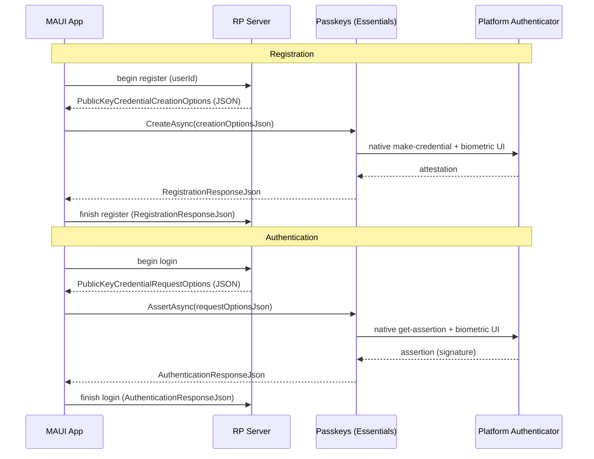

# Passkeys (WebAuthn / FIDO2) — Cross-platform Essentials API

| | |
|---|---|
| **Status** | Draft / Proposal (spec-first, open for discussion) |
| **Area** | `area-essentials` |
| **Namespace** | `Microsoft.Maui.Authentication` |
| **Target** | Next `netN.0` feature branch (adds public API) |
| **Related** | Discussion [#21498](https://github.com/dotnet/maui/discussions/21498) "FIDO2 Passkeys support?", Issue [#32020](https://github.com/dotnet/maui/issues/32020) "Cannot use passkey/fido/webauthn in BlazorWebView" |

> **This is a spec-first proposal.** The intent is to agree on the public API shape and per-platform
> implementation strategy *before* writing the implementation. Please leave feedback on the PR. The API
> surface, type names, and design decisions in this document are all open for refinement.

## 1. Summary

Add a cross-platform Essentials API that lets a .NET MAUI app create and use **passkeys** (WebAuthn /
FIDO2 public-key credentials) using the native platform authenticator UI (Face ID / Touch ID / Windows
Hello / Android biometric + Google Password Manager / iCloud Keychain).

The API is intentionally **thin**: it brokers between the app's relying-party (RP) server and the OS
authenticator. The server produces standard WebAuthn options JSON; the API drives the native UI and
returns the standard WebAuthn response JSON to send back to the server for verification. It does **not**
implement any server-side WebAuthn verification, attestation validation, or challenge generation.

## 2. Motivation

- Passwordless / phishing-resistant sign-in via passkeys is now a first-class capability on the primary
  MAUI app platforms — Android, iOS/iPadOS, Mac Catalyst, and Windows — yet MAUI exposes **none** of it
  natively. (Support is per-platform; see §7 for exactly which targets are covered and which fall back to
  `IsSupported == false`.)
- The existing `WebAuthenticator` Essentials API is **OAuth web-redirect** auth — despite the similar
  name it is unrelated to WebAuthn/passkeys.
- BlazorWebView cannot use the browser WebAuthn JS API ([#32020](https://github.com/dotnet/maui/issues/32020)),
  so even hybrid apps need a native bridge.
- Each platform's native passkey API is non-trivial (delegate/callback bridges on Apple, coroutine
  interop on Android, raw Win32 struct marshaling on Windows). Centralizing this in Essentials removes a
  large amount of per-app boilerplate and platform expertise.

## 3. Goals / Non-goals

### Goals
- One cross-platform API to **create** (register) and **get** (authenticate / assert) a passkey.
- Use the **standard WebAuthn JSON** contract so it interoperates 1:1 with existing server libraries
  (e.g. [Fido2NetLib](https://github.com/passwordless-lib/fido2-net-lib), SimpleWebAuthn, etc.).
- Follow existing Essentials conventions (`interface` + static facade + per-platform partial
  implementation + `Default`/`SetDefault` testability), mirroring `WebAuthenticator`.
- Graceful capability detection (`IsSupported`) and clear exceptions on unsupported OS/versions.

### Non-goals (for v1)
- Server-side WebAuthn (challenge issuance, attestation/assertion verification). That stays on the RP
  server, as the spec intends.
- Acting as a **credential provider** / password manager (Android `CredentialProviderService`, iOS
  AutoFill credential provider extension). This is "use passkeys in my app", not "be a passkey vault".
- Conditional UI / autofill-driven passkey sign-in (may be a follow-up; see Open Questions).
- Cross-device / security-key–only flows as a distinct API. On platforms where the OS offers this
  automatically (Apple, Windows) it is available through the same call; a dedicated security-key API is
  out of scope for v1.
- A strongly-typed C# model of the entire WebAuthn options/response schema (see §6.2 for rationale).

## 4. Background: passkeys & the cross-platform insight

A passkey ceremony has two operations, both defined by the [W3C WebAuthn spec](https://www.w3.org/TR/webauthn-3/):

1. **Registration** (`navigator.credentials.create`): server sends `PublicKeyCredentialCreationOptions`
   → authenticator creates a key pair → returns an attestation response → server stores the public key.
2. **Authentication** (`navigator.credentials.get`): server sends `PublicKeyCredentialRequestOptions`
   → authenticator signs the challenge → returns an assertion → server verifies the signature.



**Key design driver — the interop format:**

| Platform | Native contract |
|---|---|
| **Android** (Credential Manager) | **WebAuthn JSON in / JSON out** — native |
| **Apple** (AuthenticationServices) | Structured `NSData` objects |
| **Windows** (Win32 `webauthn.dll`) | Structured C structs |

Because Android already speaks the exact browser WebAuthn JSON, and because that JSON is what every
server library emits/consumes, the cross-platform contract is **JSON-in / JSON-out**. Android is a
pass-through; Apple and Windows translate JSON ⇄ native structures internally. This keeps the public API
tiny and forward-compatible with new WebAuthn fields.

## 5. Proposed public API

> The C# below is **illustrative shape, not compilable code** — get-only properties, elided bodies, and
> `internal` constructors show the intended public surface, not the implementation. Types are sketched to
> convey names, signatures, and relationships for review.

```csharp
namespace Microsoft.Maui.Authentication;

/// <summary>
/// Create and use passkeys (WebAuthn / FIDO2 public-key credentials) with the native
/// platform authenticator. Brokers standard WebAuthn JSON between a relying-party server
/// and the OS; does not perform server-side verification.
/// </summary>
public interface IPasskeys
{
    /// <summary>
    /// Whether this platform (and OS version) can create and use passkeys.
    /// </summary>
    bool IsSupported { get; }

    /// <summary>
    /// Registers a new passkey. Drives the native "create credential" UI.
    /// </summary>
    /// <param name="options">
    /// The relying party's <c>PublicKeyCredentialCreationOptions</c> (server-provided).
    /// </param>
    /// <returns>The WebAuthn registration response to send back to the RP server.</returns>
    Task<PasskeyCreationResponse> CreateAsync(
        PasskeyCreationOptions options,
        CancellationToken cancellationToken = default);

    /// <summary>
    /// Authenticates with an existing passkey. Drives the native "get credential" UI.
    /// </summary>
    /// <param name="options">
    /// The relying party's <c>PublicKeyCredentialRequestOptions</c> (server-provided).
    /// </param>
    /// <returns>The WebAuthn assertion response to send back to the RP server.</returns>
    Task<PasskeyAssertionResponse> AssertAsync(
        PasskeyRequestOptions options,
        CancellationToken cancellationToken = default);
}

/// <summary>
/// The relying party's <c>PublicKeyCredentialCreationOptions</c>, for <see cref="IPasskeys.CreateAsync"/>.
/// </summary>
public sealed class PasskeyCreationOptions
{
    /// <param name="creationOptionsJson">The server's <c>PublicKeyCredentialCreationOptions</c> JSON.</param>
    public PasskeyCreationOptions(string creationOptionsJson) =>
        _json = creationOptionsJson ?? throw new ArgumentNullException(nameof(creationOptionsJson));

    readonly string _json;

    /// <summary>
    /// When <see langword="true"/>, only offer credentials already available on-device without a
    /// network/hybrid step. Maps to Android <c>preferImmediatelyAvailableCredentials</c>; ignored
    /// where unsupported. (App-side behavior knob — not part of the server JSON.)
    /// </summary>
    public bool PreferImmediatelyAvailable { get; set; }

    /// <summary>Returns the underlying <c>PublicKeyCredentialCreationOptions</c> JSON.</summary>
    public override string ToString() => _json;
}

/// <summary>
/// The relying party's <c>PublicKeyCredentialRequestOptions</c>, for <see cref="IPasskeys.AssertAsync"/>.
/// </summary>
public sealed class PasskeyRequestOptions
{
    /// <param name="requestOptionsJson">The server's <c>PublicKeyCredentialRequestOptions</c> JSON.</param>
    public PasskeyRequestOptions(string requestOptionsJson) =>
        _json = requestOptionsJson ?? throw new ArgumentNullException(nameof(requestOptionsJson));

    readonly string _json;

    /// <inheritdoc cref="PasskeyCreationOptions.PreferImmediatelyAvailable"/>
    public bool PreferImmediatelyAvailable { get; set; }

    /// <summary>Returns the underlying <c>PublicKeyCredentialRequestOptions</c> JSON.</summary>
    public override string ToString() => _json;
}

/// <summary>
/// Result of a passkey registration. <see cref="ToString"/> returns the full WebAuthn registration
/// response (shape of <c>PublicKeyCredential</c> with an <c>AuthenticatorAttestationResponse</c>) —
/// POST it to the RP server to finish registration. A couple of commonly-needed fields are decoded
/// and cached as properties; everything else stays in the JSON for the server to verify.
/// </summary>
public sealed class PasskeyCreationResponse
{
    internal PasskeyCreationResponse(string registrationResponseJson) { /* parses lazily; caches */ }

    /// <summary>
    /// The credential id (base64url), i.e. the WebAuthn <c>PublicKeyCredential.id</c>. This is the
    /// single, primary identifier of the created passkey; store it to look the credential up later.
    /// </summary>
    public string Id { get; }

    /// <summary>Returns the full WebAuthn registration response JSON.</summary>
    public override string ToString();
}

/// <summary>
/// Result of a passkey authentication. <see cref="ToString"/> returns the full WebAuthn authentication
/// response (shape of <c>PublicKeyCredential</c> with an <c>AuthenticatorAssertionResponse</c>) —
/// POST it to the RP server to finish sign-in. A couple of commonly-needed fields are decoded and
/// cached as properties; everything else stays in the JSON for the server to verify.
/// </summary>
public sealed class PasskeyAssertionResponse
{
    internal PasskeyAssertionResponse(string authenticationResponseJson) { /* parses lazily; caches */ }

    /// <summary>
    /// The credential id (base64url), i.e. the WebAuthn <c>PublicKeyCredential.id</c> — identifies which
    /// passkey was used.
    /// </summary>
    public string Id { get; }

    /// <summary>
    /// The user handle (base64url) the RP set as <c>user.id</c> at registration, i.e. the WebAuthn
    /// <c>response.userHandle</c>. Present for discoverable-credential ("username-less") sign-in; may be
    /// <see langword="null"/> when the authenticator does not return one.
    /// </summary>
    public string? UserHandle { get; }

    /// <summary>Returns the full WebAuthn authentication response JSON.</summary>
    public override string ToString();
}

/// <summary>Static facade, mirroring <see cref="WebAuthenticator"/>.</summary>
public static class Passkeys
{
    public static bool IsSupported => Default.IsSupported;

    public static Task<PasskeyCreationResponse> CreateAsync(PasskeyCreationOptions options, CancellationToken cancellationToken = default)
        => Default.CreateAsync(options, cancellationToken);

    public static Task<PasskeyAssertionResponse> AssertAsync(PasskeyRequestOptions options, CancellationToken cancellationToken = default)
        => Default.AssertAsync(options, cancellationToken);

    // Convenience string overloads on the facade (construct the options object from raw server JSON).
    public static Task<PasskeyCreationResponse> CreateAsync(string creationOptionsJson, CancellationToken cancellationToken = default)
        => Default.CreateAsync(new PasskeyCreationOptions(creationOptionsJson), cancellationToken);

    public static Task<PasskeyAssertionResponse> AssertAsync(string requestOptionsJson, CancellationToken cancellationToken = default)
        => Default.AssertAsync(new PasskeyRequestOptions(requestOptionsJson), cancellationToken);

    static IPasskeys? defaultImplementation;
    public static IPasskeys Default => defaultImplementation ??= new PasskeysImplementation();
    internal static void SetDefault(IPasskeys? implementation) => defaultImplementation = implementation;
}
```

**On the response properties (the 80/20).** Rather than extension methods, the two or three fields most
apps actually read on-device are exposed as **real, cached properties** directly on the response types.
Everything else (attestation object, authenticator data, signature, client-data JSON) stays inside the
JSON returned by `ToString()` — those are consumed by the RP server, not the client. The responses parse
their JSON lazily on first property access and cache the results.

- **`Id` (both responses)** — the credential id, base64url. See §6.3 for why it's `Id` (matches the W3C
  JSON member `id`) and not `CredentialId`, and why raw bytes are deferred.
- **`UserHandle` (assertion only)** — base64url, nullable; the RP's `user.id`, useful for username-less
  sign-in.

### 5.1 Usage examples

#### Registration (creating a passkey)

The app asks its server to begin registration, hands the returned `PublicKeyCredentialCreationOptions`
JSON to `CreateAsync`, which drives the native "create credential" UI (Face ID / Windows Hello / Android
biometric). The resulting registration response JSON is posted back to the server, which verifies it and
stores the new public key.

```csharp
using System.Text; // for StringContent / Encoding
using Microsoft.Maui.Authentication;

if (!Passkeys.IsSupported)
    return; // fall back to password UI

// 1. Ask your server to begin registration; it returns PublicKeyCredentialCreationOptions JSON.
string creationOptionsJson = await httpClient.GetStringAsync("/passkey/register/begin");

// 2. Drive the native create-credential UI (Face ID / Windows Hello / Android biometric).
PasskeyCreationResponse created = await Passkeys.CreateAsync(creationOptionsJson);

// 3. Send the raw response JSON back to the server to verify + store the public key.
//    `created.ToString()` is *already* WebAuthn JSON, so post it as a raw application/json
//    body — do NOT use PostAsJsonAsync, which would re-encode the string as a quoted JSON literal.
using var body = new StringContent(created.ToString(), Encoding.UTF8, "application/json");
await httpClient.PostAsync("/passkey/register/finish", body);

// Optional: store the credential id so you can reference this passkey later.
string credentialId = created.Id;   // base64url
```

#### Login (authenticating with a passkey)

The app asks its server to begin sign-in, hands the returned `PublicKeyCredentialRequestOptions` JSON to
`AssertAsync`, which drives the native "get credential" UI so the user picks a passkey and authenticates.
The resulting assertion response JSON is posted back to the server, which verifies the signature to
complete sign-in.

```csharp
using System.Text; // for StringContent / Encoding
using Microsoft.Maui.Authentication;

if (!Passkeys.IsSupported)
    return; // fall back to password UI

// 1. Ask your server to begin sign-in; it returns PublicKeyCredentialRequestOptions JSON.
string requestOptionsJson = await httpClient.GetStringAsync("/passkey/login/begin");

// 2. Drive the native get-credential UI so the user selects a passkey and authenticates.
PasskeyAssertionResponse asserted = await Passkeys.AssertAsync(requestOptionsJson);

// 3. Send the raw response JSON back to the server to verify the signature and finish sign-in.
//    Post the already-serialized WebAuthn JSON as a raw application/json body (not PostAsJsonAsync).
using var body = new StringContent(asserted.ToString(), Encoding.UTF8, "application/json");
await httpClient.PostAsync("/passkey/login/finish", body);

// Optional: a couple of commonly-needed fields are available directly as (cached) properties.
string credentialId = asserted.Id;          // base64url — which passkey was used
string? userHandle = asserted.UserHandle;   // base64url RP user id, if returned
```

## 6. Design decisions

### 6.1 Why JSON in / JSON out
- **Zero translation on Android** — Credential Manager consumes/produces exactly this JSON.
- **1:1 with server libraries** — Fido2NetLib etc. already emit `CreationOptions`/`RequestOptions` JSON
  and consume the response JSON. No impedance mismatch.
- **Smallest public surface** — two options types + two response types.
- **Forward-compatible** — new WebAuthn fields (e.g. `hints`, PRF extension) require no API change; they
  flow through the JSON. On Apple/Windows we map the subset the OS supports and ignore the rest.

### 6.2 Thin wrapper types (not raw strings, not a full typed model)
Each payload is a small dedicated type whose **`ToString()` returns the underlying WebAuthn JSON** — there
is deliberately **no shared base class** and **no `Json` property**; the JSON is simply what the object
stringifies to. This is the middle ground:

- **vs. raw strings:** stronger typing (can't pass a request where a response is expected, or an options
  object where a response goes), and a natural home for the app-side behavior knob
  (`PreferImmediatelyAvailable`) and the decoded properties — while still surfacing the JSON verbatim via
  `ToString()`.
- **vs. a fully-typed WebAuthn model:** a complete model (`Rp`, `User`, `PubKeyCredParams`,
  `AllowCredentials`, `AuthenticatorSelection`, extensions…) is a **large** public surface that must
  track ongoing WebAuthn spec churn, still needs JSON serialization for Android, and duplicates types in
  server libraries.
- **Decoded fields are real, cached properties — not extension methods, and not the whole schema.** We
  start with the 80/20 the client actually reads (`Id`, and `UserHandle` on the assertion) as ordinary
  properties. No `PasskeysExtensions` class ships initially; more fields (or the raw bytes) can be added
  as **new properties/methods later without breaking** the core API. Responses parse their JSON lazily and
  cache the decoded values.

### 6.3 Naming decisions

Naming is anchored to the terms the W3C WebAuthn spec and the platform SDKs already use, so the API is
familiar to anyone who has touched passkeys and searchable against existing docs.

**Industry background.** The [W3C WebAuthn Level 3](https://www.w3.org/TR/webauthn-3/) spec defines
dedicated *JSON serialization* types whose names all carry a **`JSON` suffix**:
[`PublicKeyCredentialCreationOptionsJSON`](https://w3c.github.io/webauthn/#dictdef-publickeycredentialcreationoptionsjson),
[`PublicKeyCredentialRequestOptionsJSON`](https://w3c.github.io/webauthn/#dictdef-publickeycredentialrequestoptionsjson),
[`RegistrationResponseJSON`](https://w3c.github.io/webauthn/#dictdef-registrationresponsejson), and
[`AuthenticationResponseJSON`](https://w3c.github.io/webauthn/#dictdef-authenticationresponsejson),
produced/consumed via [`PublicKeyCredential.toJSON()`](https://w3c.github.io/webauthn/#dom-publickeycredential-tojson)
and `parseCreationOptionsFromJSON()` / `parseRequestOptionsFromJSON()`. Android's Credential Manager
mirrors this with string members named
[`requestJson`](https://developer.android.com/reference/androidx/credentials/CreatePublicKeyCredentialRequest),
[`registrationResponseJson`](https://developer.android.com/reference/androidx/credentials/CreatePublicKeyCredentialResponse),
and [`authenticationResponseJson`](https://developer.android.com/reference/androidx/credentials/PublicKeyCredential).

So the industry vocabulary is: **inputs are "options", outputs are "responses", and the serialized form
is called "JSON"** — not "payload", not "request"/"response body". That directly informs the names below.

| MAUI type / member | Wraps (industry type) | Reasoning & source |
|---|---|---|
| `PasskeyCreationOptions` | [`PublicKeyCredentialCreationOptionsJSON`](https://w3c.github.io/webauthn/#dictdef-publickeycredentialcreationoptionsjson) | Registration **input** → "creation options". Matches W3C "creation options" and Android's `CreatePublicKeyCredentialRequest(requestJson)`. |
| `PasskeyRequestOptions` | [`PublicKeyCredentialRequestOptionsJSON`](https://w3c.github.io/webauthn/#dictdef-publickeycredentialrequestoptionsjson) | Authentication **input** → "request options". Matches W3C "request options" and Android's `GetPublicKeyCredentialOption(requestJson)`. (WebAuthn overloads "request" to mean the *get* options — hence `RequestOptions`, not `AssertionOptions`.) |
| `PasskeyCreationResponse` | [`RegistrationResponseJSON`](https://w3c.github.io/webauthn/#dictdef-registrationresponsejson) | Registration **output**. W3C/Android both call this the "registration response". |
| `PasskeyAssertionResponse` | [`AuthenticationResponseJSON`](https://w3c.github.io/webauthn/#dictdef-authenticationresponsejson) | Authentication **output**. W3C JSON type is "authentication response"; the underlying object is `AuthenticatorAssertionResponse` and Apple calls it an *assertion*. See Open Question #5 on `Assertion` vs `Authentication`. |
| `ToString()` (each type) | `...JSON` suffix / Android `...Json` members | Returns the raw serialized value. There is no separate `Json` property or shared base — the object simply stringifies to its WebAuthn JSON. (The W3C `JSON` suffix / Android `requestJson` naming is why the JSON is the object's canonical string form.) |
| `Id` (both responses) | [`PublicKeyCredential.id`](https://www.w3.org/TR/webauthn-3/#dom-publickeycredential-id) | The credential id, base64url. See "Id naming" below. |
| `UserHandle` (assertion) | [`AuthenticatorAssertionResponse.userHandle`](https://www.w3.org/TR/webauthn-3/#dom-authenticatorassertionresponse-userhandle) → JSON [`userHandle`](https://w3c.github.io/webauthn/#dom-authenticationresponsejson) | "User handle" is the W3C term of art (the RP's `user.id`). `string?` base64url, nullable. Apple exposes it as `UserId`; we prefer the W3C name. |
| `Passkeys` / `IPasskeys` | — | User-facing term everyone uses ([FIDO Alliance "passkeys"](https://fidoalliance.org/passkeys/)), rather than the spec-internal `WebAuthn`/`PublicKeyCredential` or the older `FIDO2`. |
| `CreateAsync` | `navigator.credentials.create()` | W3C registration verb is *create*; Android is `createCredential`. |
| `AssertAsync` | `navigator.credentials.get()` | W3C authentication verb is *get*, but a bare `GetAsync` is meaningless here and collides with the many `Get*` APIs; the ceremony's output is an [*assertion*](https://www.w3.org/TR/webauthn-3/#authentication-assertion), so `Assert` is precise. See Open Question #5. |

**No shared base type — decision.** Earlier drafts had an abstract `PasskeyJsonObject` base. It's dropped:
there is no W3C concept for it, and its only job (hold + stringify JSON) is fully served by a `ToString()`
override on each concrete type. Each of the four types is small and self-contained, which also keeps the
public surface honest (an options type and a response type genuinely have nothing in common but "wraps
JSON"). "Payload" was considered and rejected — WebAuthn/Android never use it, and it would blur the
options-vs-response distinction the spec makes explicit.

**`Id` naming — decision.** In WebAuthn the value is the [**Credential ID**](https://www.w3.org/TR/webauthn-3/#credential-id):
a probabilistically-unique byte sequence that identifies the public key credential. It surfaces on
`PublicKeyCredential` in two forms of the *same* value —
[`id`](https://www.w3.org/TR/webauthn-3/#dom-publickeycredential-id) (base64url string) and
[`rawId`](https://www.w3.org/TR/webauthn-3/#dom-publickeycredential-rawid) (the bytes). So "credential"
does carry meaning, **but within a single passkey response there is exactly one identifier and it is the
primary one.** We therefore expose it as **`Id`** (`string`, base64url):

- Matches the W3C/Android JSON member name `id` verbatim — the exact token the customer sees in the
  payload and stores in their DB, so comparisons are direct.
- Unambiguous in context (a `PasskeyAssertionResponse.Id` can only be the credential id).
- Shortest correct name. Apple's binding calls the byte form `CredentialId`; `CredentialId` is offered as
  the alternative in Open Question #7 for reviewers who prefer the explicit term.

**Raw id bytes — decision (defer).** `rawId` is the same Credential ID as bytes. Credential IDs are
[spec-capped at 1023 bytes](https://www.w3.org/TR/webauthn-3/#credential-id) but for passkeys are typically
small (~16–64 bytes). We **do not** expose them in v1: the base64url `Id` is what apps forward and compare,
and the full `rawId` remains in the `ToString()` JSON. If demand appears, the .NET guideline against
array-typed properties argues for a **method** (`byte[] GetRawId()`) rather than a `byte[] RawId` property;
tracked in Open Question #7.

### 6.4 Placement
- Lives in Essentials alongside `WebAuthenticator`, namespace `Microsoft.Maui.Authentication`.

## 7. Platform implementation design

Each platform gets a `PasskeysImplementation` partial, following the existing `WebAuthenticator` file
convention (see `src/Essentials/src/WebAuthenticator/`): `Passkeys.android.cs`, `Passkeys.ios.cs`
(compiles for **both** iOS and Mac Catalyst), `Passkeys.windows.cs`, and a not-supported stub
`Passkeys.netstandard.tvos.tizen.cs`. A `Passkeys.maccatalyst.cs` would be added only if Mac Catalyst
needs behavior that differs from iOS. Note Essentials does **not** currently build a standalone `net-macos`
target (the `macos` compile group in `Essentials.csproj` is commented out), so there is no
`Passkeys.macos.cs` in v1 — see §7.2.

### 7.1 Android — Jetpack Credential Manager

- Docs: [Credential Manager](https://developer.android.com/identity/credential-manager) ·
  [Sign in with passkeys](https://developer.android.com/identity/sign-in/credential-manager) ·
  [`androidx.credentials` reference](https://developer.android.com/reference/androidx/credentials/package-summary)
- **New NuGet dependencies**: `Xamarin.AndroidX.Credentials` and
  `Xamarin.AndroidX.Credentials.PlayServicesAuth` (Essentials currently references AndroidX Activity,
  Browser, Security.SecurityCrypto — not Credentials).
- Native model (Kotlin, from the official guide):

  ```kotlin
  // Registration
  val credentialManager = CredentialManager.create(context)
  val request = CreatePublicKeyCredentialRequest(requestJson = creationOptionsJson)
  val result = credentialManager.createCredential(context, request)
        as CreatePublicKeyCredentialResponse
  val registrationResponseJson = result.registrationResponseJson

  // Authentication
  val option = GetPublicKeyCredentialOption(requestJson = requestOptionsJson)
  val getRequest = GetCredentialRequest(listOf(option))
  val getResult = credentialManager.getCredential(context, getRequest)
  val publicKeyCredential = getResult.credential as PublicKeyCredential
  val authenticationResponseJson = publicKeyCredential.authenticationResponseJson
  ```

- Projected .NET usage (`AndroidX.Credentials`, exact async-interop shape to be confirmed during
  implementation — the underlying API is Kotlin-suspend/callback and will be wrapped in a
  `TaskCompletionSource`):

  ```csharp
  var manager = CredentialManager.Create(Platform.CurrentActivity!);
  var request = new CreatePublicKeyCredentialRequest(options.ToString());
  var response = (CreatePublicKeyCredentialResponse)await manager.CreateCredentialAsync(
      Platform.CurrentActivity!, request /*, cancellationSignal, executor */);
  var registrationResponseJson = response.RegistrationResponseJson;
  ```

- **Context**: requires the current `Activity` (via `Platform.CurrentActivity`). Passkey UI is a bottom
  sheet on that activity.
- **App setup (documented, not code)**: host a [Digital Asset Links](https://developer.android.com/identity/sign-in/credential-manager#add-support-dal)
  file at `https://<rp-id>/.well-known/assetlinks.json` binding the app's signing certificate.
- **Min API**: Credential Manager is API 23+, but passkeys realistically need **API 28+ (Android 9)**
  with Google Play services. `IsSupported` gates on this.
- Exceptions map from `CreateCredentialException` / `GetCredentialException` subclasses (e.g.
  `*CancellationException` → `TaskCanceledException`, `NoCredentialException` → no-credential result).

### 7.2 Apple — AuthenticationServices (iOS / iPadOS / Mac Catalyst)

- **Scope note (macOS).** The `AuthenticationServices` passkey API exists on standalone macOS 13+ too,
  but **Essentials does not currently build a `net-macos` target** (the `macos` compile group in
  `Essentials.csproj` is commented out). So v1 covers **iOS, iPadOS, and Mac Catalyst**. Standalone
  macOS support is a near-free follow-up once/if Essentials enables the macOS TFM — the implementation
  code would be effectively identical.
- Docs: [`ASAuthorizationPlatformPublicKeyCredentialProvider`](https://developer.apple.com/documentation/authenticationservices/asauthorizationplatformpublickeycredentialprovider) ·
  [Supporting passkeys](https://developer.apple.com/documentation/authenticationservices/public-private_key_authentication/supporting_passkeys) ·
  [.NET binding](https://learn.microsoft.com/dotnet/api/authenticationservices.asauthorizationplatformpublickeycredentialprovider)
- **No new dependency** — `AuthenticationServices` is already bound in `Microsoft.iOS` /
  `Microsoft.MacCatalyst` (and `Microsoft.macOS`, if a macOS target is later enabled).
- **Structured, not JSON.** We parse the incoming options JSON, extract `challenge`, `user.id`,
  `user.name`, `rp.id`, `pubKeyCredParams`, `allowCredentials`, `userVerification`, then build the
  native request; on completion we read the raw `NSData` and **assemble the WebAuthn response JSON**
  ourselves (base64url-encoding the binary fields).
- **Binding note (Obj-C, not Swift).** `Microsoft.iOS` / `Microsoft.MacCatalyst` bind the **Objective-C**
  `AuthenticationServices` framework and project it to C#. There is no Swift interop involved — the
  "native" API we actually call from the MAUI implementation is the bound Obj-C surface. The Swift
  snippet below is the canonical Apple-docs reference; the C# snippet is the equivalent bound API the
  implementation would use. Both are provided for reviewers.

- Reference — Apple's native model (Swift, from the Apple docs):

  ```swift
  let provider = ASAuthorizationPlatformPublicKeyCredentialProvider(relyingPartyIdentifier: rpId)

  // Registration
  let reg = provider.createCredentialRegistrationRequest(
      challenge: challenge, name: userName, userID: userId)
  // Authentication
  let asr = provider.createCredentialAssertionRequest(challenge: challenge)

  let controller = ASAuthorizationController(authorizationRequests: [reg]) // or [asr]
  controller.delegate = self
  controller.presentationContextProvider = self
  controller.performRequests()
  ```

- Bound API — the equivalent in C# (Objective-C projection via `Microsoft.iOS` etc.), which is what the
  MAUI implementation actually writes:

  ```csharp
  using AuthenticationServices;
  using Foundation;

  var provider = new ASAuthorizationPlatformPublicKeyCredentialProvider(relyingPartyIdentifier: rpId);

  // Registration (challenge/userId are NSData parsed from the options JSON)
  ASAuthorizationPlatformPublicKeyCredentialRegistrationRequest reg =
      provider.CreateCredentialRegistrationRequest(challenge, userName, userId);
  // Authentication
  ASAuthorizationPlatformPublicKeyCredentialAssertionRequest asr =
      provider.CreateCredentialAssertionRequest(challenge);

  var controller = new ASAuthorizationController(new ASAuthorizationRequest[] { reg }) // or { asr }
  {
      Delegate = this,                     // ASAuthorizationControllerDelegate
      PresentationContextProvider = this,  // IASAuthorizationControllerPresentationContextProviding
  };
  controller.PerformRequests();

  // Delegate callbacks (bridged to a TaskCompletionSource):
  //   DidComplete(ASAuthorizationController, ASAuthorization)  -> success
  //   DidComplete(ASAuthorizationController, NSError)          -> failure/cancel
  ```

- Verified .NET binding members we build on (`net-ios` `AuthenticationServices`, `Microsoft.iOS.dll`):
  - `ASAuthorizationPlatformPublicKeyCredentialProvider(string relyingPartyIdentifier)`,
    `.CreateCredentialRegistrationRequest(NSData challenge, string name, NSData userId)`,
    `.CreateCredentialAssertionRequest(NSData challenge)`.
  - Request props: `Challenge`, `Name`, `UserId`, `DisplayName`, `UserVerificationPreference`,
    `AttestationPreference`.
  - Registration result `ASAuthorizationPlatformPublicKeyCredentialRegistration`:
    `RawAttestationObject`, `RawClientDataJson`, `CredentialId`.
  - Assertion result `ASAuthorizationPlatformPublicKeyCredentialAssertion`:
    `RawAuthenticatorData`, `Signature`, `UserId`, `RawClientDataJson`, `CredentialId`.
- Async bridge: wrap the `ASAuthorizationControllerDelegate` callbacks
  (`DidComplete(...ASAuthorization)` / `DidComplete(...NSError)`) in a `TaskCompletionSource`. Reuse the
  window/presentation-anchor plumbing already used by other Essentials APIs.
- **App setup (documented)**: [Associated Domains](https://developer.apple.com/documentation/xcode/supporting-associated-domains)
  entitlement with `webcredentials:<rp-id>` and a hosted `apple-app-site-association` file.
- **Min OS**: iOS 16 / iPadOS 16 / Mac Catalyst 16 (and macOS 13 Ventura if a macOS target is later
  enabled). Gate `IsSupported` via `OperatingSystem.IsIOSVersionAtLeast(16)` etc.

### 7.3 Windows — Win32 WebAuthn API (`webauthn.dll`)

- Docs: [`WebAuthNAuthenticatorMakeCredential`](https://learn.microsoft.com/windows/win32/api/webauthn/nf-webauthn-webauthnauthenticatormakecredential) ·
  [`WebAuthNAuthenticatorGetAssertion`](https://learn.microsoft.com/windows/win32/api/webauthn/nf-webauthn-webauthnauthenticatorgetassertion) ·
  [webauthn.h header](https://learn.microsoft.com/windows/win32/api/webauthn/) ·
  [Microsoft `webauthn` reference implementation](https://github.com/microsoft/webauthn)
- **No NuGet dependency** — direct P/Invoke into the in-box `webauthn.dll`. `AllowUnsafeBlocks` is
  already enabled for the Windows TFM in `Essentials.csproj`.
- **Structured, not JSON.** Same JSON ⇄ struct translation as Apple, plus manual marshaling.
- Native signatures:

  ```cpp
  HRESULT WebAuthNAuthenticatorMakeCredential(
      HWND hWnd,
      PCWEBAUTHN_RP_ENTITY_INFORMATION                 pRpInformation,
      PCWEBAUTHN_USER_ENTITY_INFORMATION               pUserInformation,
      PCWEBAUTHN_COSE_CREDENTIAL_PARAMETERS            pPubKeyCredParams,
      PCWEBAUTHN_CLIENT_DATA                           pWebAuthNClientData,
      PCWEBAUTHN_AUTHENTICATOR_MAKE_CREDENTIAL_OPTIONS pWebAuthNMakeCredentialOptions,
      PWEBAUTHN_CREDENTIAL_ATTESTATION                *ppWebAuthNCredentialAttestation);

  HRESULT WebAuthNAuthenticatorGetAssertion(
      HWND hWnd,
      LPCWSTR                                          pwszRpId,
      PCWEBAUTHN_CLIENT_DATA                           pWebAuthNClientData,
      PCWEBAUTHN_AUTHENTICATOR_GET_ASSERTION_OPTIONS  pWebAuthNGetAssertionOptions,
      PWEBAUTHN_ASSERTION                             *ppWebAuthNAssertion);

  DWORD WebAuthNGetApiVersionNumber();
  HRESULT WebAuthNIsUserVerifyingPlatformAuthenticatorAvailable(BOOL *pbIsUserVerifyingPlatformAuthenticatorAvailable);
  void   WebAuthNFreeCredentialAttestation(PWEBAUTHN_CREDENTIAL_ATTESTATION);
  void   WebAuthNFreeAssertion(PWEBAUTHN_ASSERTION);
  ```

- **HWND**: the API is modal on a top-level window. Acquire the current window handle from the MAUI
  window (`WinRT.Interop.WindowNative.GetWindowHandle(...)`).
- **`ClientDataJson`**: on Windows we must supply the `WEBAUTHN_CLIENT_DATA` (challenge + origin +
  type). We build client data JSON from the options and pass it through; the OS returns
  `pbAttestationObject` / `pbCredentialId` (make) and `pbAuthenticatorData` / `pbSignature` /
  `pbUserId` (get), which we base64url-encode into the response JSON.
- **Version gating**: `WebAuthNGetApiVersionNumber()` for capability, and
  `WebAuthNIsUserVerifyingPlatformAuthenticatorAvailable` for Hello availability. Passkeys need
  **Windows 11**; older `webauthn.dll` (Win10 1903+) supports FIDO2 security keys but not full passkeys.
- **Highest implementation cost** of the three (struct marshaling, memory ownership/free, version
  branching). Recommend implementing this platform **last**.

### 7.4 Unsupported platforms
- **Built by Essentials but no passkey support in v1** — `netstandard`, tvOS, Tizen: `IsSupported == false`;
  `CreateAsync`/`AssertAsync` throw `FeatureNotSupportedException` (consistent with other Essentials APIs).
  Covered by the `Passkeys.netstandard.tvos.tizen.cs` stub. (tvOS *does* have an
  `AuthenticationServices` passkey API and could be added later; it is out of scope for v1.)
- **Not built by Essentials today** — standalone macOS and watchOS compile groups are commented out in
  `Essentials.csproj`, so they need no stub until those targets are enabled.

## 8. Error handling

| Situation | Behavior |
|---|---|
| OS/version without passkey support | `IsSupported == false`; calls throw `FeatureNotSupportedException` |
| User cancels the native UI | `TaskCanceledException` (matches `WebAuthenticator`) |
| No matching credential (authenticate) | `TaskCanceledException` or a dedicated `PasskeyException` (Open Question) |
| Malformed options JSON | `ArgumentException` |
| Domain association not configured | Platform error surfaced as `PasskeyException` with the native message |
| Any other native failure | `PasskeyException` wrapping the platform exception/HRESULT |

## 9. Dependencies & packaging impact
- **Android**: adds `Xamarin.AndroidX.Credentials` + `Xamarin.AndroidX.Credentials.PlayServicesAuth`
  package references (version pinned via `eng/Versions.props`). This increases the Android dependency
  closure of `Microsoft.Maui.Essentials` — needs sign-off (size/servicing considerations, `NuGets.md`).
- **Apple / Windows**: no new NuGet packages (in-box frameworks / P/Invoke).
- **Public API**: new types in `Microsoft.Maui.Authentication` → `PublicAPI.Unshipped.txt` entries per
  TFM. Because this adds public API, implementation targets the current `netN.0` feature branch.

## 10. Security considerations
- The API never sees or stores private keys — those remain in the platform authenticator / secure
  hardware. It only relays the public attestation/assertion material.
- Challenges must be generated and verified **server-side**; the API does not validate them. Doc must
  make this explicit to avoid misuse.
- RP ID / origin binding is enforced by the OS via domain association (asset links / associated
  domains). Misconfiguration fails closed at the OS layer.
- No secrets are logged; binary fields are surfaced only as part of the response the caller already
  must send to their server.

## 11. Testing strategy
- **Unit tests** (`Essentials.UnitTests`): options/response JSON (de)serialization, base64url handling,
  `IsSupported` gating, `SetDefault` substitution, exception mapping. Platform calls mocked via
  `IPasskeys`.
- **Device tests**: passkey ceremonies require real authenticators/biometrics and hosted domain
  association, so full end-to-end is hard to automate in CI. Propose: verify `IsSupported`, request
  construction, and JSON translation on-device; gate the interactive ceremony behind a manual/sample
  test with a reference RP server.
- **Sample**: add a Passkeys page to `Essentials.Sample` wired to a small reference RP endpoint.

## 12. Open questions
1. **Package size / dependency**: is adding AndroidX Credentials to Essentials acceptable, or should
   passkeys ship as a **separate opt-in NuGet** (e.g. `Microsoft.Maui.Authentication.Passkeys`) to avoid
   growing the Essentials closure for apps that don't use it?
2. **Security keys / cross-device**: expose any explicit control, or rely entirely on the OS-offered
   flows within the single call?
3. **Conditional UI / autofill** passkey sign-in (Android `preferImmediatelyAvailable`, iOS
   `ASAuthorizationController.performAutoFillAssistedRequests`, Windows silent) — v1 or follow-up?
4. **Decoded properties (the 80/20)**: v1 exposes the raw JSON via `ToString()` plus `Id` (both
   responses) and `UserHandle` (assertion) as cached properties. Is that the right minimal set? Candidates
   to add later as **properties/methods** (not extension methods): raw id bytes (`byte[] GetRawId()`),
   `AuthenticatorAttachment`, transports, client-data JSON. Anything here that's 80/20 enough for v1?
5. **Method / response naming**: `AssertAsync` vs `GetAsync` vs `AuthenticateAsync` (the last collides
   conceptually with `WebAuthenticator.AuthenticateAsync`). Relatedly, `PasskeyAssertionResponse` vs
   `PasskeyAuthenticationResponse` (W3C JSON type is `AuthenticationResponseJSON`, but Apple and
   `AuthenticatorAssertionResponse` use "assertion").
6. **BlazorWebView bridge** ([#32020](https://github.com/dotnet/maui/issues/32020)): should we also ship
   a JS-interop shim so `navigator.credentials` in BlazorWebView routes to this native API? Likely a
   separate proposal, but worth acknowledging.
7. **`Id` naming**: keep `Id` (matches the W3C JSON `id` member) or use the explicit `CredentialId`
   (matches Apple's binding and the "Credential ID" term of art)? See §6.3.

## 13. References
- W3C WebAuthn Level 3 — https://www.w3.org/TR/webauthn-3/
- W3C WebAuthn L3 §JSON serialization (`...JSON` types, `toJSON()`) — https://w3c.github.io/webauthn/#sctn-parseCreationOptionsFromJSON
- FIDO Alliance passkeys — https://fidoalliance.org/passkeys/
- Android Credential Manager — https://developer.android.com/identity/credential-manager
- Android passkeys guide — https://developer.android.com/identity/sign-in/credential-manager
- `androidx.credentials` API — https://developer.android.com/reference/androidx/credentials/package-summary
- Android `CreatePublicKeyCredentialRequest` (`requestJson`) — https://developer.android.com/reference/androidx/credentials/CreatePublicKeyCredentialRequest
- Apple `ASAuthorizationPlatformPublicKeyCredentialProvider` — https://developer.apple.com/documentation/authenticationservices/asauthorizationplatformpublickeycredentialprovider
- Apple "Supporting passkeys" — https://developer.apple.com/documentation/authenticationservices/public-private_key_authentication/supporting_passkeys
- .NET binding: `ASAuthorizationPlatformPublicKeyCredentialProvider` — https://learn.microsoft.com/dotnet/api/authenticationservices.asauthorizationplatformpublickeycredentialprovider
- Windows `WebAuthNAuthenticatorMakeCredential` — https://learn.microsoft.com/windows/win32/api/webauthn/nf-webauthn-webauthnauthenticatormakecredential
- Windows `WebAuthNAuthenticatorGetAssertion` — https://learn.microsoft.com/windows/win32/api/webauthn/nf-webauthn-webauthnauthenticatorgetassertion
- Microsoft `webauthn` reference — https://github.com/microsoft/webauthn
- Fido2NetLib (server-side .NET) — https://github.com/passwordless-lib/fido2-net-lib
