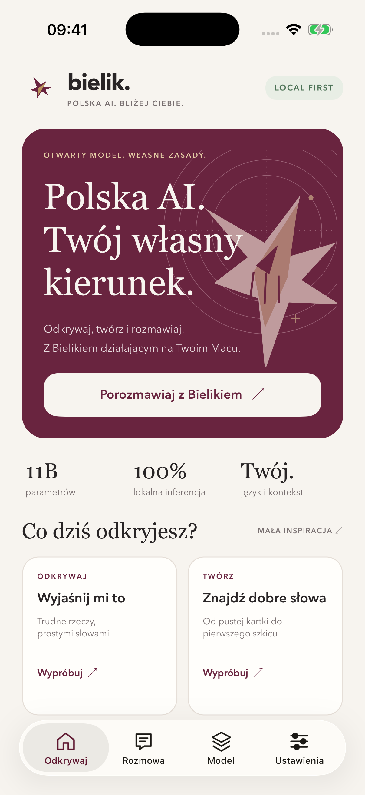
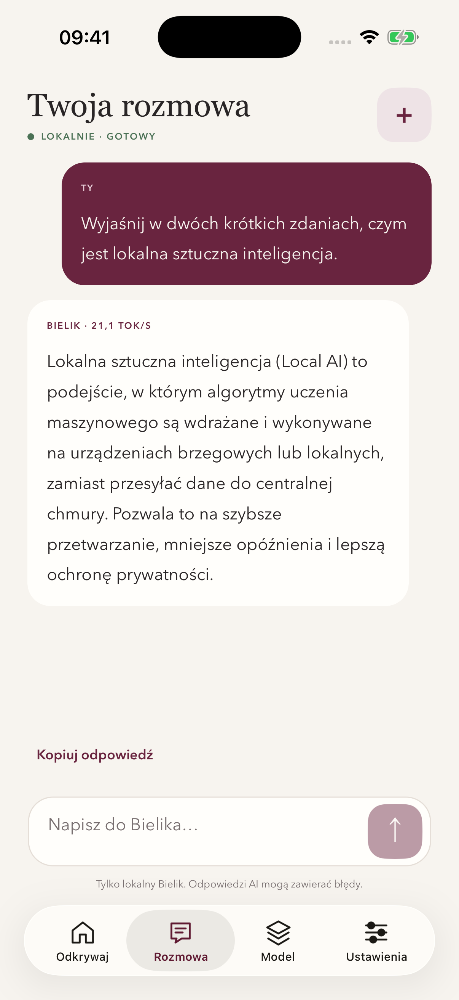
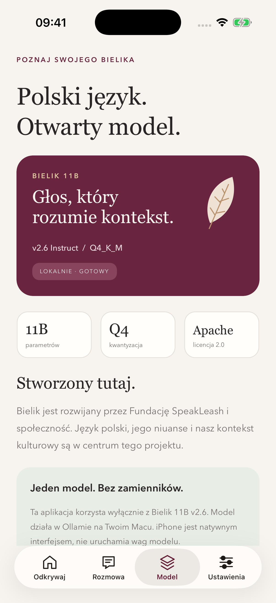

# Bielik for iOS

A native, Polish-language .NET 11 MAUI companion inspired by [bielik.ai](https://bielik.ai/). Four screens cover discovery, streamed chat, the selected model, and local connection settings. The artwork is original; this is an unofficial application, not a SpeakLeash product.

**Only local Bielik is used.** The pinned model is `hf.co/speakleash/Bielik-11B-v2.6-Instruct-GGUF:Q4_K_M`. Ollama runs it on the Mac; the iOS simulator is the native client. This is **not inference on the iPhone**. No other model or cloud AI fallback is configured.

This consumer app is isolated from the MAUI repository's build infrastructure. Its own SDK, workloads, packages, and build properties apply only beneath this directory. Run the following commands from `samples/Bielik`, not the repository root.

<p>
  
  
  
</p>

[Real local-inference walkthrough](media/local-bielik-walkthrough.mp4) · [UI progress recording](media/progress/ui-progress.mp4) · [Screenshots](media/screenshots)

## Requirements

| Component | Version used |
| --- | --- |
| .NET SDK | `11.0.100-preview.6.26359.118` |
| Workload set | `11.0.100-preview.6.26364.2` |
| MAUI Controls | `11.0.0-preview.6.26360.8` |
| Xcode | 26.6 |
| Simulator | iPhone 17 Pro, iOS 26.5 |
| Ollama | 0.32.14 |
| DevFlow agent and project-local CLI | `0.1.0-preview.12.26421.1` |

Install the SDK specified in [`global.json`](global.json), Xcode and its iOS simulator runtime. The SDK and MAUI APIs are previews. Ollama needs enough memory for an 11B model; the selected quantization downloads approximately 6.7 GB of weights. Python 3 is needed for the verification scripts, and FFmpeg is needed only for media compression.

```bash
cd samples/Bielik
dotnet --version
dotnet workload restore Bielik/Bielik.csproj
dotnet tool restore

# Only if these tools are missing:
brew install ollama ffmpeg
```

The local tool manifest deliberately pins the CLI to the agent version. An older global `maui` CLI can inspect the app but cannot honor the newer agent's mutation-lease protocol; use `dotnet maui` here.

## Run the exact local model

Start a dedicated, loopback-only Ollama server in one terminal:

```bash
OLLAMA_HOST=127.0.0.1:11434 OLLAMA_NO_CLOUD=1 ollama serve
```

In another terminal:

```bash
OLLAMA_HOST=127.0.0.1:11434 \
  ollama pull hf.co/speakleash/Bielik-11B-v2.6-Instruct-GGUF:Q4_K_M

curl --fail http://127.0.0.1:11434/api/version
```

Do not start a second server if the intended local instance already owns that port. The app checks `/api/tags` for the exact model before sending a conversation. Missing weights produce an explicit installation error, not a fallback response.

If the model download repeatedly fails with HTTP/2 stream cancellations, restart **only the server you started** with `GODEBUG=http2client=0` added to its environment, then repeat the pull. Ollama resumes partially downloaded weights.

**Runtime choice:** this app explicitly requests CPU inference (`num_gpu=0`). On this M4 Max with Ollama 0.32.14, a clean Metal runner repeatedly produced control characters and an incomplete response, while the same weights and prompt completed correctly on CPU. The [untouched comparison](media/runtime-comparison.json) preserves both outcomes. This is an observed runtime-specific limitation, not a claim that Bielik generally cannot use GPUs. No model substitution is involved.

## Build and install on the simulator

List available devices and choose a dedicated simulator:

```bash
xcrun simctl list devices available
export BIELIK_SIMULATOR="<your-simulator-UDID>"
xcrun simctl boot "$BIELIK_SIMULATOR"
xcrun simctl bootstatus "$BIELIK_SIMULATOR" -b
```

Skip `boot` if that simulator is already booted. None of these commands opens or takes control of the desktop Simulator window.

```bash
dotnet restore Bielik/Bielik.csproj \
  --runtime iossimulator-arm64 -p:Configuration=Debug

dotnet build Bielik/Bielik.csproj \
  --no-restore --framework net11.0-ios --configuration Debug \
  -p:RuntimeIdentifier=iossimulator-arm64 \
  -p:EnableCodeSigning=true -p:CodesignKey=-

xcrun simctl install "$BIELIK_SIMULATOR" \
  Bielik/bin/Debug/net11.0-ios/iossimulator-arm64/Bielik.app
xcrun simctl launch --terminate-running-process \
  "$BIELIK_SIMULATOR" dev.bielik.companion
```

Simulator ad-hoc signing is intentional. Disabling signing can cause iOS to kill the app before managed startup. Allow the first launch to finish loading; a splash-screen screenshot is not evidence that the pages rendered.

The default Debug endpoint is `http://127.0.0.1:11434`, which reaches this Mac from its iOS simulator. Open **Ustawienia** and check the connection, then use **Rozmowa**. Inspiration cards populate the composer without automatically sending a prompt.

If NuGet is unreachable but the exact dependencies are already cached, append `--source "$HOME/.nuget/packages"` to `dotnet restore`. This workaround was used on the development machine; it is not a replacement for fetching dependencies on a clean machine.

## Reproduce the checks and captures

The ordinary service tests require no simulator or model:

```bash
dotnet test Bielik.Core.Tests/Bielik.Core.Tests.csproj
```

They cover local-only endpoints, the Release HTTPS policy, exact-model enforcement, NDJSON streaming, malformed and truncated responses, cancellation, and whole-turn history bounds. The verified service suite has **46 passing cases**.

Run actual inference probes against the installed model:

```bash
python3 scripts/test-model.py \
  --output media/model-evaluation.json \
  --code-output /tmp/bielik-generated-code/Generated.cs
```

The script records untouched responses, weight metadata, timings and generation rates for arithmetic, strict JSON, schema-constrained JSON, conversation memory, Polish explanation, and C# generation. It does not execute the generated code. Inspect that output before compiling it. These are small functional samples, not a general model-quality benchmark.

### Actual Bielik results

The [raw CPU evaluation](media/model-evaluation.json) and [native UI evidence](media/ui-report.json) were recorded on this Mac. The model digest is `7eb4bbe15c57c14e87ce5fa1132a01371ed1cc0b1626811c44667756e19359cc`.

| Probe | Observed result |
| --- | --- |
| `17 + 25`, numeric answer only | Passed: `42` |
| JSON instructed only by prompt | **Failed strict format**: correct object enclosed in Markdown fences |
| Same JSON with an Ollama schema | Passed: valid, exact JSON object |
| Remember and recall `bursztyn` | Passed through both the direct API and native app |
| Two-sentence Polish explanation | Coherent Polish and correct basic distinction; speed/privacy claims remain deployment-dependent |
| Generated C# | Correct implementation, but **failed the no-Markdown instruction** |
| Compiled C# body | [7/7 checks passed](media/generated-code-checks.txt), including negative values, empty input, `long` overflow safety and null rejection; only enclosing fences were removed |

Substantive direct CPU responses ran at approximately **19-25 tokens/second**; the final recorded native explanation measured **21.1 tokens/second**. Tiny replies have noisier rates. The model-probe command intentionally exits **1** for the observed strict-JSON failure; that is a model-quality finding, not a failing application test. Do not treat instruction-only output as guaranteed machine-readable JSON or executable source. The model's claims about faster execution, improved privacy or reduced energy use are not guarantees; they depend on the deployment.

With the Debug app installed and the local model ready:

```bash
python3 scripts/capture-ios.py \
  --simulator "$BIELIK_SIMULATOR" \
  --output /tmp/bielik-capture
```

The capture script resets this sample's conversation and endpoint. All **15 native checks passed**, including navigation, presets, public-endpoint rejection, a real streamed response, native clipboard copying, preserving conversation when rechecking an unchanged endpoint, conversation recall, generation cancellation, and recovery from an unavailable-server error without fallback. It captures screenshots, a simulator-only H.264 movie, and a JSON report. It uses a **non-forced, exclusive DevFlow lease** and releases it afterward. It never uses XCTest, desktop input, or another app's window.

Add `--tour-only` for a UI progress recording before weights are installed; that mode explicitly makes no inference claim. Use a dedicated simulator for either mode.

Compress a capture without changing its content:

```bash
ffmpeg -i /tmp/bielik-capture/local-bielik-walkthrough.mp4 \
  -vf 'scale=720:-2,fps=24' -c:v libx264 -crf 23 \
  -movflags +faststart -an media/local-bielik-walkthrough.mp4
ffprobe -v error -show_entries format=duration,size \
  media/local-bielik-walkthrough.mp4
```

The [UI progress movie](media/progress/ui-progress.mp4) documents the native app before inference was available. It is an actual simulator recording, not a mockup.

## Release and physical iPhones

Release builds contain no DevFlow agent and no cleartext transport exceptions. Restore separately when changing configuration, because the Debug-only package references affect NuGet assets:

```bash
dotnet restore Bielik/Bielik.csproj \
  --runtime iossimulator-arm64 -p:Configuration=Release
dotnet build Bielik/Bielik.csproj --no-restore --target:Rebuild \
  --framework net11.0-ios --configuration Release \
  -p:RuntimeIdentifier=iossimulator-arm64 \
  -p:EnableCodeSigning=true -p:CodesignKey=-
```

Repeat the Debug restore before switching back to Debug. The Release build has been verified with zero warnings or errors and without development-agent assemblies.

On a physical iPhone, `127.0.0.1` means the phone, **not the Mac**. Use a private-IP HTTPS reverse proxy on the same trusted LAN, with a valid certificate trusted by iOS, forwarding to loopback Ollama. Keep Ollama itself on loopback, do not expose either server to the internet, and do not disable certificate validation. Release rejects a previously saved HTTP address with an explicit error. Device provisioning requires your Apple signing identity.

Physical-device deployment, TLS provisioning, and App Store distribution are not part of the verified simulator setup. There is no embedded 11B inference engine in this app.

## Privacy and implementation boundaries

Only the endpoint preference is persisted. Messages remain in memory; starting a new conversation, changing the endpoint, or restarting the process discards them. Only completed exchanges enter the next inference request, limited to the last five full exchanges plus the current question. Canceled and failed fragments remain marked in the UI but are excluded from future context.

The HTTP client disables proxies and redirects. Endpoints must be localhost, loopback, RFC1918 IPv4, or IPv6 unique-local addresses. Public addresses, credentials, query strings, non-root paths, and cloud-metadata addresses are rejected. Debug permits local HTTP for simulator development; Release requires HTTPS. The selected server is trusted to run the installed weights, so do not point it at an untrusted proxy. Ollama may retain diagnostic logs; the app does not configure a chat-history database.

Model-card links open external documentation only; they are not inference endpoints. Model-generated answers can be wrong and should be reviewed.

Sources: [Bielik](https://bielik.ai/), [Bielik locally](https://bielik.ai/bielik-lokalnie/), and the [official SpeakLeash model card](https://huggingface.co/speakleash/Bielik-11B-v2.6-Instruct-GGUF), which identifies the selected weights as Apache-2.0 licensed. Weights are downloaded separately and are not committed to this repository.
