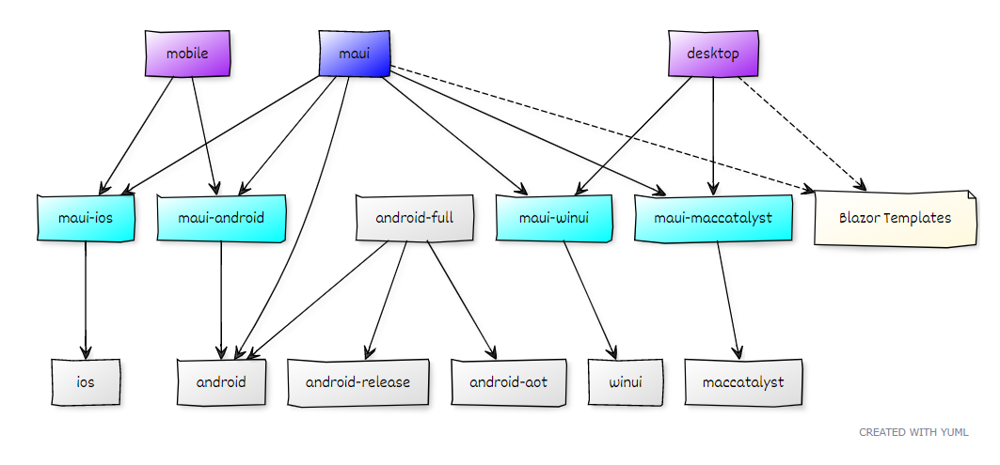

# .NET MAUI Workloads

.NET Workloads are a new concept in .NET 6.

The idea, is a project to be able to set `$(UseMaui)`:

```xml
<Project Sdk="Microsoft.NET.Sdk">
  <PropertyGroup>
    <TargetFrameworks>$(_MauiDotNetTfm)-android;$(_MauiDotNetTfm)-ios</TargetFrameworks>
    <OutputType>Exe</OutputType>
    <UseMaui>true</UseMaui>
  </PropertyGroup>
</Project>
```

`$(UseMaui)` automatically brings in the following workload packs:

* `Microsoft.NET.Sdk.Maui`
* `Microsoft.Maui.Sdk`
* `Microsoft.Maui.Resizetizer.Sdk`
* `Microsoft.Maui.Core.Ref.[platform]`
* `Microsoft.Maui.Core.Runtime.[platform]`
* `Microsoft.Maui.Controls.Ref.[platform]`
* `Microsoft.Maui.Controls.Runtime.[platform]`
* `Microsoft.Maui.Essentials.Ref.[platform]`
* `Microsoft.Maui.Essentials.Runtime.[platform]`
* `Microsoft.Maui.Templates`

BlazorWebView is an addition to MAUI, project can currently opt into
it by adding `.Razor` to the `Sdk` attribute.

`<Project Sdk="Microsoft.NET.Sdk.Razor">` sets
`$(UsingMicrosoftNETSdkRazor)`, which triggers the MAUI workload to
include:

* `Microsoft.AspNetCore.Components.WebView.Maui`

This will automatically add these dependencies:

```xml
<PackageReference Include="Microsoft.AspNetCore.Authorization" />
<PackageReference Include="Microsoft.AspNetCore.Components.WebView" />
<PackageReference Include="Microsoft.AspNetCore.Components.WebView.Maui" />
<PackageReference Include="Microsoft.JSInterop" />
```

If you are a .NET 6 project, but don't want to use
Microsoft.Maui.Controls you could bring in partial parts of MAUI.

`$(UseMauiAssets)` brings in `Microsoft.Maui.Resizetizer.Sdk`.

`$(UseMauiCore)` brings in:

* `Microsoft.Maui.Core.Ref.[platform]`
* `Microsoft.Maui.Core.Runtime.[platform]`

`$(UseMauiEssentials)` brings in:

* `Microsoft.Maui.Essentials.Ref.[platform]`
* `Microsoft.Maui.Essentials.Runtime.[platform]`

Special files:

* `AutoImport.props` - defines the default includes (or wildcards) for
  Maui projects will go. Note that this is imported by *all* .NET 6
  project types -- *even non-mobile ones*.
* `WorkloadManifest.json` - general .NET workload configuration
* `WorkloadManifest.targets` - imports `Microsoft.Maui.Sdk` when
  `$(UseMaui)` is `true`. Note that this is imported by *all* .NET 6
  project types -- *even non-mobile ones*.

For further details about .NET Workloads, see these .NET design docs:

* [.NET Optional SDK Workloads](https://github.com/dotnet/designs/blob/main/accepted/2020/workloads/workloads.md)
* [Workload Resolvers](https://github.com/dotnet/designs/blob/main/accepted/2020/workloads/workload-resolvers.md)
* [Workload Manifests](https://github.com/mhutch/designs/blob/b82449a228c0addb95b5a4995bb838749ea6f8cc/accepted/2020/workloads/workload-manifest.md)

## .NET MAUI Workload Ids

A .NET "workload" is a collection of packs.

.NET MAUI will have several workload ids depending on what needs to be
installed:

* `maui`: everything
* `maui-mobile`: iOS & Android
* `maui-desktop`: Mac Catalyst & Windows
* `maui-core`: required by all platforms
* `maui-android`
* `maui-maccatalyst`
* `maui-macos`
* `maui-windows`
* `maui-tizen`

`maui-android` simply extends the `android` workload, adding the
Android-specific platform implementation for MAUI.

These ids will not map exactly to the Visual Studio Installer's
concept of a "workload". Consider the following diagram for what .NET
developers would get from the choices of `mobile`, `maui`, or
`desktop`:



## `$(MauiVersion)`

Right now the .NET MAUI workload is installed side-by-side per .NET
SDK band such as:

    dotnet/sdk-manifests/6.0.100/microsoft.net.sdk.maui/

To give greater flexibility, you can specify in your `.csproj`:

```xml
<MauiVersion>6.0.100-rc.2.2000</MauiVersion>
```

Even if you have `6.0.100-rc.2.1000` installed system-wide, placing
this in your `.csproj` enables it to build against newer MAUI
assemblies at build & runtime. Things might break if the version is
much different that what MAUI source generators or MSBuild tasks
expect. We have a `$(_MinimumMauiWorkloadVersion)` property to fall
back on if there is a breaking change that requires a newer .NET MAUI
system-wide install.

    error MAUI004: At least version '6.0.200' of the .NET MAUI workload is required to use <MauiVersion>6.0.200-preview.13</MauiVersion>.

One issue is that any MSBuild tasks no longer update via `$(MauiVersion)`:

* `Microsoft.Maui.Sdk`: source generators and XamlC
* `Microsoft.Maui.Resizetizer.Sdk`: MSBuild tasks

## Using the .NET MAUI Workload

After you've done a build, such as:

```dotnetcli
$ dotnet cake
```

You'll have various `artifacts/*.nupkg` files produced, as well as the
proper files copied to `./bin/dotnet`.

At this point, you can build the samples using `-p:UseWorkload=true`.
This uses the workload instead of the `<ProjectReference/>` that are
declared:

```dotnetcli
$ git clean -dxf src/Controls/samples/
$ ./bin/dotnet/dotnet build Microsoft.Maui.Samples.slnf -p:UseWorkload=true
```

### Install System-Wide

Once you have `artifacts/*.nupkg` locally, you can install them in a
system-wide dotnet install in `/usr/local/share/dotnet/` or
`C:\Program Files\dotnet\`.

On macOS, you could do:

```dotnetcli
$ sudo dotnet build src/DotNet/DotNet.csproj -t:Install
```

On Windows, you would use an Administrator command prompt:

```dotnetcli
> dotnet build src/DotNet/DotNet.csproj -t:Install
```

`DotNet.csproj` will install the workload in the instance of `dotnet`
that you run it under.

### CI for dotnet/maui

On CI in order to test the workload, we download the `.nupkg` files to
`artifacts` and provision a .NET 6 without mobile workload packs via
`-p:InstallWorkloadPacks=false`:

```dotnetcli
$ dotnet build src/DotNet/DotNet.csproj -p:InstallWorkloadPacks=false
```

Next, we can use the new `Install` target to extract from `artifacts/*.nupkg`:

```dotnetcli
$ ./bin/dotnet/dotnet build src/DotNet/DotNet.csproj -t:Install
```

Then we can build samples with `-p:UseWorkload=true`:

```dotnetcli
$ ./bin/dotnet/dotnet build Microsoft.Maui.Samples.slnf -p:UseWorkload=true
```

## Cleanup .NET 6 installs & workloads

Sometimes your .NET 6 install might get "hosed", so these are some
quick instructions on how to uninstall .NET 6 and all workloads to
start fresh.

By default .NET 6 is installed in:

* Windows: `C:\Program Files\dotnet\`
* macOS: `/usr/local/share/dotnet/`

On Windows, start by going to `Control Panel` > `Programs and
Features` and uninstall .NET 6. Files will still be left behind after
doing this. macOS doesn't really have a way to uninstall `.pkg` files,
so we'll just be deleting files manually.

Manually remove these directories:

* `dotnet/library-packs`
* `dotnet/metadata`
* `dotnet/packs/Microsoft.Android.*`
* `dotnet/packs/Microsoft.iOS.*`
* `dotnet/packs/Microsoft.MacCatalyst.*`
* `dotnet/packs/Microsoft.macOS.*`
* `dotnet/packs/Microsoft.Maui.*`
* `dotnet/packs/Microsoft.tvOS.*`
* `dotnet/sdk/6.0.100-*`
* `dotnet/sdk-manifests`
* `dotnet/template-packs`

These folders are all .NET 6 specific, so they won't affect .NET 5 or
older versions.

After this you can install .NET 6 with a fresh install of your choice.
